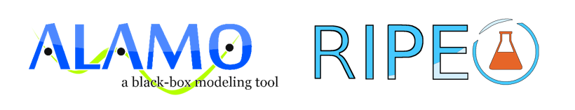

Data Driven Machine Learning
============================

.. toctree::
    :maxdepth: 1

    alamopy
    ripe

.. warning::
    The ddm-learning library is still in active development and we
    hope to improve on it in future releases. Please use its
    functionality at your own discretion.

Overview
--------

The Data Driven Machine Language (ddm-learning) repository contains regression tools for the development of property models for kinetics and thermodynamics of a system. The provided tools include both ALAMOpy and RIPE that can access ALAMO and other solvers through the Python API. Examples for both tool are provided.

Contributing
------------

**By contributing to this repository, you are agreeing to all the terms set out
in the LICENSE.txt and COPYRIGHT.txt files in this directory.**

