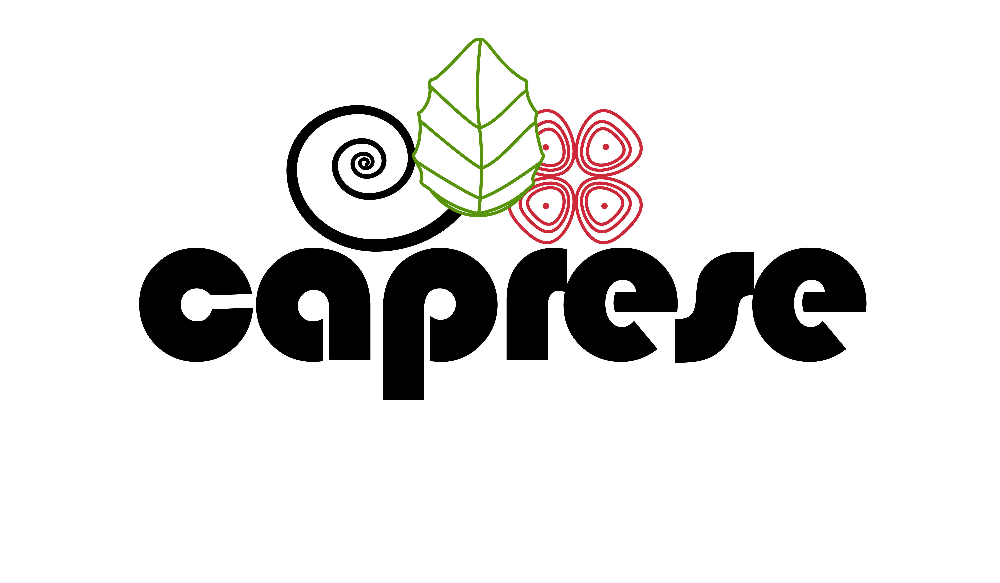

Dynamic Modeling and Optimization
=================================

.. toctree::
    :maxdepth: 2

    caprese/index

..
   .. image:: ../_images/ddm-software.png
       :width: 600px

All happy dynamic models solve in the same way; each unhappy dynamic model
fails to solve in its own way.

Caprese is a module for simulation of IDAES flowsheets with nonlinear program
(NLP)-based control and estimation strategies, namely Nonlinear Model
Predictive Control (NMPC) and Moving Horizon Estimation (MHE).
