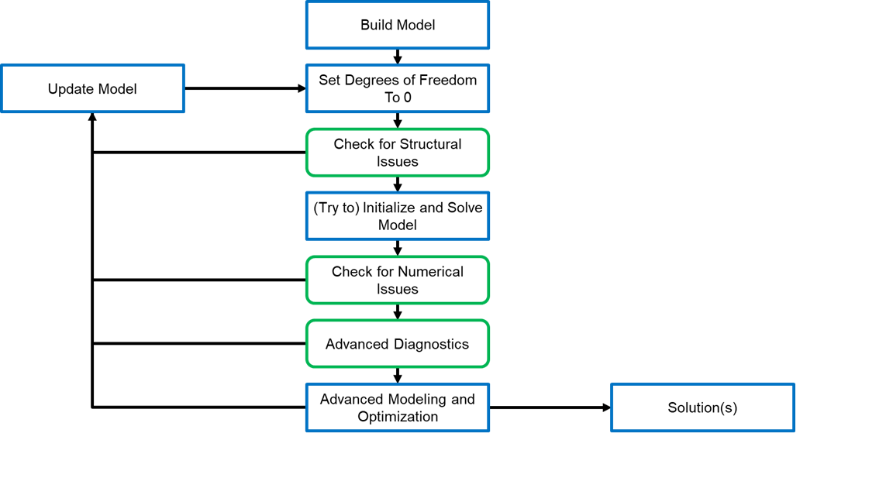

Model Diagnostics Workflow
==========================

.. contents::
    :depth: 3
    :local:

.. toctree::
    :maxdepth: 1
    
    svd_analysis
    degeneracy_hunter

Introduction
------------

Writing well-posed equation-oriented models is a significant challenge, and even the most experienced developers often have to spend a lot of time diagnosing and resolving issues before a model is able to solve reliably. This documentation is intended to assist users with this process by outlining a general workflow for model development and debugging in order to more easily identify and resolve modeling issues. IDAES also provides a ``DiagnosticsToolbox`` to assist users with this workflow, and a detailed description of the API can be found :ref:`here<reference_guides/core/util/diagnostics/diagnostics_toolbox:Diagnostics Toolbox>`.

General Workflow
----------------

The diagram below shows a high-level overview of the model development and diagnosis workflow recommended by the IDAES team. Boxes in blue represent model development tasks whilst green boxes indicate diagnosis and debugging steps. It is important to note that the workflow is inherently iterative; any change to the model you should start again from the beginning of the workflow to ensure that the changes you made did not introduce any unexpected new issues.

Choose a Model to Debug
"""""""""""""""""""""""

As shown above, all model development begins with a model and the IDAES team recommends starting with the simplest possible model you can. It is always easier to debug small changes, so users should apply this workflow from the very beginning of model development starting with the simplest possible representation of their system (e.g., a single unit model or set of material balances). At each step of the process (i.e., each change or new constraint), you should check to ensure that your model is well-posed and that it solves robustly before making additional changes. In this way, it will be clear where to start looking for new issues as they arise, as they will be related in some way to the change you just made.

Start with a Square Model
"""""""""""""""""""""""""

Next, you should ensure your model has zero degrees of freedom (as best you can); whilst your ultimate goal may be to solve some optimization problem with degrees of freedom, you should always start from a square model first. Firstly, this is because many of the model diagnosis tools work best with square models. Secondly, all models are based on the foundation of a square model; an optimization problem is just a square model with some degrees of freedom added. If your underlying square model is not well-posed then any more advanced problem you solve based on it is fundamentally flawed (even if it solves).

Check for Structural Issues
"""""""""""""""""""""""""""

Once you have a square model, the next step is to check to see if there are any issues with the structure of the model; for example structural singularities or unit consistency issues. As these issues exist in the very structure of the model, it is possible to check for these before calling a solver and in doing so make it more likely that you will be able to successfully solve the model. Any issues identified at this stage should be resolved before trying to move forwards.

Try to Solve Model
""""""""""""""""""

Once you have ensured there are no structural issues with your model, the next step is to try to solve your model (or initialize it if you haven't already) using the solver of your choice (you should also experiment with different solvers if needed). Hopefully you will get some solution back from the solver, even if it is not optimal and/or feasible (in cases where you get critical solver failures, see the section later in this documentation).

Check for Numerical Issues
""""""""""""""""""""""""""

Once you have at least a partial solution to your model, the next step is to check for numerical issues in your model, such as possible bounds violations and poor scaling. Due to their nature, numerical issues depend on having a solution to the model, and they can often be limited to certain model states (i.e., it is possible to have a model which behaves well at one model state only to fail badly if you change your model state). As such, numerical checks should be performed at a number of points across the full range of expected states to try to ensure that the model is well-posed across the full modeling range. Any issues that are identified here should be addressed before moving on, and remember that after any changes you should always start by checking for structural issues again.

Apply Advanced Diagnostics Tools (if required)
""""""""""""""""""""""""""""""""""""""""""""""

If you are still having trouble solving your model after running the structural and numerical checks, then you will need to look to more advanced (and computationally expensive) tools to try and resolve your issues. Finally, once you are satisfied that your model is robust and well behaved, you can move on to solving more complex problems.

Diagnostics Toolbox
-------------------

Whilst the workflow outlined above gives a high-level overview of the model development and diagnostics process, there is a lot of detail buried in each of the steps. Rather than provide the user with a long series of steps and check-boxes to complete, the :ref:`IDAES Diagnostics Toolbox<reference_guides/core/util/diagnostics/diagnostics_toolbox:Diagnostics Toolbox>` instead provides a centralized interface for accessing diagnostics tools and guiding users through the diagnostics workflow. High level methods are provided for each of the model diagnosis steps (green boxes) in the workflow above which will provide a summary of any issues identified, and these will recommend additional methods and tools to use to further examine each issue identified.

Modeling Log Book
-----------------

Model development and diagnostics is inherently an iterative process, and often you will try one approach to resolve an issue only to find it made things worse or that you can no longer reproduce an important result from a previous model. Due to this, users are strongly encouraged to maintain a "modeling log book" which records their model development activities. This log book should record each change made to the model and why, along with a Git hash (or equivalent version control marker) and a record on any important results that were generated with the current version of the model. This log book will prove to be invaluable when (and not if) you need to revert to an older version of the model to undo some unsuccessful changes or to work out why a previous result can no longer be reproduced.

Handling Critical Solver Failures
---------------------------------

TBA
