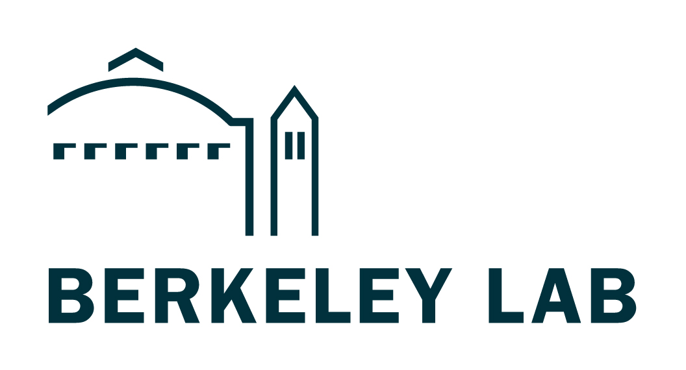
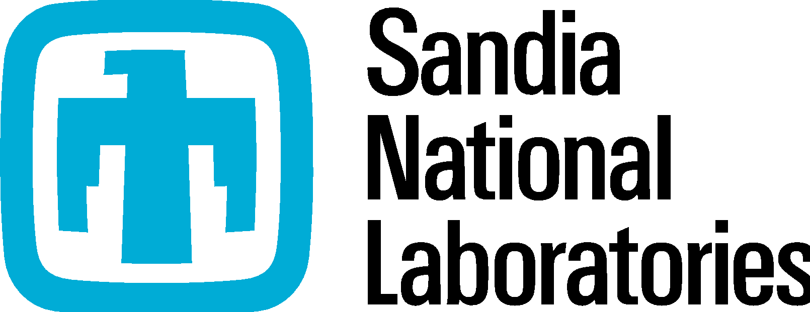

.. index::
    pair: idaes;Home
.. Include 'entities' e.g. |middot|. See https://docutils.sourceforge.io/docs/ref/rst/definitions.html
.. include:: <isonum.txt>
.. include:: <isoamsa.txt>

Institute for the Design of Advanced Energy Systems (IDAES)
===========================================================

About IDAES
-----------

The Institute for Design of Advanced Energy Systems (IDAES) was originated to bring the most advanced modeling and optimization capabilities to the challenges of transforming and decarbonizing the world’s energy systems to make them environmentally sustainable while maintaining high reliability and low cost.
For more information about the project, see the `IDAES website`_.
See also :doc:`IDAES concepts <explanations/concepts>` in this documentation.

Citing IDAES
------------
If you use IDAES software for your research, please cite `the following publication <https://aiche.onlinelibrary.wiley.com/doi/10.1002/amp2.10095>`_::

    Lee, Andrew, Jaffer H. Ghouse, John C. Eslick, Carl D. Laird, John D. Siirola,
    Miguel A. Zamarripa, Dan Gunter et al. "The IDAES process modeling framework
    and model library—Flexibility for process simulation and optimization."
    Journal of Advanced Manufacturing and Processing 3, no. 3 (2021): e10095.
    https://doi.org/10.1002/amp2.10095

Contents
--------

.. list-table::
   :class: index-table

   * - Getting Started
         | :doc:`Installing IDAES <tutorials/getting_started/index>`
         |  |nbsp|   :doc:`Windows <tutorials/getting_started/windows>`
            |middot| :doc:`MacOS <tutorials/getting_started/mac_osx>`
            |middot| :doc:`Linux <tutorials/getting_started/linux>`
         | :doc:`Installing IDAES for Contributors <tutorials/advanced_install/index>`
         |
         | :doc:`IDAES Examples <tutorials/tutorials_examples>`
           |rarrhk| `website <https://idaes-examples.readthedocs.io/en/latest/>`_
     - How-To Guides
         | :doc:`Setting up IDAES Models <how_to_guides/workflow/index>`
         | :doc:`Developing Custom Models <how_to_guides/custom_models/general_model_development>`
         | :doc:`Installing Specific IDAES Versions <how_to_guides/versioned_idaes_install>`
   * - Explanations
         | :doc:`Why IDAES <explanations/why_idaes>`
         | :doc:`Concepts <explanations/concepts>`
         | :doc:`Components of IDAES <explanations/components/index>`
         | :doc:`User Interfaces <explanations/components/ui/index>`
         | :doc:`Conventions <explanations/conventions>`
         | :doc:`Model Diagnostics Workflow <explanations/model_diagnostics/index>`
         | :doc:`Modeling Extensions <explanations/modeling_extensions/index>`
         | :doc:`Related Packages <explanations/related_packages/index>`
         | :doc:`FAQ <explanations/faq>`
         | :doc:`License <explanations/license>` and
           :doc:`Copyright <explanations/copyright>`
     - Reference Guides
         | :doc:`IDAES Model Libraries <reference_guides/model_libraries/index>`
         | :doc:`IDAES Core <reference_guides/core/index>`
         | :doc:`Model Scaling Toolbox <reference_guides/scaling/scaling>`
         | :doc:`Initializing Models <reference_guides/initialization/index>`
         | :doc:`Command-line tools <reference_guides/commands/index>`
         | :doc:`Configuration <reference_guides/configuration>`
         | :doc:`Logging Processing & Outputs <reference_guides/logging>`
         | :doc:`Developing for IDAES <reference_guides/developer/index>`
         | :doc:`Grid integration application <reference_guides/apps/grid_integration/index>`
         | `Flowsheet Visualizer <https://idaes-ui.readthedocs.io/en/latest/user/fv/>`_

.. toctree::
    :hidden:
    :maxdepth: 2

    tutorials/index
    how_to_guides/index
    explanations/index
    reference_guides/index
    archived_features/index
    explanations/faq

Collaborating institutions
--------------------------
The IDAES team is comprised of collaborators from the following institutions:

National Laboratory Collaborators
+++++++++++++++++++++++++++++++++

.. table::
   :widths: auto

   +---------------+-------------------------------------------+
   | |netl_logo|   |   National Energy Technology Laboratory   |
   +---------------+-------------------------------------------+
   | |lbnl_logo|   |   Lawrence Berkeley National Laboratory   |
   +---------------+-------------------------------------------+
   | |snl_logo|    |   Sandia National Laboratories            |
   +---------------+-------------------------------------------+

University Collaborators
++++++++++++++++++++++++

.. table::
   :widths: auto

   +---------------+-------------------------------------------+
   | |cmu_logo|    |   Carnegie Mellon University              |
   +---------------+-------------------------------------------+
   | |wvu_logo|    |   West Virginia University                |
   +---------------+-------------------------------------------+
   | |und_logo|    |   University of Notre Dame                |
   +---------------+-------------------------------------------+
   | |gatech_logo| |   Georgia Institute of Technology         |
   +---------------+-------------------------------------------+

Sponsor
-------

This work was sponsored by the Department of Energy, Fossil Energy and Carbon Management

Contact us
-----------
General, background and overview information is available at the `IDAES website`_.
Framework development happens at our `GitHub repo <https://github.com/IDAES/idaes-pse>`_ where you can `report issues/bugs <https://github.com/IDAES/idaes-pse/issues>`_ or `make contributions
<https://github.com/IDAES/idaes-pse/pulls>`_.
For further enquiries, send an email to: <idaes-support@idaes.org>

.. _IDAES website: https://idaes.org

Indices and tables
------------------

* :ref:`genindex`
* :ref:`modindex`
* :ref:`search`

.. |CO2| replace:: CO\ :sub:`2`
