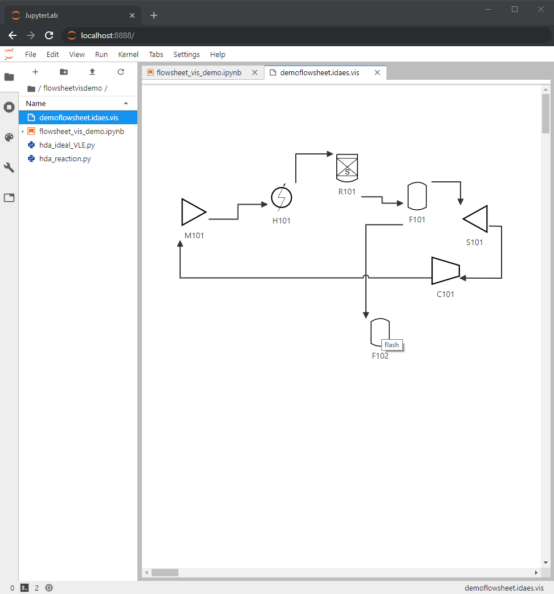

JupyterLab
==========

.. toctree::
    :maxdepth: 1

    modelvis

Overview
--------

`JupyterLab <https://jupyterlab.readthedocs.io/>`_ is an interface
for working with Jupyter Notebooks simultaneously with files, plots,
terminals, and other customizable interfaces.

Flowsheet Viewer
----------------

The Flowsheet Viewer is a JupyterLab extension 
that displays flowsheets serialized with ``flowsheet.serialize()``.

.. note::
    The tool is used in conjunction with the 
    `idaes.dmf.ui` subpackage, which serializes the model as a `.idaes.vis` file 
    which is read by the JupyterLab extension.

