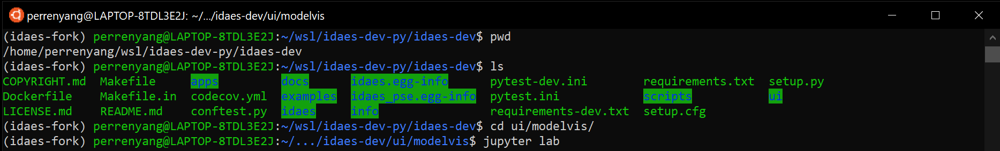
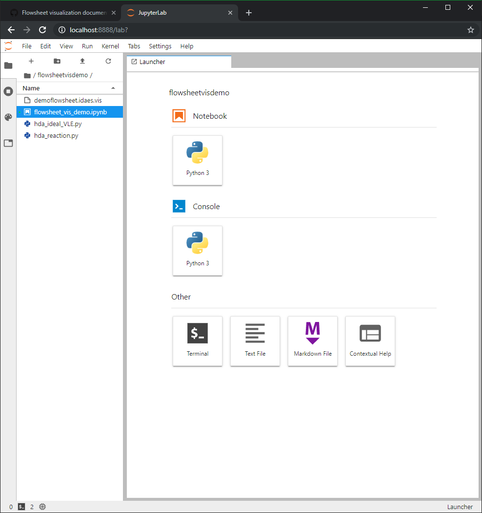
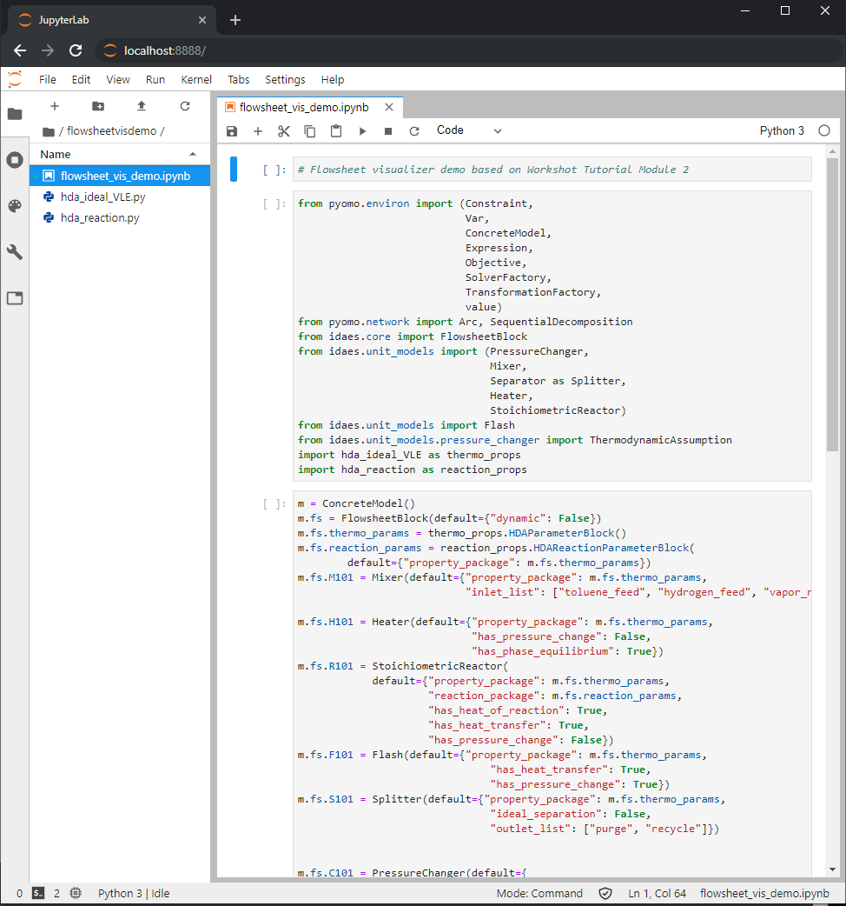
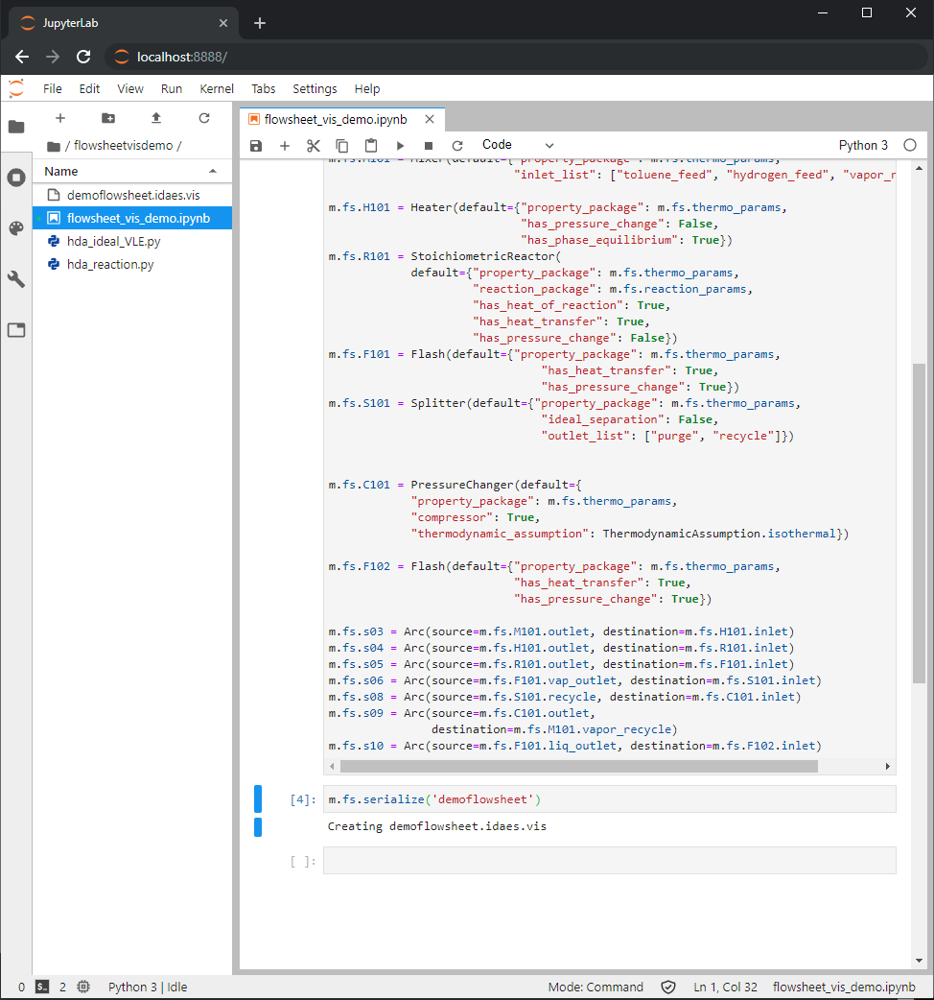
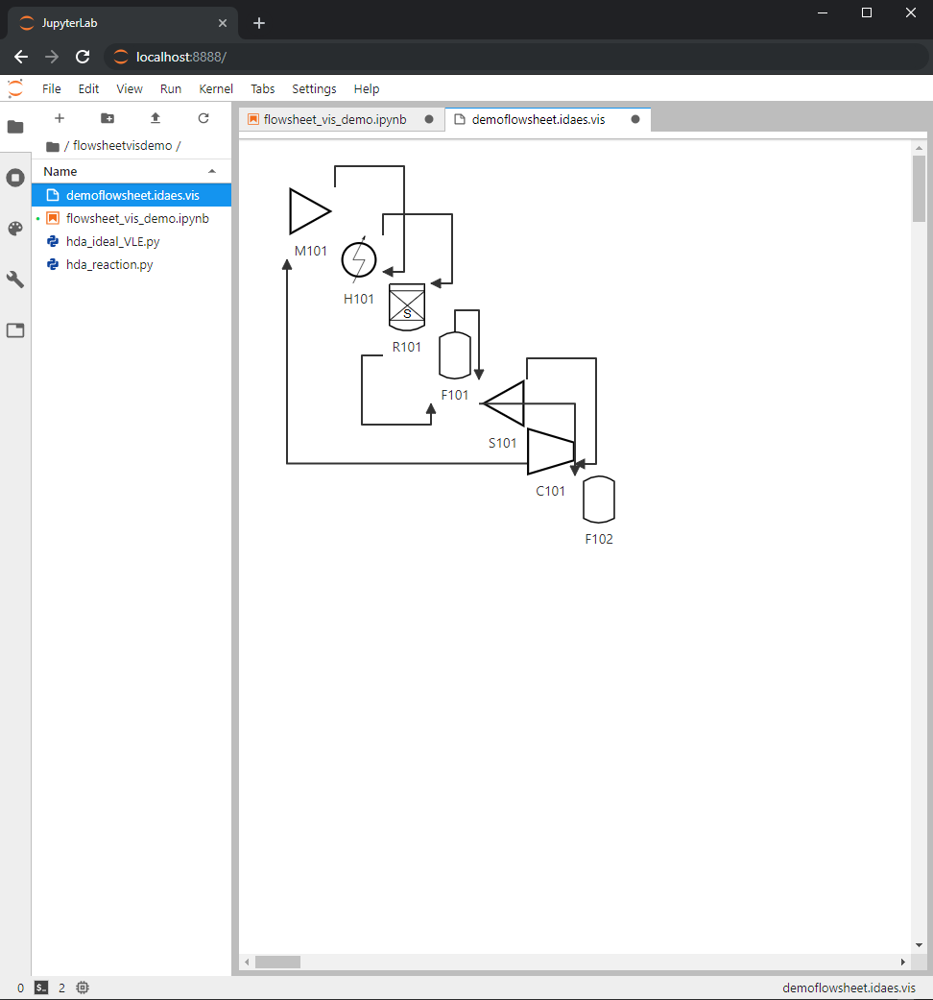
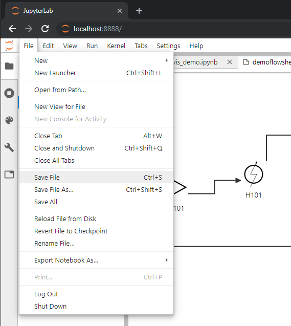
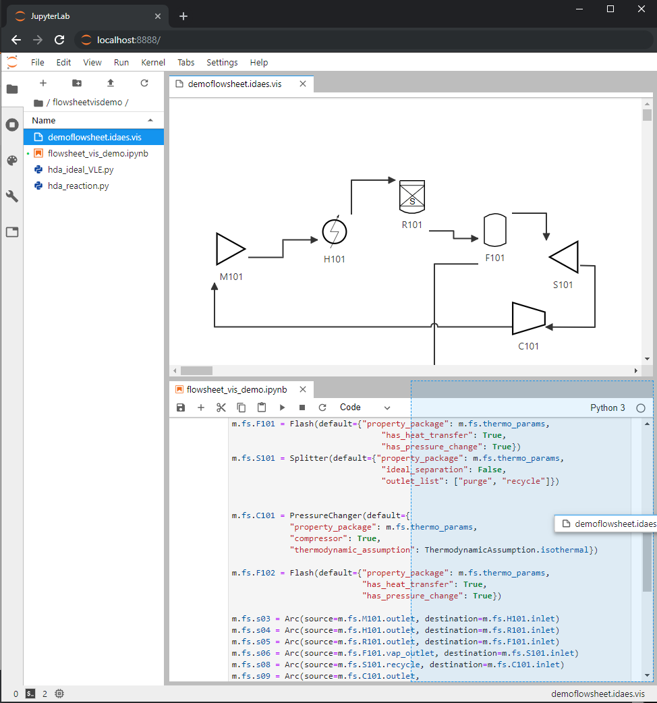

.. _modelvis:

Flowsheet Viewer
===================================

.. image:: ../_images/modelvis/jupyterlab4.png
    :alt: Flowsheet viewer sample image

.. note::
    The flowsheet viewer requires the use of JupyterLab. 

Overview
--------

Flowsheets may be serialized to ".idaes.vis" files which, in conjunction with the 
flowsheet viewer, produce interactive visual representations of flowsheets. 
The resultant flowsheet diagrams can be rearranged and saved.

Instructions
------------

1. :ref:`Ensure that the latest IDAES is installed. <idaes_installation>` 

2. `Install JupyterLab. <https://jupyterlab.readthedocs.io/en/stable/getting_started/installation.html>`_
   If you are not using Conda environments, use the `pip install` instructions.

  
Installation
------------

From your terminal, call the following commands to build and install the extension:

.. code-block:: sh

	cd <repository>/ui/modelvis/idaes-model-vis
    npm install # takes a few minutes
    npm run build
    jupyter labextension link . # takes a few minutes

.. _usage:

Usage
-----

1. Launch JupyterLab (run ``jupyter lab`` from a folder you wish to work out of). 

2. Create a new Python 3 notebook from the JupyterLab Launcher, or select a preexisting
   notebook from the directory navigation pane on the left. An example (depicted) is located
   in idaes-pse/ui/modelvis/flowsheetdemo.

3. In the notebook, construct a flowsheet as usual (add unit models, set connections, etc.).

4. Run the `.serialize()` method from the flowsheet, as below:
   
    .. code-block:: python

        m.fs.serialize('myflowsheetname')

   A ``.idaes.vis`` file should be created with the chosen filename 
   (e.g. ``myflowsheetname.idaes.vis``), and
   become visible in the JupyterLab file browser. If there is an existing
   file with the same name, you must either choose a different filename
   or add the additional optional argument ``overwrite=True``
   (in which case the file will be overwritten).

8. Open the created ``.idaes.vis`` file in JupyterLab. A tab should open and display
   a graph representation of the serialized flowsheet; the components are
   tiled diagonally by default, and can be rearranged to your liking. 

.. image:: ../_images/modelvis/jupyterlab4.png

9. The layout of the graph can be saved into the serialized file by using JupyterLab's
   ``File->Save`` menu item (or the equivalent hotkey Ctrl+s/Command+s). 
   Autosaving can also be configured by using JupyterLab's
   ``Settings->Advanced Settings Editor`` option under ``Document Manager``.
   

Miscellany
^^^^^^^^^^

- Unit model icons can be rotated by right-clicking on the icon.

.. TODO Doesn't seem to work on my system --PY

- Connections paths between unit models can be moved by clicking on the link, then 
  dragging the link vertex that appears. Double-click the vertex to remove it.

- JupyterLab tabs can be rearranged by clicking and dragging the top of the tab, 
  and resized by dragging the borders.

Developer notes
---------------

Rebuilding
^^^^^^^^^^

After making changes to the TypeScript, rebuild the extension and reinstall it into JupyterLab:

.. code-block:: sh

    npm run build
    jupyter lab build
