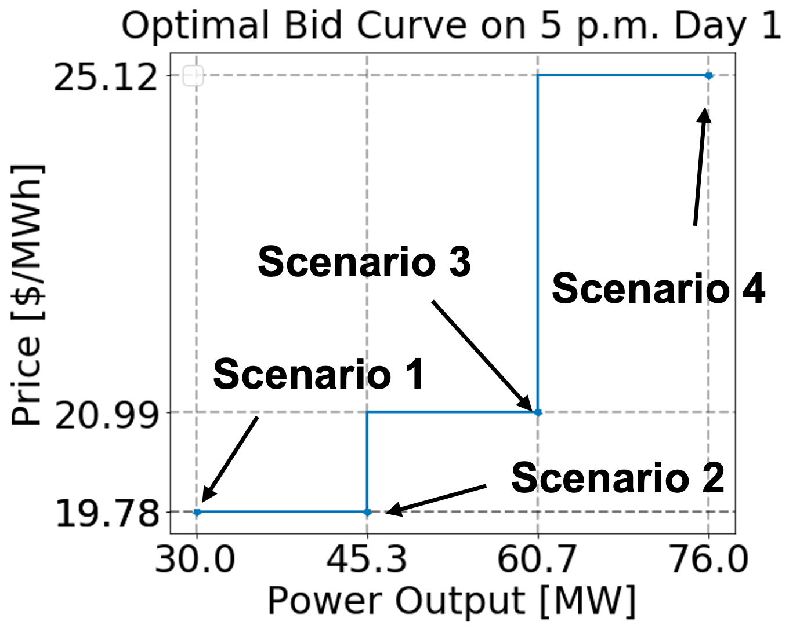

Bidder
============================================
Market participating resources (e.g., generators, IESs) submit energy bids
(a.k.a., bid curves) to the day-ahead and real-time markets for each trading time
period to communicate their flexibility and marginal costs. As shown in the figure
below, an energy bid is a piecewise constant function described by several energy
offer price (\$/MWh) and
operating level (MW) pairs. Bid curves from each resource are inputs (i.e.,
parameters) in the market-clearing optimization problems solved by production cost models. Currently,
the ``Bidder`` formulates a two-stage stochastic program to calculate the optimized
time-varying bid curves for thermal generators. In this stochastic program, each
uncertain price scenario has a corresponding power output. As shown in the figure,
each of these uncertain price and power output pairs formulates a segment in the
bidding curves.

Here we present a stochastic bidding model for a renewable integrated energy system (wind generator +  polymer electrolyte membrane (PEM) electrolyzer).

Day-Ahead Bidding Problem for Wind + PEM IES
---------------------------------------------

The objective function is the expected profit, which equals the revenue subtract the cost. 
We want to consider the revenue from the electricity market and the hydrogen market.

.. math:: \max \quad \sum_{s \in S, t \in T^{DA}}\omega_{s}[{(\pi_{t,s}^{DA}P_{t,s}^{DA} + \pi_{t,s}^{RT}(P_{t,s}^{RT}-P_{t,s}^{DA}))\Delta t  + Pr^{H}m_{t,s}^{H}- c_{t,s}}] - C_{fix}

s.t.

.. math:: P_{t,s}^{DA} \leq P_{t,s}^{RT} \quad \forall t, s \quad \quad (1)
.. math:: P_{t,s} = P^{RT}_{t,s} \quad \forall t, s \quad \quad (2)
.. math:: (\pi_{t,s'}^{DA} - \pi_{t,s}^{DA})(P_{t,s'}^{DA} - P_{t,s}^{DA}) \geq 0 \quad \forall s \in S, \forall s' \in S \backslash s, \forall t \in T^{DA} \quad \quad (3)
.. math:: P_{t,s}^{DA} \leq P_{t,s}^{wind} \quad \forall t, s \quad \quad (4)
.. math:: P_{t,s}^{RT} \leq P_{t,s}^{wind} \quad \forall t, s \quad \quad (5)
.. math:: P_{t,s}^{wind} \leq f_{t} P_{max}^{wind} \quad \forall t, s \quad \quad (6)
.. math:: P_{t,s}^{DA} + P_{t,s}^{PEM} \leq P_{t, s}^{wind} \quad \forall t, s \quad \quad (7)
.. math:: P_{t,s}^{PEM} \leq P_{max}^{PEM} \quad \forall t, s \quad \quad (8)
.. math:: m_{t,s}^{H} = P_{t,s}^{PEM}C_{H}\Delta t \quad \forall t, s \quad \quad (9)
.. math:: c_{t,s} = C^{op} P_{t,s}^{PEM}\quad \forall t, s \quad \quad (10)
.. math:: C_{fix} = C_{fix}^{wind}P_{max}^{wind} + C_{fix}^{PEM}P_{max}^{PEM} \quad \quad (11)

Equation (1) requires the day-ahead offering power is less or equal to the real-time offering power 
in order to avoid underbidding. Equation (2) states that the RT offering power is the same as the 
IES power output to the grid. In the bidding mode, the market rules require the offering power is 
non-decreasing (convex) with its marginal cost in an energy bid. This rule is represented by equation (3).
Equation (4) to (9) are process model constraints. Equation (10) calculates the operation costs for IES
and equation (11) calculate the fixed cost for IES.

**Parameters**

:math:`\omega_{s}`: Frequency of each scenario.

:math:`\pi^{DA}_{t,s}`: Day-ahead LMP forecasting from forecaster at hour t for scenario s, \$/MWh.

:math:`\pi^{RT}_{t,s}`: Real-time LMP forecasting from forecaster at hour t for scenario s, \$/MWh.

:math:`Pr^{H}`: Market price for hydrogen, \$/kg.

:math:`P_{max}^{PEM}`: PEM max capacity, MW.

:math:`f_{t}`: Wind power generation capacity factor at hour t, MW/MW.

:math:`P_{max}^{wind}`: Wind generator max capacity, MW.

:math:`C^{op}`: PEM operation cost coefficient, \$/MW.

:math:`C_{fix}^{wind}`: Wind generator fixed cost  coefficient, \$/MW.

:math:`C_{fix}^{PEM}`:  PEM fixed cost coefficient, \$/MW.

:math:`C_{H}`: Electricity to hydrogen conversion rate, kg/MWh.

**Variables**

:math:`P_{t,s}`: IES power output to the grid at hour t in scenario s, MW.

:math:`P_{t,s}^{DA}`: Day-ahead offering power at hour t in scenario s, MW.

:math:`P_{t,s}^{RT}`: Real-time offering power at hour t in scenario s, MW.

:math:`P_{t,s}^{wind}`: Wind power generation at hour t in scenario s, MW.

:math:`P_{t,s}^{PEM}`:  Power delivered to PEM at hour t in scenario s, MW.

:math:`m_{t,s}^{H}`: Hydrogen production mass at hour t in scenario s, kg.

:math:`c_{t,s}`: IES operational cost at hour t in scenario s, \$.

Real-time Bidding Problem for Wind+PEM IES
------------------------------------------

.. math:: \max \quad \sum_{t \in T_{DA}}\hat{\pi}_{t}^{DA}\hat{P}_{t}^{DA}\Delta t + \sum_{t\in T_{RT}, s\in S}\omega_{s}[\pi_{t,s}^{RT}(P_{t,s}^{RT} -\hat{P}_{t}^{DA})\Delta t + Pr^{H}m_{t,s}^{H} - c_{t,s} - \omega_{t}^{RT} P_{t,s}^{underbid}] - C_{fix}

s.t.

.. math:: \hat{P}^{DA}_{t} \leq P_{t,s}^{RT} + P_{t,s}^{underbid} \quad \forall t, s \quad \quad (12)
.. math:: P_{t,s}^{RT} = P_{t,s} \quad \forall t, s \quad \quad (13)
.. math:: (\pi_{t,s'}^{RT} - \pi_{t,s}^{RT})(P_{t,s'}^{RT} - P_{t,s}^{RT}) \geq 0 \quad \forall s \in S, \forall s' \in S \backslash s, \forall t \in T^{RT} \quad \quad (14)
.. math:: P_{t,s}^{RT} \leq P_{t,s}^{wind} \quad \forall t, s \quad \quad (15)
.. math:: P_{t,s}^{wind} \leq f_{t}P_{wind}^{max} \quad \forall t, s \quad \quad (16)
.. math:: P_{t,s}^{RT} + P_{t,s}^{PEM} \leq P_{t,s}^{wind} \quad \forall t, s \quad \quad (17)
.. math:: P_{t,s}^{PEM} \leq P_{max}^{PEM} \quad \forall t, s \quad \quad (18)
.. math:: m_{t,s}^{H} = P_{t,s}^{PEM}C_{H}\Delta t \quad \forall t, s \quad \quad (19)
.. math:: c_{t,s} = C^{op} P_{t,s}^{PEM}\quad \forall t, s \quad \quad (20)
.. math:: C_{fix} = C_{fix}^{wind}P_{max}^{wind} + C_{fix}^{PEM}P_{max}^{PEM} \quad \quad (21)

Before the actual operations, electricity markets allow the resources to submit real-time energy bids to 
correct deviations from the day-ahead market. At this time, both day-ahead LMP :math:`\hat{\pi}_{t}^{DA}`
and day-ahead dispatch level :math:`\hat{P}_{t}^{DA}` have been realized as a result of the
day-ahead market clearing. In real-time market, due to the forecaster error and some other reasons, the 
real-time offering power may not realize promises that generator owner makes in the day-ahead market. We 
call this 'underbidding' and underbiding energy will be penaltized by the ISO. To prevent the underbidding 
and loss of revenue, we add a relaxed lower bound for the real-time offering power with a slack
variable :math:`P_{t,s}^{underbid}` for underbidding in equation (12) and penalized in the objective function.

**Parameters**

:math:`\omega_{s}`: Frequency of each scenario.

:math:`\omega_{t}^{RT}`: Penalty for underbidding at real-time at hour t, \$/MWh.

:math:`\hat{\pi}_{t}^{DA}`: Realized day-ahead energy LMP signals at hour t, \$/MWh.

:math:`\hat{P}_{t}^{DA}`: Realized day-ahead dispatch level at hour t, \$/MWH.

:math:`\pi^{RT}_{t,s}`: Real-time LMP forecasting from forecaster at hour t for scenario s, \$/MWh.

:math:`Pr^{H}`: Market price for hydrogen, \$/kg.

:math:`P^{PEM}_{max}`: PEM max capacity, MW.

:math:`f_{t}`: Wind power generation capacity factor at hour t, MW/MW.

:math:`P_{max}^{wind}`: Wind generator max capacity, MW.

:math:`C^{op}`: PEM operation cost coefficient, \$/MW.

:math:`C_{fix}^{wind}`: Wind generator fixed cost  coefficient, \$/MW.

:math:`C_{fix}^{PEM}`:  PEM fixed cost coefficient, \$/MW.

:math:`C_{H}`: Electricity to hydrogen conversion rate, kg/MWh.

**Variables**

:math:`P_{t,s}`: IES power output to the grid at hour t in scenario s, MW.

:math:`P_{t,s}^{underbid}`: The amount of underbidding power in real-time at hour t in scenario s, MW.

:math:`P_{t,s}^{RT}`: Real-time offering power at hour t in scenario s, MW.

:math:`P_{t,s}^{wind}`: Wind power generation at hour t in scenario s, MW.

:math:`P_{t,s}^{PEM}`: Power delivered to PEM at hour t in scenario s, MW.

:math:`m_{t,s}^{H}`: Hydrogen production mass at hour t in scenario s, kg.

:math:`c_{t,s}`: IES operational cost at hour t in scenario s, \$.

Some wind, battery, PEM models and the double-loop simulation example can be found in Dispatches GitHub repository.

https://dispatches.readthedocs.io/en/main/models/renewables/index.html

|example_bid|

.. module:: idaes.apps.grid_integration.bidder

.. autoclass:: Bidder
  :members:

.. autoclass:: SelfScheduler
  :members:

PEMParametrizedBidder
============================================
The ``PEMParametrizedBidder`` bids the renewable-PEM IES at a constant price. 
The logic of ``PEMParametrizedBidder`` is to reserve a part of the renewable generation
to co-produce the hydrogen. The reserved power can be sold at the marginal cost of the hydrogen
price. 

.. autoclass:: PEMParametrizedBidder
  :members: