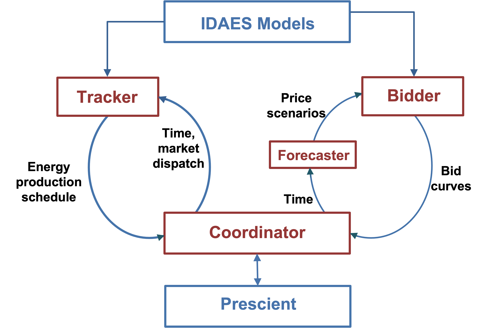

Implementation
==============

|doubleloop_implementation|

The above figure shows the design of the implementation. The objects ``Forecaster``, ``Bidder``,
``Tracker``, and ``Coordinator`` help manage information exchange within the
multiscale integrated simulation framework. The ``Bidder`` and ``Tracker`` take
an IDAES model, and augment the model with necessary variables and constraints
for energy system optimal bidding and tracking. The ``Coordinator`` acts as the
bridge between process modeling and grid modeling. On the one hand, the ``Coordinator``
passes time to the ``Forecaster`` which then forecasts market uncertainty for
the ``Bidder``. The ``Bidder`` then calculates optimal bids and passes back to
the ``Coordinator`` and the bids finally enter Prescient. On the other hand,
the ``Coordinator`` passes time and market dispatches to the ``Tracker``.
The ``Tracker`` solves optimal tracking problems and passes actual energy production
schedules back to the ``Coordinator``, and these schedules will enter Prescient for settlement calculation.
