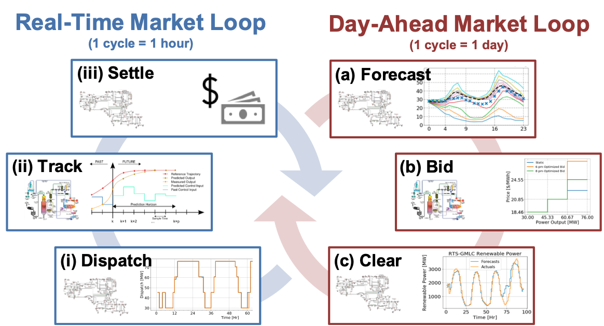

Introduction
==================

|doubleloop|

The subpackage implements a new generalized multiscale simulation framework (shown in
figure) that integrates the process and grid modeling paradigms to quantify
the operational (hours to year timescale) interactions between energy systems and
wholesale electricity markets. This multiscale framework aims to:

  (1) Elucidate complex relationships between resource dynamics and market dispatch (with uncertainty, beyond price-taker assumption);

  (2) Predict the economic opportunities and market impacts of emerging technologies (e.g., hydrogen co-production, integrated energy systems);

  (3) Guide conceptual design and retrofit to meet current and future power grid needs.

The framework integrates optimal operations, and control of an energy system with
market clearing via a high-fidelity Production Cost Model (PCM) Prescient which
optimizes resource dispatch decisions across an entire transmission network.
Specifically, in the day-ahead market loop, the following steps are modeled:

  (a) Forecast: energy systems perform market uncertainty forecasts, e.g., locational marginal prices (LMP).

  (b) Bid: energy systems utilize the uncertainty forecasts and solve optimization problems to compute optimal bidding strategies into the markets.

  (c) Clearing: after collecting day-ahead bids from market participants, the market operator (modeled by Prescient) solves unit commitment problems to clear the day-ahead market.

Similarly, in the real-time market loop, the following steps are modeled:

  (i) Dispatch: after collecting hourly real-time bids from market participants, the market operator (modeled by Prescient) dispatches power generation schedules to energy systems by solving real-time economic dispatch problems.

  (ii) Tracking: energy systems solve optimal nonlinear model predictive control (NMPC) problems to track the dispatch signals.

  (iii) Settle: based on the actual energy production schedules, the market operator calculates and pays the energy and ancillary service settlements to the participants.
