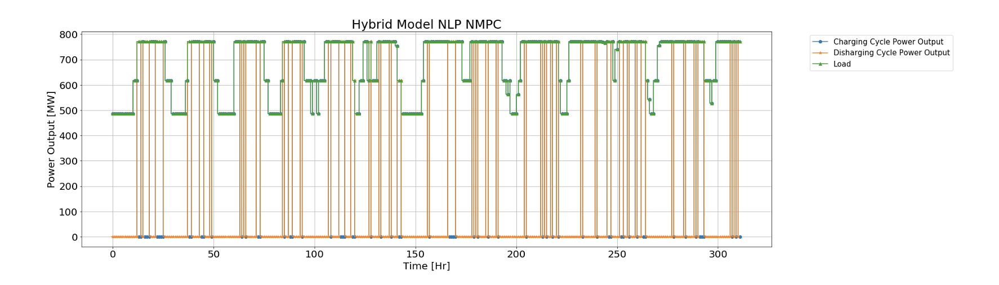

Tracker
============
Production Cost Models (PCM) computes the time-varying dispatch schedules for each resource using
simplified models. Emerging resources including IESs and industrial demand response
need to determine the optimal operations strategy to track their market dispatch
signal. The ``Tracker`` formulates these decisions as a model predictive control
(MPC) problem. The figure below shows an example of the optimal tracking from an
integrated energy system which consists of a thermal generator and an energy storage.
The figure shows that to track the dispatch (load) the energy system can optimally
use power output from charging and discharging cycle.

Tracking Problem for Wind+PEM IES
----------------------------------

Here we present a tracking problem example for wind + PEM IES.

.. math:: \min \quad \sum_{t \in T^{RT}} (c_{t,0} + \omega_{t}(P^{+}_{t,0} + P^{-}_{t,0})) - C_{fix}

s.t.

.. math:: P_{t,0} + P_{t,0}^{-} = \hat{P}^{RT}_{t} + P^{+}_{t,0} \quad \forall t

.. math:: P_{t,0} + \hat{P}_{t,0}^{PEM} \leq \hat{P}_{wind}^{RT} \quad \forall t

.. math:: P_{t,0}^{PEM} \leq P_{max}^{PEM} \quad \forall t

.. math:: m_{t,0}^{H} = P_{t,0}^{PEM}C_{H}\Delta t \quad \forall t

.. math:: c_{t,0} = C^{op} P_{t,0}^{PEM}\quad \forall t

.. math:: C_{fix} = C_{fix}^{wind}P_{max}^{wind} + C_{fix}^{PEM}P_{max}^{PEM}

**Parameters**

:math:`\hat{P}^{RT}_{t}`: Realized real-time dispatch level at hour t, MW.

:math:`\hat{P}_{wind}^{RT}`: Realized wind generation power at hour t, MW.

:math:`P_{max}^{PEM}`: PEM max capacity, MW.

:math:`C^{op}`: PEM operation cost coefficient, \$/MW.

:math:`C_{fix}^{wind}`: Wind generator fixed cost  coefficient, \$/MW.

:math:`C_{fix}^{PEM}`:  PEM fixed cost coefficient, \$/MW.

:math:`C_{H}`: Electricity to hydrogen conversion rate, kg/MWh.

**Variables**

:math:`P_{t,0}`: IES power output to the grid at hour t in scenario 0, MW.

:math:`P_{t,0}^{PEM}`: Power delivered to PEM at hour t in scenario 0, MW.

:math:`P_{t,0}^{+}`: Power over-delivered by the IES to the grid at hour t in scenario 0, MW.

:math:`P_{t,0}^{-}`: Power under-delivered by the IES to the grid at hour t in scenario 0, MW.

:math:`m_{t,0}^{H}`: Hydrogen production mass at hour t in scenario 0, kg.

:math:`c_{t,0}`: IES operational cost at hour t in scenario 0, \$.

|tracking_example|

.. module:: idaes.apps.grid_integration.tracker

.. autoclass:: Tracker
  :members:
