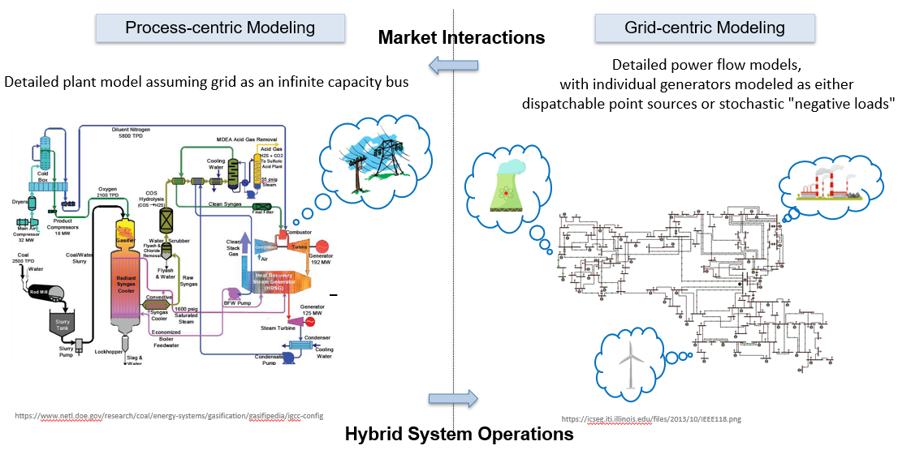
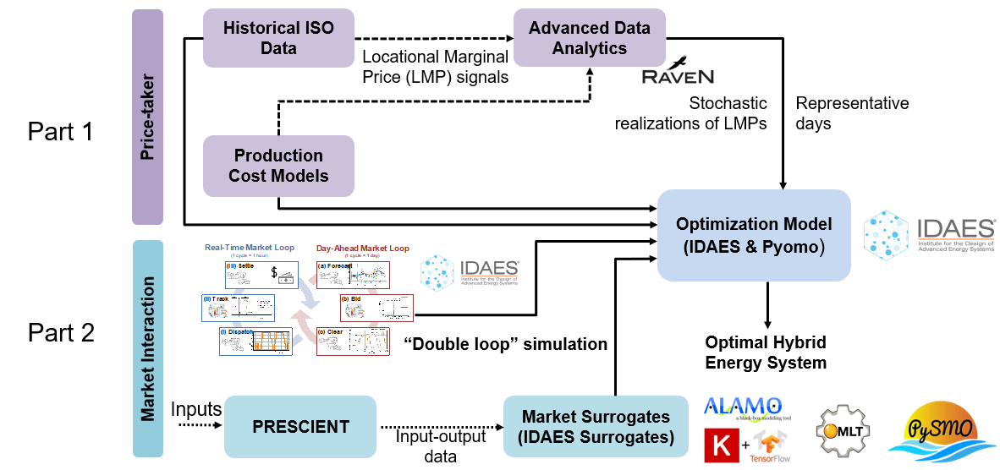

Price Taker
===========

Price takers are entities that must accept market prices since they lack the market share
to directly influence the market price. Likewise, it is assumed that a price taker's resource or energy
system is small enough such that it does not significantly impact the market. When coupled with multi-period modeling,
the price-taker model is able to synthesize grid-centric modeling with steady-state process-centric modeling, as
depicted in the figure below.

|pricetaker|

The following equations represent the multi-period price taker model, where :math:`d` are design decisions,
:math:`u` are operating decisions, :math:`δ` are power decisions, :math:`s` are scenarios (timeseries/representative days),
:math:`w` is weight/frequency, :math:`R` is revenue, :math:`π` is price data,
:math:`C` is capital and operating costs, :math:`g` is the process model, and :math:`h` is the temporal constraint.

    .. math::

       max_{d,u, δ} = \sum_{s ∈ S} \sum_{t ∈ T} w_{s}[R(d,u_{s,t},δ_{s,t},π_{s,t}) - C(d,u_{s,t},δ_{s,t})]

    .. math::

       g(d,u_{s,t},δ_{s,t}) = 0; ∀_{s} ∈ S, t ∈ T

    .. math::

       h(d,u_{s,t},δ_{s,t},u_{s,t+1},δ_{s,t+1}) = 0; ∀_{s} ∈ S, t ∈ T

The price taker multi-period modeling workflow is shown in part 1 of the figure below. The price taker model uses
simulated or historical ISO (Independent System Operator) data to generate locational marginal price (LMP)
signals, and production cost models (PCMs) are used to compute and optimize the time-varying dispatch schedules for each
resource based on their respective bid curves. Advanced data analytics reinterpret the LMP signals and PCM
as stochastic realizations of the LMPs in the form of representative days (or simply the full-year price signals).
Part 2 describes how a variety of input parameters (design capacity, minimum power output, ramp rate, minimum up/down time, marginal cost, no load cost, and startup profile)
are used generate data for market surrogates, which, in conjunction with the price taker model, can be used to optimize hybrid energy systems.

|hybrid_energy_system|

.. module:: idaes.apps.grid_integration.pricetaker.price_taker_model

.. autoclass:: PriceTakerModel
  :members: