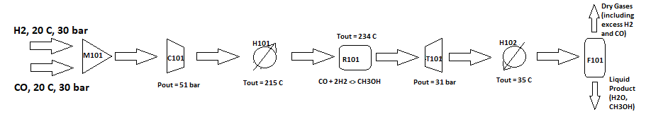

Methanol Synthesis Flowsheet (gas-phase, steady state)
======================================================

.. currentmodule:: idaes.models.flowsheets.methanol_flowsheet

This example demonstrates a steady-state simulation of methanol synthesis from hydrogen and carbon monoxide.
 This example does not represent any particular chemical process, but should be a reasonable approximation for methanol synthesis systems employing a
 water-gas shift reaction. General process descriptions for gas-phase synthesis, as well as thermophysical and reaction properties, were taken from the
 following publication:
 Nieminen, H.; Laari, A.; Koiranen, T. CO2 Hydrogenation to Methanol by a Liquid-Phase Process with Alcoholic Solvents: A Techno-Economic Analysis.
 Processes 2019, 7, 405. https://doi.org/10.3390/pr7070405

To simulate relevant natural gas components, the reactant vapors are mixed stoichiometrically and brought to optimal reaction conditions prior to entering
the gas-phase reactor. Vapor liquid equilibrium is mainly applicable in the post-reactor Flash unit for methanol recovery, and is accounted for by the
thermophysical properties. Water is included as a component to assist with VLE calculations. See the example notebook
`examples-pse.src.examples.flowsheets.methanol_synthesis.ipynb` for usage and implementation of this model.
 
This model is for demonstration and tutorial purposes only. Before looking at the
model, it may be useful to look at the process flow diagram (PFD).

Methanol Synthesis (gas-phase, steady-state)

Inputs:

* Raw material inlet conditions 
* Pre-reactor compressor outlet pressure
* Pre-reactor heater outlet temperature
    

Main Assumptions:

    Reaction is estimated as a kinetic, rate-based process with an Arrhenius power law
    Thermodynamics assume ideal vapor and liquid behavior, with smooth VLE and fugacity for phase equilibrium
    Minimum pressure mixing, isothermal compression and isentropic expansion for unit operations
            

Main Models used: 
    - Mixer
    - Compressor
    - Heater (acts as steam HXC, with costing surrogate)
    - Stoichiometric Reactor
    - Turbine
    - Heater (acts as cooling water HXC, with costing surrogate)
    - Flash

Property packages used:
    - methanol_water_ideal (exists in idaes/models/properties/examples folder)
    - methanol_reactions (exists in idaes/models/properties/examples folder)

Figures Process Flow Diagram:

