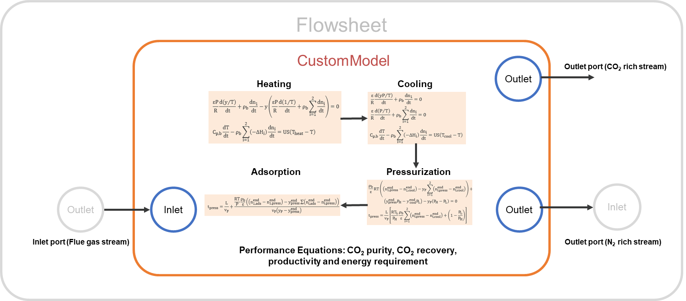

Fixed Bed Temperature Swing Adsorption (TSA)
=============================================

The fixed bed TSA unit model consists of a fixed bed four-step temperature swing adsorption (TSA) cycle. 
The model is implemented as a 0-D equilibrium-based shortcut model without axial variation of states and 
with a semi-analytical solution of the cyclic steady state. The following assumptions were considered in 
the model implementation:

* The gas phase behaves ideally.
* There are negligible mass transfer resistances, i.e., the gas phase reaches thermal equilibrium with the 
  solid adsorbent instantaneously.
* There are negligible spatial gradients and thermal dispersion.
* Pressure drop during adsorption step is described by Ergun’s equation.
* Heat capacity of column wall does not affect the bed dynamics.
* Temperature of heating/cooling fluid is homogeneous along the column.
* Heat transfer coefficient is independent of composition, temperature, and pressure. 
* The model considers local adsorption equilibrium and takes into account heat transfer mechanisms.

The TSA cycle comprises four steps as shown in Figure 1: heating, cooling, pressurization, and adsorption:

    
    Figure 1. Schematic representation of the fixed bed TSA cycle

1) Heating: the column is initially saturated with the feed and heated with one open end to desorb the CO2 
   loaded during the adsorption step and regenerate the adsorbent. Axial gradients and pressure drop are 
   neglected during this step, and mass and energy balances are as follows:

.. math::
  \frac{{\epsilon{}}_tP}{R}\frac{d\left(\frac{y}{T}\right)}{dt}+{\rho{}}_b\frac{dn_{{CO}_2}}{dt}+\frac{v_{out}}{L}\frac{P}{RT}=0

.. math::
  \frac{{\epsilon{}}_tP}{R}\frac{d\left(\frac{1}{T}\right)}{dt}+{\rho{}}_b\sum_i\frac{dn_i}{dt}+\frac{v_{out}}{L}\frac{P}{RT}=0\rightarrow{}for i={CO}_2,\ N_2

.. math::
  C_{p,b}\frac{dT}{dt}-{\rho{}}_b\sum_i\left(-{\Delta{}H}_i\right)\frac{dn_i}{dt}=US\left(T_{heat}-T\right)\rightarrow{}for i={CO}_2,\ N_2

2) Cooling: the column is cooled down with no in/out flows to bring the temperature to the adsorption 
   temperature. This step is modeled as a batch process with varying pressure and temperature. Axial 
   gradients and pressure drop are neglected during this step, and mass and energy balances are as follows:

.. math::
  \frac{{\epsilon{}}_t}{R}\frac{d\left(\frac{yP}{T}\right)}{dt}+{\rho{}}_b\frac{dn_{{CO}_2}}{dt}=0

.. math::
  \frac{{\epsilon{}}_t}{R}\frac{d\left(\frac{P}{T}\right)}{dt}+{\rho{}}_b\sum_i\frac{dn_i}{dt}=0\rightarrow{}for i={CO}_2,\ N_2

.. math::
  C_{p,b}\frac{dT}{dt}-{\rho{}}_b\sum_i\left(-{\Delta{}H}_i\right)\frac{dn_i}{dt}=US\left(T_{cool}-T\right)\rightarrow{}for i={CO}_2,\ N_2

3) Pressurization: due to a pressure decrease in the cooing step, the column is repressurized to atmospheric 
   pressure using the feed. Mass balance is solved analytically from an initial state to a final state and 
   the composition at end of the pressurization step and time of pressurization are determined as follows:

.. math::
  \frac{{\rho{}}_b}{\epsilon{}}RT\left(\left(n_{{CO}_2,press}^{end}-n_{{CO}_2,cool}^{end}\right)-y_F\sum_i\left(n_{i,press}^{end}-n_{i,cool}^{end}\right)\right)+\left(y_{press}^{end}P_H-y_{cool}^{end}P_L\right)-y_F\left(P_H-P_L\right)=0

.. math::
  t_{press}=\frac{L}{v_F}\left[\frac{RT_L}{P_H}\frac{{\rho{}}_b}{{\epsilon{}}_t}\sum_i\left(n_{i,press}^{end}-n_{i,cool}^{end}\right)+\left(1-\frac{P_L}{P_H}\right)\right]

4) Adsorption: the regenerated column is loaded with CO2 in the adsorption step producing a nitrogen (N2) stream with high purity. 
   The adsorption step is complete when the CO2 front reaches the end of the column. Therefore, the adsorption time is determined 
   by the time needed for a shock wave to travel from the column inlet to the column outlet; the pressure drop is given by Ergun’s equation, as follows:

.. math::
  t_{press}=\frac{L}{v_F}+\frac{\frac{RT}{P}\frac{{\rho{}}_b}{{\epsilon{}}_t}\left(\left(n_{{CO}_2,ads}^{end}-n_{{CO}_2,press}^{end}\right)-y_{press}^{end}\sum\left(n_{i,ads}^{end}-n_{i,press}^{end}\right)\right)}{v_F\left({y_F-y}_{press}^{end}\right)}

.. math::
  -\frac{\Delta{}P}{L}=\frac{150\mu{}{\left(1-{\epsilon{}}_b\right)}^2}{{d_p}^2{{\epsilon{}}_b}^3}v_F+\frac{1.75\left(1-{\epsilon{}}_b\right){\rho{}}_g}{d_p{{\epsilon{}}_b}^3}{v_F}^2

Further details of the equilibrium-based shortcut model are given by Joss et al. 2015.

IDAES Implementation
--------------------
Figure 2 shows a schematic representation of the implementation of the fixed bed TSA model in IDAES:

* The fixed bed TSA model was implemented in IDAES as a Unit Model Class with several configuration arguments to provide flexibility to the model. 
* Custom methods were implemented to build each cycle step by using the generic skeleton model unit available in IDAES.
* The model includes one inlet port (feed stream to the system) and two outlet ports (CO2 rich stream and N2-rich stream).
* Expressions are included to calculate pressure drop in the column and minimum fluidization velocity to avoid unrealistic pressure drop in the column and also constrain the feed velocity to be lower than the minimum fluidization velocity.
* Mass balances are indexed by components that will facilitate the addition of more components to the model.
* The model includes a robust initialization routine with scaling factors.
* The model uses a custom method to build performance indicators such as purity, recovery, productivity and energy requirement.
* The model uses custom methods to build isotherm model and adsorbent properties, which will facilitate to change the adsorbent as long as the isotherm parameters and material properties are available. 

    
    Figure 2. Schematic representation of the IDAES TSA model

Model Structure
---------------

The fixed bed TSA OD unit model consists of four-step adsorption cycle with one inlet Port (``inlet``) and 
two outlet Ports (``co2_rich_outlet`` and ``n2_rich_outlet``).

Construction Arguments
----------------------

The fixed bed TSA unit model has the following construction arguments:

========================= =================
Argument                  Default Value
========================= =================
adsorbent                 Adsorbent.zeolite_13x
number_of_beds            120
transformation_method     dae.collocation
transformation_scheme     TransformationScheme.lagrangeRadau
finite_elements           20
collocation_points        6
compressor                False
compressor_properties     None
steam_calculation         SteamCalculationType.none
steam_properties          None
========================= =================

Variables
---------

Model Inputs (variable name) - symbol:

* Adsorption pressure - :math:`P_{H}`
* Adsorption temperature - :math:`T_{L}`
* Desorption temperature - :math:`T_{H}`
* Temperature of cooling fluid - :math:`T_{cool}`
* Temperature of heating fluid - :math:`T_{heat}`
* Column length - :math:`L`
* Column inner diameter - :math:`d_{i}`

Model Outputs (variable name):

* Purity
* Recovery
* Productivity
* Specific Energy
* Cycle step times
* Pressure drop

Degrees of Freedom
------------------

The fixed bed TSA model has generally 6-9 degrees of freedom: 
the inlet state (flow_mol, enth_mol, and pressure), adsorption pressure, adsorption temperature, 
desorption temperature, temperature of cooling fluid, temperature of heating fluid, column length, and column diameter.

Reference
---------
L. Joss, M. Gazzani, M. Hefti, D. Marx, and M. Mazzotti. Temperature swing
adsorption for the recovery of the heavy component: an equilibrium-based
shortcut model. Industrial & Engineering Chemistry Research, 2015, 54(11),
3027-3038