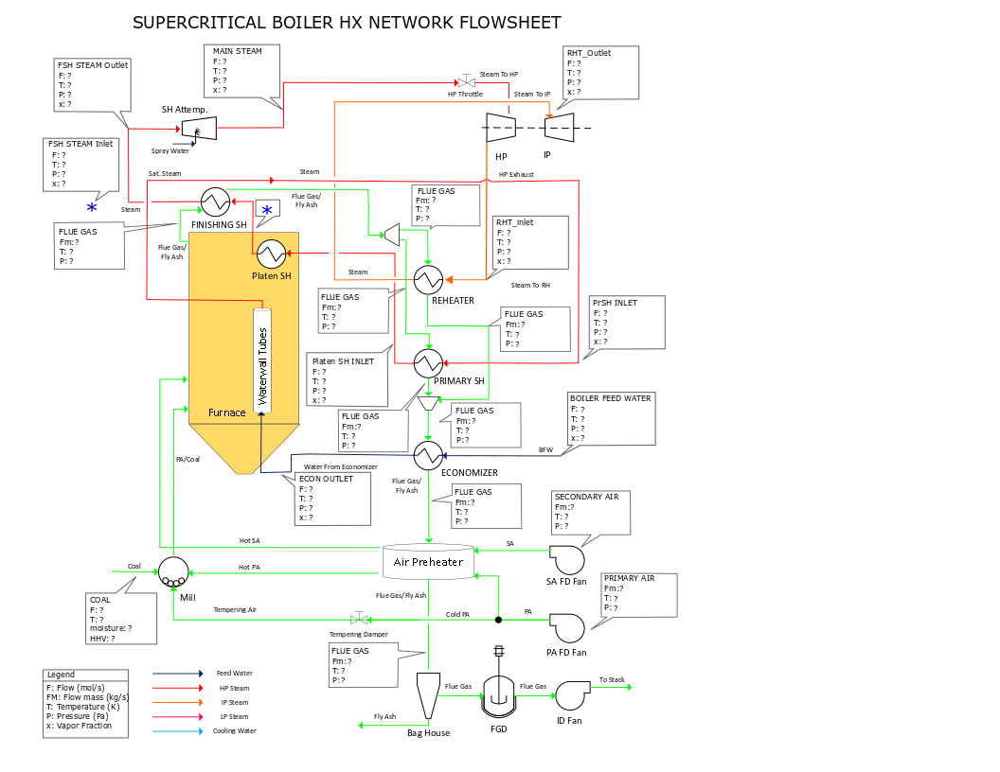

Supercritical Coal-Fired Power Plant Flowsheet (steady state)
=============================================================

.. currentmodule:: idaes.power_generation.flowsheets.supercritical_power_plant.SCPC_power_plant

This is an example supercritical pulverized coal (SCPC) power plant.This simulation model consist of a ~595 MW gross coal fired power plant. 
 The dimensions and operating conditions used for this simulation do not represent any specific coal-fired power plant.

This model is for demonstration and tutorial purposes only. Before looking at the
model, it may be useful to look at the process flow diagram (PFD).

SCPC Power Plant (simplified description)

Inputs:

* Throttle valve opening, 
* Feed water pump pressure,
* BFW - boiler feed water (from Feed water heaters),
* Coal from pulverizers
    

Main Assumptions:

    Coal flowrate is a function of the plant load, the coal HHV is fixed and heat dutty 
    from fire side to water wall and platen superheater are fixed.
    
    Boiler heat exchanger network: 
        Water Flow: 
            Fresh water -> FWH's -> Economizer -> Water Wall -> Primary SH -> Platen SH -> Finishing Superheate -> HP Turbine -> Reheater -> IP Turbine
        Flue Gas Flow:
            Fire Ball -> Platen SH -> Finishing SH -> Reheater  -> o -> Economizer -> Air Preheater
                                                   -> Primary SH --^ 
        Steam Flow:
            Boiler -> HP Turbine -> Reheater -> IP Turbine -> Condenser
            HP, IP, and LP steam extractions to Feed Water Heaters
            

Main Models used: 
    - Mixers: Attemperator, Flue gas mix
    - Heater: Platen SH, Fire/Water side (simplified model), Feed Water Heaters, Hot Tank, Condenser
    - BoilerHeatExchanger: Economizer, Primary SH, Finishing SH, Reheater
        + Shell and tube heat exchanger
            - tube side: Steam (side 1 holdup)
            - shell side: flue gas (side 2 holdup)
    - Steam Turbines
    - Pumps

Property packages used:
    - IAPWS: Water/steam side
    - IDEAL GAS: Flue Gas side

Figures Process Flow Diagram:

