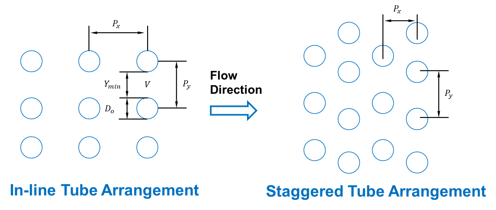

BoilerHeatExchanger
===================

.. index::
   pair: idaes.power_generation.unit_models.boiler_heat_exchanger; BoilerHeatExchanger

.. currentmodule:: idaes.power_generation.unit_models.boiler_heat_exchanger

The BoilerHeatExchanger model can be used to represent boiler heat exchangers in
sub-critical and super critical power plant flowsheets (i.e. economizer, primary superheater, secondary superheater, finishing superheater, reheater, etc.).
The model consists of a shell and tube crossflow heat exchanger, in which the shell is used as the gas side and the tube is used as the water or steam side.
Rigorous heat transfer calculations (convective heat transfer for shell side, and convective heat transfer for tube side) and shell and tube pressure drop calculations have been included.

The BoilerHeatExchanger model can be imported from :code:`idaes.power_generation.unit_models`,
while additional rules and utility functions can be imported from
``idaes.power_generation.unit_models.boiler_heat_exchanger``.

Example
-------

The example below demonstrates how to initialize the BoilerHeatExchanger model,
and override the default temperature difference calculation.

.. code:: python

    # Import Pyomo libraries
    from pyomo.environ import ConcreteModel, SolverFactory, value
    # Import IDAES core
    from idaes.core import FlowsheetBlock
    # Import Unit Model Modules
    from idaes.generic_models.properties import iapws95
    # import ideal flue gas prop pack
    from idaes.power_generation.properties.IdealProp_FlueGas import FlueGasParameterBlock
    # Import Power Plant HX Unit Model
    from idaes.power_generation.unit_models.boiler_heat_exchanger import (
        BoilerHeatExchanger,
        TubeArrangement,
        HeatExchangerFlowPattern,
    )
    import pyomo.environ as pe # Pyomo environment
    from idaes.core import FlowsheetBlock, StateBlock
    from idaes.unit_models.heat_exchanger import delta_temperature_amtd_callback
    from idaes.generic_models.properties import iapws95

    # Create a Concrete Model as the top level object
    m = ConcreteModel()

    # Add a flowsheet object to the model
    m.fs = FlowsheetBlock(default={"dynamic": False})

    # Add property packages to flowsheet library
    m.fs.prop_water = iapws95.Iapws95ParameterBlock()
    m.fs.prop_fluegas = FlueGasParameterBlock()

    # Create unit models
    m.fs.ECON = BoilerHeatExchanger(
        default={
            "tube: {"property_package": m.fs.prop_water},
            "shell": {"property_package": m.fs.prop_fluegas},
            "has_pressure_change": True,
            "has_holdup": False,
            "flow_pattern": HeatExchangerFlowPattern.countercurrent,
            "tube_arrangement": TubeArrangement.inLine,
            "side_1_water_phase": "Liq",
            "has_radiation": False
        }
    )

    # Set Inputs
    # BFW Boiler Feed Water inlet temperature = 555 F = 563.706 K
    # inputs based on NETL Baseline Report v3 (SCPC 650 MW net, no carbon capture case)
    h = iapws95.htpx(563.706, 2.5449e7)
    m.fs.ECON.side_1_inlet.flow_mol[0].fix(24678.26) # mol/s
    m.fs.ECON.side_1_inlet.enth_mol[0].fix(h)
    m.fs.ECON.side_1_inlet.pressure[0].fix(2.5449e7) # Pa

    # FLUE GAS Inlet from Primary Superheater
    FGrate = 28.3876e3  # mol/s equivalent of ~1930.08 klb/hr
    # Use FG molar composition to set component flow rates (baseline report)
    m.fs.ECON.side_2_inlet.flow_component[0,"H2O"].fix(FGrate*8.69/100)
    m.fs.ECON.side_2_inlet.flow_component[0,"CO2"].fix(FGrate*14.49/100)
    m.fs.ECON.side_2_inlet.flow_component[0,"N2"].fix(FGrate*(8.69
                                                     +14.49+2.47+0.06+0.2)/100)
    m.fs.ECON.side_2_inlet.flow_component[0,"O2"].fix(FGrate*2.47/100)
    m.fs.ECON.side_2_inlet.flow_component[0,"NO"].fix(FGrate*0.0006)
    m.fs.ECON.side_2_inlet.flow_component[0,"SO2"].fix(FGrate*0.002)
    m.fs.ECON.side_2_inlet.temperature[0].fix(682.335) # K
    m.fs.ECON.side_2_inlet.pressure[0].fix(100145) # Pa
    # economizer design variables and parameters
    ITM = 0.0254  # inch to meter conversion
    # Based on NETL Baseline Report Rev3
    m.fs.ECON.tube_di.fix((2-2*0.188)*ITM)  # calc inner diameter
    #                        (2 = outer diameter, thickness = 0.188)
    m.fs.ECON.tube_thickness.fix(0.188*ITM) # tube thickness
    m.fs.ECON.pitch_x.fix(3.5*ITM)
    # pitch_y = (54.5) gas path transverse width /columns
    m.fs.ECON.pitch_y.fix(5.03*ITM)
    m.fs.ECON.tube_length.fix(53.41*12*ITM) # use tube length (53.41 ft)
    m.fs.ECON.tube_nrow.fix(36*2.5)         # use to match baseline performance
    m.fs.ECON.tube_ncol.fix(130)            # 130 from NETL report
    m.fs.ECON.nrow_inlet.fix(2)
    m.fs.ECON.delta_elevation.fix(50)
    # parameters
    # heat transfer resistance due to tube side fouling (water scales)
    m.fs.ECON.tube_rfouling = 0.000176
    # heat transfer resistance due to tube shell fouling (ash deposition)
    m.fs.ECON.shell_rfouling = 0.00088
    if m.fs.ECON.config.has_radiation is True:
        m.fs.ECON.emissivity_wall.fix(0.7)       # wall emissivity
    # correction factor for overall heat transfer coefficient
    m.fs.ECON.fcorrection_htc.fix(1.5)
    # correction factor for pressure drop calc tube side
    m.fs.ECON.fcorrection_dp_tube.fix(1.0)
    # correction factor for pressure drop calc shell side
    m.fs.ECON.fcorrection_dp_shell.fix(1.0)

    # Initialize the model
    m.fs.ECON.initialize()

Degrees of Freedom
------------------

Aside from the inlet conditions, a heat exchanger model usually has two degrees
of freedom, which can be fixed for it to be fully specified. Things that are
frequently fixed are two of:

* heat transfer area,
* heat transfer coefficient, or
* temperature approach.

In order to capture off design conditions and heat transfer coefficients at ramp up/down or load following conditions, the BoilerHeatExanger
model includes rigorous heat transfer calculations. Therefore, additional degrees of freedom are required to calculate Nusselt, Prandtl, Reynolds numbers, such as:

* tube_di (inner diameter)
* tube length
* tube number of rows (tube_nrow), columns (tube_ncol), and inlet flow (nrow_inlet)
* pitch in x and y axis (pitch_x and pitch_y, respectively)

If pressure drop calculation is enabled, additional degrees of freedom are required:

* elevation with respect to ground level (delta_elevation)
* tube fouling resistance (tube_r_fouling)
* shell fouling resistance (shell_r_fouling)

Model Structure
---------------

The ``BoilerHeatExchanger`` model contains two ``ControlVolume0DBlock`` blocks. By default the
gas side is named ``shell`` and the water/steam side is named ``tube``. These names are configurable.
The sign convention is that duty is positive for heat flowing from the hot side to the cold
side.

The control volumes are configured the same as the ``ControlVolume0DBlock`` in the
:ref:`Heater model <reference_guides/model_libraries/generic/unit_models/heater:Heater>`.
The ``BoilerHeatExchanger`` model contains additional constraints that calculate the amount
of heat transferred from the hot side to the cold side.

The ``BoilerHeatExchanger`` has two inlet ports and two outlet ports. By default these are
``shell_inlet``, ``tube_inlet``, ``shell_outlet``, and ``tube_outlet``. If the user
supplies different hot and cold side names the inlet and outlets are named accordingly.

Variables
---------

=========================== ================== =========== =============================================================================
Variable                    Symbol             Index Sets  Doc
=========================== ================== =========== =============================================================================
heat_duty                   :math:`Q`          time        Heat transferred from hot side to the cold side
area                        :math:`A`          None        Heat transfer area
U                           :math:`U`          time        Heat transfer coefficient
delta_temperature           :math:`\Delta T`   time        Temperature difference, defaults to LMTD
=========================== ================== =========== =============================================================================

Note: ``delta_temperature`` may be either a variable or expression depending on the callback used.  If the specified cold side is hotter
than the specified hot side this value will be negative.

Constraints
-----------

The default constraints can be overridden by providing :ref:`alternative rules
<reference_guides/model_libraries/generic/unit_models/heat_exchanger:Callbacks>` for
the heat transfer equation, temperature difference, heat transfer coefficient, shell
and tube pressure drop. This section describes the default constraints.

Heat transfer from shell to tube:

.. math::
  Q = UA\Delta T

Temperature difference is:

.. math::
  \Delta T = \frac{\Delta T_1 - \Delta T_2}{\log_e\left(\frac{\Delta T_1}{\Delta T_2}\right)}

The overall heat transfer coefficient is calculated as a function of convective heat transfer shell and tube, and wall conduction heat transfer resistance.

Convective heat transfer equations:

.. math::
    \frac{1}{U}*fcorrection_{htc} = [\frac{1}{hconv_{tube}} + \frac{1}{hconv_{shell}} + r + tube_{r fouling} + shell_{r fouling}]

.. math::
    hconv_{tube} = \frac{Nu_{tube} k}{tube_{di}}
.. math:: Nu_{tube} = 0.023 Re_{tube}^{0.8} Pr_{tube}^{0.4}
.. math:: Pr_{tube} = \frac{Cp  \mu}{ k  Mw}

.. math:: Re_{tube} = \frac{tube_{di} V \rho}{\mu}

.. math:: hconv_{shell} = \frac{Nu_{shell} k_{flue gas}}{tube_{do}}
.. math:: Nu_{shell} = f_{arrangement} 0.33 Re_{tube}^{0.6} Pr_{tube}^{0.3333}
.. math:: Pr_{shell} = \frac{Cp  \mu}{ k  Mw}
.. math:: Re_{shell} = \frac{tube_{do}  V  \rho}{\mu}
.. math:: tube_{do}  = 2*tube_{thickness} + tube_{di}

Wall heat conduction resistance equation:

.. math:: r = 0.5 * tube_{do} * \log{(\frac{tube_{do}}{tube_{di}})}*k

where:

* hconv_tube : convective heat transfer resistance tube side (fluid water/steam) (W / m2 / K)
* hconv_shell : convective heat transfer resistance shell side (fluid Flue Gas) (W / m2 / K )
* Nu : Nusselt number
* Pr : Prandtl number
* Re : Reynolds number
* V: velocity (m/s)
* tube_di : inner diameter of the tube (m)
* tube_do : outer diameter of the tube (m) (expression calculated by the model)
* tube_thickness : tube thickness (m)
* r = wall heat conduction resistance (K m^2 / W)
* k : thermal conductivity of the tube wall (W / m / K)
* :math:`\rho` : density (kg/m^3)
* :math:`\mu` : viscocity (kg/m/s)
* tube_r_fouling : tube side fouling resistance (K m^2 / W)
* shell_r_fouling : shell side fouling resistance (K m^2 / W)
* fcorrection_htc: correction factor for overall heat trasnfer
* f_arrangement: tube arrangement factor

Note:
by default fcorrection_htc is set to 1, however, this variable can be used to match unit performance (i.e. as a parameter estimation problem using real plant data).

Tube arrangement factor is a config argument with two different type of arrangements supported at the moment:
1.- In-line tube arrangement factor (f_arrangement = 0.788), and 2.- Staggered tube arrangement factor (f_arrangement = 1). f_arrangement is a parameter that can be adjusted by the user.

The ``BoilerHeatExchanger`` includes an argument to compute heat tranfer due to radiation of the flue gases. If has_radiation = True the model builds additional heat transfer calculations that will be added to the hconv_shell resistances.
Radiation effects are calculated based on the gas gray fraction and gas-surface radiation (between gas and shell).

.. math::
    Gas_{gray frac} = f (gas_{emissivity})
.. math::
    frad_{gas gray frac} = f (wall_{emissivity}, gas_{emissivity})

.. math::
    hconv_{shell_rad} = f (k_{boltzmann}, frad_{gas gray frac}, T_{gas in}, T_{gas out}, T_{fluid in}, T_{fluid out})

Note:
Gas emissivity is calculated with surrogate models (see more details in boiler_heat_exchanger.py).
Radiation = True when flue gas temperatures are higher than 700 K (for example, when the model is used for units like Primary superheater, Reheater, or Finishing Superheater;
while Radiation = False when the model is used to represent the economizer in a power plant flowsheet).

If pressure change is set to True, :math:`deltaP_{uturn} and friction_{factor}` are calculated

Tube side:

.. math:: \Delta P_{tube} = \Delta P_{tube friction} + \Delta P_{tube uturn} - elevation * g *\frac{\rho_{in} + \rho_{out}}{2}

.. math:: \Delta P_{tube friction} = f( tube_{di} \rho, V_{tube}, number of tubes, tube_{length})

.. math:: \Delta P_{tube uturn} = f(\rho, v_{tube}, k_{loss uturn})

where:

* :math:`k_{loss uturn}` : pressure loss coeficient of a tube u-turn
* g : is the acceleration of gravity 9.807 (m/s^2)

Shell side:

.. math:: \Delta P_{shell} = 1.4 \Delta P_{shell friction} \rho V_{shell}^2

:math:`\Delta P_{shell friction}` is calculated based on the tube arrangement type:

In-line: :math:`\Delta P_{shell friction} = \frac{ 0.044 + \frac{0.08 ( \frac{P_x}{tube_{do}} ) } {(\frac{P_y}{tube_{do}}-1)^{0.43+\frac{1.13}{(\frac{P_x}{tube_{do}})}}}}{Re^{0.15}}`

Staggered: :math:`\Delta P_{shell friction} = \frac{ 0.25 + \frac{0.118}{(\frac{P_y}{tube_{do}} -1)^{1.08}} }{Re^{0.16}}`

Figure. Tube Arrangement

  Tube Arrangement

Class Documentation
-------------------

.. Note::
  The ``hot_side_config`` and ``cold_side_config`` can also be supplied using the name of
  the hot and cold sides (``shell`` and ``tube`` by default) as in
  :ref:`the example <reference_guides/model_libraries/power_generation/unit_models/boiler_heat_exchanger:Example>`.

.. autoclass:: BoilerHeatExchanger
   :members:

.. autoclass:: BoilerHeatExchangerData
   :members:
