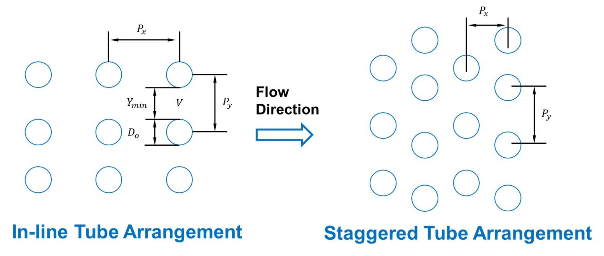

BoilerHeatExchanger2D
=====================

.. index::
   pair: idaes.power_generation.unit_models.boiler_heat_exchanger_2D; HeatExchangerCrossFlow2D_Header

.. currentmodule:: idaes.power_generation.unit_models.boiler_heat_exchanger_2D

The BoilerHeatExchanger2D model can be used to represent boiler heat exchangers in
sub-critical and super critical power plant flowsheets (i.e. econmizer, primary superheater, secondary superheater, finishing superheater, reheater, etc.).
The model consists of a shell and tube crossflow heat exchanger, in which the shell is used as the gas side and the tube is used as the water or steam side.
Due to the fluid temperature changes along the flow paths inside and outside of the tubes, the velocities of the fluids also change from the inlet to the outlet, causing the changes of heat transfer coefficients and friction factors on both sides along the flow paths.  If the flows on both sides can be discretized along the flow paths, local temperature difference between the hot and cold streams (the driving force for heat transfer), local heat transfer coefficients and local friction factors can be used and a more accurate model can be constructed.  Figure 1 shows a schematic of the shell and tube cross-flow heat exchanger.  In this figure, the hot fluid on the shell side flows from left to right while the cold fluid flows through the tubes up and down.  Notice that the cold fluid may enter the tube bundle in multiple rows (2 rows shown in the figure) and flow in parallel.  The dash lines show the discretization along the flow path of the hot shell-side flow.  The dash lines also cut the tube side flow to multiple segments with the direction of the flow inside the tube switching in two neighboring segments.  The flow properties such as heat transfer coefficients and friction factors are calculated in individual discretized elements.  Meanwhile the overall flow configuration is either a co-current or counter-current.  Counter-current configuration are shown in Figure 1.  Since the tube-side flow switches direction from one discretized section to another, pressure drop due the U-turn is also modeled based on the loss coefficient of the U-turn.  If the elevation changes between the tube inlet and outlet, the pressure change due to gravity for the tube side fluid is also modeled in each element.
Rigorous heat transfer calculations (convective heat transfer for shell side, and convective heat transfer for tube side) and shell and tube pressure drop calculations have been included.

  Cross-flow heat exchanger

In a transient heat transfer process such as in a load ramping operating condition, tube metal wall contains internal energy and its change with time represents the accumulation term (source or sink) in the energy conservation equation.  Due to the high density and high heat capacity of the tube metal, its energy holdup should not be ignored.  In other words, the transient tube wall temperatures and its distribution along the wall thickness and along the flow path need to be solved.  In addition to the discretization along the flow path direction, the discretization along the tube wall thickness at each discretized flow path section is required, which make the heat exchanger model a 2-D model.  Besides, the temperature gradient along the tube thickness is also required to calculate the thermal stress and other equipment health related properties.
Figure 2 shows the discretization of tube wall temperature along the tube radius direction.
The transient tube wall temperature T_(w,r)  at each discretized radius r is calculated based on transient heat conduction equation(Eqn. 1), and in the cylindrical coordinate system the heat conduction equation is shown in equation 2.

  Cross-flow heat exchanger

where, T_(w,r) is the tube metal temperature, t is time, alfa is termal diffusivity of the tube metal, typically steel, and r is the radius. This partial differential equation can be discretized by Pyomo-DAE in the radius direction. The heat accumulation in the tube metal is represented by the solution of the transient temperatures along the radius direction.

The HeatExchangerCrossFlow2D_Header model can be imported from :code:`idaes.power_generation.unit_models`,
while additional rules and utility functions can be imported from
``idaes.power_generation.unit_models.boiler_heat_exchanger2D``.

Degrees of Freedom
------------------

The configuration variables for the 2-D heat exchanger model include the inside diameter of the tube and thickness of the tube.
They are used as parameters of the model and have to be declared for discretization in the radius direction.
Once declared as configuration arguments, they are not allowed to change (immutable). Other configuration variables include “finite_elements” (the number of elements) in the flow path direction, “radial_elements” (the number of elements in radius direction, “tube_arrangement” for either staggered or in-line arrangement, “has_radiation” if shell-side radiation heat transfer is considered, and “flow_type” for either co-current or counter-current configuration. Additionally, has_header has been added as a configuration argument, when it is True, the health of the water/steam headers is calculated (see header section).
The main input variables for the 2-D cross-flow heat exchanger model include design variables such as number of tube segments, number of tube columns, number of tube inlet rows, length of the tube in each segment (each pass), pitches in directions parallel and perpendicular to the shell fluid flow, and elevation change from tube inlet to tube outlet. The thermal and transport properties are also required as well as the mechanical properties if the equipment health model is used. Other required operating variables include fouling resistances on both tube and shell sides, tube wall emissivity if radiation model is turned on, and correction factors for heat transfer and pressure drops on both sides.
Given the inlet conditions such as pressures, temperatures and flow rates on both sides, the outlet conditions will be predicted by the model. Meanwhile the temperature and pressure distributions along the flow path direction will be solved on both sides.  The 2-D tube wall temperature distribution will also be solved.

In order to capture off design conditions and heat transfer coefficients at ramp up/down or load following conditions, the BoilerHeatExchanger2D
model includes rigorous heat transfer calculations. Therefore, additional degrees of freedom are required to calculate Nusselt, Prandtl, Reynolds numbers, such as:

* tube_di (inner diameter)
* tube length
* tube number of rows (tube_nrow), columns (tube_ncol), and inlet flow (nrow_inlet)
* pitch in x and y axis (pitch_x and pitch_y, respectively)

If pressure drop calculation is enabled, additional degrees of freedom are required:

* elevation with respect to ground level (delta_elevation)
* tube fouling resistance (tube_r_fouling)
* shell fouling resistance (shell_r_fouling)

Model Structure
---------------

The ``HeatExchangerCrossFlow2D_Header`` model contains two ``ControlVolume1DBlock`` blocks. By default the
gas side is named ``shell`` and the water/steam side is named ``tube``. These names are configurable.
The sign convention is that duty is positive for heat flowing from the hot side to the cold
side.

The control volumes are configured the same as the ``ControlVolume1DBlock`` in the
:ref:`Heater model <reference_guides/model_libraries/generic/unit_models/heater:Heater>`.
The ``HeatExchangerCrossFlow2D_Header`` model contains additional constraints that calculate the amount
of heat transferred from the hot side to the cold side.

The ``HeatExchangerCrossFlow2D_Header`` has two inlet ports and two outlet ports. By default these are
``shell_inlet``, ``tube_inlet``, ``shell_outlet``, and ``tube_outlet``. If the user
supplies different hot and cold side names the inlet and outlets are named accordingly.

Variables
---------

=========================== ================== =========== =============================================================================
Variable                    Symbol             Index Sets  Doc
=========================== ================== =========== =============================================================================
heat_duty                   :math:`Q`          time        Heat transferred from hot side to the cold side
area                        :math:`A`          None        Heat transfer area
U                           :math:`U`          time        Heat transfer coefficient
delta_temperature           :math:`\Delta T`   time        Temperature difference, defaults to LMTD
=========================== ================== =========== =============================================================================

Note: ``delta_temperature`` may be either a variable or expression depending on the callback used.  If the specified cold side is hotter
than the specified hot side this value will be negative.

Constraints
-----------

The default constraints can be overridden by providing :ref:`alternative rules
<reference_guides/model_libraries/generic/unit_models/heat_exchanger:Callbacks>` for
the heat transfer equation, temperature difference, heat transfer coefficient, shell
and tube pressure drop. This section describes the default constraints.

Heat transfer from shell to tube:

.. math::
  Q = UA\Delta T

Temperature difference is:

.. math::
  \Delta T = \frac{\Delta T_1 - \Delta T_2}{\log_e\left(\frac{\Delta T_1}{\Delta T_2}\right)}

The overall heat transfer coefficient is calculated as a function of convective heat transfer shell and tube, and wall conduction heat transfer resistance.

Convective heat transfer equations:

.. math::
    \frac{1}{U}*fcorrection_{htc} = [\frac{1}{hconv_{tube}} + \frac{1}{hconv_{shell}} + r + tube_{r fouling} + shell_{r fouling}]

Tube convective heat transfer (for all elements in tube discretization approach):

.. math::
    hconv_{tube} = \frac{Nu_{tube} k}{2tube_{ri}}

.. math:: Nu_{tube} = 0.023 Re_{tube}^{0.8} Pr_{tube}^{0.4}

.. math:: Pr_{tube} = \frac{Cp  \mu}{ k  Mw}

.. math:: Re_{tube} = \frac{tube_{ri}2 V \rho}{\mu}

Shell convective heat transfer:

.. math:: hconv_{shell} = \frac{Nu_{shell} k_{flue gas}}{tube_{do}}
.. math:: Nu_{shell} = f_{arrangement} 0.33 Re_{tube}^{0.6} Pr_{tube}^{0.3333}
.. math:: Pr_{shell} = \frac{Cp  \mu}{ k  Mw}
.. math:: Re_{shell} = \frac{tube_{do}  V  \rho}{\mu}
.. math:: tube_{do}  = 2*tube_{thickness} + tube_{di}

Wall heat conduction resistance equation:

.. math:: r = 0.5 * tube_{do} * \log{(\frac{tube_{do}}{tube_{di}})}*k

where:

* hconv_tube : convective heat transfer resistance tube side (fluid water/steam) (W / m2 / K)
* hconv_shell : convective heat transfer resistance shell side (fluid Flue Gas) (W / m2 / K )
* Nu : Nusselt number
* Pr : Prandtl number
* Re : Reynolds number
* V: velocity (m/s)
* tube_di : inner diameter of the tube (m)
* tube_do : outer diameter of the tube (m) (expression calculated by the model)
* tube_thickness : tube thickness (m)
* r = wall heat conduction resistance (K m^2 / W)
* k : thermal conductivity of the tube wall (W / m / K)
* :math:`\rho` : density (kg/m^3)
* :math:`\mu` : viscocity (kg/m/s)
* tube_r_fouling : tube side fouling resistance (K m^2 / W)
* shell_r_fouling : shell side fouling resistance (K m^2 / W)
* fcorrection_htc: correction factor for overall heat trasnfer
* f_arrangement: tube arrangement factor

Note:
by default fcorrection_htc is set to 1, however, this variable can be used to match unit performance (i.e. as a parameter estimation problem using real plant data).

Tube arrangement factor is a config argument with two different type of arrangements supported at the moment:
1.- In-line tube arrangement factor (f_arrangement = 0.788), and 2.- Staggered tube arrangement factor (f_arrangement = 1). f_arrangement is a parameter that can be adjusted by the user.

The ``HeatExchangerCrossFlow2D_Header`` model includes an argument to compute heat tranfer due to radiation of the flue gases. If has_radiation = True the model builds additional heat transfer calculations that will be added to the hconv_shell resistances.
Radiation effects are calculated based on the gas gray fraction and gas-surface radiation (between gas and shell).

.. math::
    Gas_{gray frac} = f (gas_{emissivity})
.. math::
    frad_{gas gray frac} = f (wall_{emissivity}, gas_{emissivity})

.. math::
    hconv_{shell_rad} = f (k_{boltzmann}, frad_{gas gray frac}, T_{gas in}, T_{gas out}, T_{fluid in}, T_{fluid out})

Note:
Gas emissivity is calculated with surrogate models (see more details in boiler_heat_exchanger.py).
Radiation = True when flue gas temperatures are higher than 700 K (for example, when the model is used for units like Primary superheater, Reheater, or Finishing Superheater;
while Radiation = False when the model is used to represent the economizer in a power plant flowsheet).

If pressure change is set to True, :math:`deltaP_{uturn} and friction_{factor}` are calculated

Tube side:

.. math:: \Delta P_{tube} = \Delta P_{tube friction} + \Delta P_{tube uturn} - elevation * g *\frac{\rho_{in} + \rho_{out}}{2}

.. math:: \Delta P_{tube friction} = f( tube_{di} \rho, V_{tube}, number of tubes, tube_{length})

.. math:: \Delta P_{tube uturn} = f(\rho, v_{tube}, k_{loss uturn})

where:

* :math:`k_{loss uturn}` : pressure loss coeficient of a tube u-turn
* g : is the acceleration of gravity 9.807 (m/s^2)

Shell side:

.. math:: \Delta P_{shell} = 1.4 \Delta P_{shell friction} \rho V_{shell}^2

:math:`\Delta P_{shell friction}` is calculated based on the tube arrangement type:

In-line: :math:`\Delta P_{shell friction} = \frac{ 0.044 + \frac{0.08 ( \frac{P_x}{tube_{do}} ) } {(\frac{P_y}{tube_{do}}-1)^{0.43+\frac{1.13}{(\frac{P_x}{tube_{do}})}}}}{Re^{0.15}}`

Staggered: :math:`\Delta P_{shell friction} = \frac{ 0.25 + \frac{0.118}{(\frac{P_y}{tube_{do}} -1)^{1.08}} }{Re^{0.16}}`

Figure. Tube Arrangement

  Tube Arrangement

Header Health Model
-------------------
The heat exchanger 2D model allows the user to calculate the thermal and mechanical stresses of the water/steam headers connected to the outlet of the tube side. Additionally, the rupture time and fatigue calculation of allowable cycles are computed by the model.
A simplified 1D PDE problem is developed to represent the heat conduction transient through the radius of the superheater/reheater headers.
Regarding to the flow path configuration (counter-current or co-current) of the 2D heat exchanger, the first or the last discretization point will be used to define the boundary of the headers.
For this example, the last discretization point will be used for the outlet superheater header due to the counter-current flow configuration. Under the assumptions of constant conductivity and no heat generation, the Fourier’s equation is converted to the Eq. (h1) for the cylindrical header. The Pyomo.DAE framework is applied to solve the PDE problem. The thermal and mechanical stresses are calculated based on the pressure and temperature difference between both sides of the header which can be used to evaluate the allowable number of cycles of the main body and the critical point of the edge of the hole.

.. math:: \frac{1}{a} \frac{\partial T}{\partial t} = \frac{{\partial}^2 T}{\partial r^2} + \frac{1}{r} \frac{\partial T}{\partial r}

where T is wall temperature (K), r is radius (m), and a is the material thermal difussivity (m2/s). The material thermal difussivity is a function of (material thermal conductivity, specific heat, and density)

Detailed description of the mechanical stress calculations and thermal stress calculations can be found in S. Bracco, 2012 and Taler & Duda, 2006, respectively.

Rupture time calculation: The creep phenomenon is an important design consideration in the analysis of structures.
At the high temperature operation, the creep is coupled with fatigue due to cycling, the damage will be much higher than that occurring if the same fatigue or creep is working alone.
For example, a long-time creep rupture strength values can be derived by using the Manson-Haferd model. However, depending on the investigated material, users can find another correlation to calculate the rupture strength in the open literature.

Fatigue calculation of allowable cycles:
For general ferritic and austenitic materials, the calculation of the allowable number of cycles are expressed in the following equation. However, the users can be recommended to find a specific fatigue equation for their own material to obtain a better result.
Using the calculated stresses above, the number of allowable cycles of the component can be evaluated based on fatigue assessment standard, such as EN 13445. The detail of the developed approach can be found in Bracco’s report (S. Bracco, 2012). This model can be applied for both drum and thick-walled components such as header. According to the EN 13445 standard, for a single cycle, the allowable number of fatigue cycles N can be computed as:

.. math:: N = \frac{46000}{\Delta\Sigma R_i - 0.63 R_m + 11.5}

where Rm is the material tensile strength at room temperature while the reference stress range :math:`\Delta\SigmaR_i` depends on the stress range :math:`\Delta\Sigma_i`

Bracco, S. (2012). Dynamic simulation of combined cycles operating in transient conditions: An innovative approach to determine the steam drums life consumption. In Proceedings of the 25th International Conference on Efficiency, Cost, Optimization and Simulation of Energy Conversion Systems and Processes, ECOS 2012.
Taler, J., & Duda, P. (2006). Solving direct and inverse heat conduction problems. Solving Direct and Inverse Heat Conduction Problems. Springer Berlin Heidelberg. https://doi.org/10.1007/978-3-540-33471-2

Class Documentation
-------------------

.. autoclass:: HeatExchangerCrossFlow2D_Header
   :members:

.. autoclass:: HeatExchangerCrossFlow2D_HeaderData
   :members:
