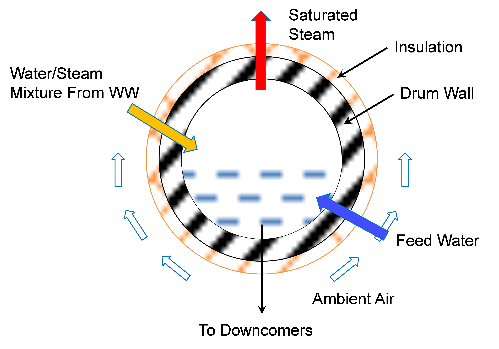
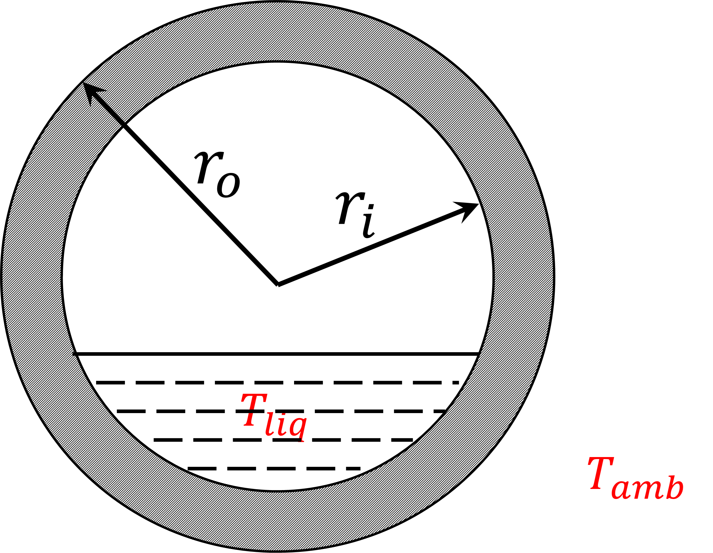

Drum 1D Model
=============

.. index::
  pair: idaes.power_generation.unit_models.drum1D;Drum1D

.. currentmodule:: idaes.power_generation.unit_models.drum1D

Introduction
------------
The 1-D drum model is similar to the 0-D drum model, however, the 1-D heat conduction through the radius or thickness of the drum wall is modeled. 
The heat conduction through insulation is modeled as steady state and no energy holdup or accumulation in the insulation layer is considered. Dynamics and energy holdup are accounted for in the drum metal.

Similar to the drum model, the drum 1D model consists of three main sub-unit operations: 

1) a flash model to separate the saturated steam from the saturated liquid water in the water/steam mixture, 
2) a mixer model to mix saturated liquid water with feed water, and 
3) a water tank model to calculate drum level and pressure drop.

First the water/steam mixture from boiler waterwall tubes (risers) enters the flash model and leaves in two separate streams (liquid water and steam). 
Then, the saturated water from the flash model is mixed with the feed water stream (typically from the economizer or a water pipe linking the economizer and the drum) 
and leave the mixer model in a single mixed stream. Finally, the mixed stream enters the water tank of the drum and leaves the vessel through the multiple downcomers (see Figure 1).

The sub-unit models for the flash and the mixer (Items 1 and 2 in the above list) are identical to the 0-D drum model.  The main difference between them is the way the horizontal water tank model is modeled, especially with respect to the heat transfer from the liquid water through the drum metal wall, its insulation layer and to the ambient air. In other words, the drum is not adiabatic.
The heat transfer from the liquid water in the drum to the ambient air includes a) convective heat transfer between the liquid water and the wetted inner wall of the drum, b) heat conduction from the inner drum wall to the outer drum wall through the drum metal thickness, c) heat conduction from the insulation layer inner wall to its outer wall, and d) natural heat convection from the insulation outer wall to the ambient air, typical at a room temperature.
Figure 1 is a schematic of the cross-sectional area of the drum.  As can be seen in the figure, the liquid water occupies the lower part of the drum and the saturated steam occupies the upper part.  The metal wall and insulation layer are also shown in the figure.  The water/steam mixture and feed water enter the drum while the saturated steam leaves the drum through the pipes in the upper part and the subcooled water leaves the drum to the downcomers.

    
    Figure 1. Schematic of a boiler drum with metal wall and insulation layer

Inlet Ports:

* water_steam_inlet: water/steam mixture from waterwall
* feedwater_inlet: feedwater from economizer/pipe

Outlet Ports:

* liquid_outlet: liquid to downcomer
* steam_outlet: saturated steam leaving the drum

Variables
---------

Model inputs (variable name):

* water/steam inlet (water_steam_inlet: flow_mol, enth_mol, pressure)
* feedwater inlet (feedwater_inlet: flow_mol, enth_mol, pressure)
* drum diameter (drum_diameter)
* drum length (drum_length)
* number of downcomer tubes (number_downcomers)
* downcomer diameter (downcomer_diameter)
* drum level (drum_level)
* heat duty (heat_duty)

Model Outputs:

* vapor outlet (vap_outlet: flow_mol, enth_mol, pressure)
* liquid outlet (liq_outlet: flow_mol, enth_mol, pressure)

Constraints
-----------

As mentioned above, the drum model imports a `HelmPhaseSeparator` and mixer models, specific documentation for these models can be obtained in: 
Once the water enters the tank model the main equations calculate water velocity and pressure drop calculation due to gravity based on water level and contraction to downcomer. 
Water level (drum_leve) is either fixed for steady state simulation or calculated for dynamic model (Dynamic = True)

Main assumptions:

1) Heat loss is a variable given by the user (zero heat loss can be specified if adiabatic)
2) Pressure change due to gravity based on water level and contraction to downcomer is calculated
3) Water level is either fixed for steady-state model or calculated for dynamic model
4) Assume enthalpy_in == enthalpy_out + heat loss + energy accumulation
5) Subcooled water from economizer and saturated water from waterwall are well mixed before entering the drum

Pressure equality constraint:

.. math::
  P_{SaturatedWater} = P_{FeedWater}

Pressure drop in unit:

.. math::
  deltaP = deltaP_{contraction} + deltaP_{gravity}

.. math::
  deltaP_{gravity} = f(\rho_{liquid}, acceleration  gravity, drum\_level)

.. math::
  deltaP_{contraction} = f(\rho_{liquid}, V)

where:
* V: fluid velocity (m/s, liquid only)

Note that the model builds an Pyomo Arc to connect the Liquid_outlet from the self.aFlash unit to the SaturatedWater inlet port of the mixer, and the mixed_state (Mixer outlet) is directly constructed as the Drum `control_volume.properties_in`. 
Once the Drum model is constructed, the mixer and flash blocks can be found as `self.aDrum.aMixer` and `self.aDrum.aFlash`

Convective heat transfer:
Strictly speaking, the inner drum wall temperature is not uniform along the circumference since the temperature of the wetted lower section is different from that of the upper section in contact with the saturated steam.  The heat convection between the liquid water and the inner drum wall is considered as the dominant mechanism compared to the heat convection between the saturated steam and the inner drum wall in the upper dry section.  The main assumption for the 1-D drum model is that the latter part can be ignored and inner drum wall temperature is uniformly distributed.
The convective heat transfer coefficient between the liquid water and the inner wetted wall (wetted section only) is calculated based on pool boiling assumption

.. math:: h_{in} = f (Pr, Pred, Mw, T_{wall,in}, T_{liq})

where P_red is the reduced pressure (ratio of the drum pressure to the critical pressure of water), Mw is the molecular weight of water in mol/g, T_(wall,in) is the wetted drum inner wall temperature, and T_liq is the liquid water temperature.
The heat transfer coefficient of the natural heat convection h_(conv,ins) at the outer insulation wall can be calculated from the Nusselt number N_u by.

.. math:: h_{conv,ins}=\frac{N_u k_{air}}{D_{o,ins}}

where D_(o,ins) is the outside diameter of the insulation layer and k_air is the thermal conductivity of air.  The N_u for natural convection of a horizontal cylindrical wall is correlated to Rayleigh number R_a and Prandtl number of air P_(r,air) by

The Rayleigh number R_a is defined as

.. math:: R_a=\frac{gβ(T_{wall,out,ins}-T_{amb}) D_{o,ins}^3}{να}

where g is gravity, β is thermal expansion coefficient of air, T_(wall,out,ins) is the outside insulation wall temperature, T_amb is the ambient temperature, ν is kinematic viscosity of air, and α is thermal diffusivity of air.  To simplify the model, the thermal and transport properties of air are assumed to be constant at a film temperature, the average of the room temperature of 25 C and a insulation wall temperature of 80 C.

The equivalent heat transfer coefficient of the natural convection at the drum metal wall outside the boundary (hconv,drum) can be calculated from hconv,ins as:

.. math:: h_{conv,drum} = \frac{D_{o,ins} h_{conv,ins}}{D_{o,drum}}

where D_(o,drum) is the outside diameter of the drum metal wall

The energy accumulation for the insulation layer is ignored due to its low heat capacity compared with the drum metal wall. The heat transfer resistance of the insulation layer based on inner insulation area is considered though (r_ht,ins).
The heat transfer resistance of the insulation layer and the natural heat convection are combined to obtain the equivalent overall heat transfer coefficient at the outer boundary of the drum metal wall (hout).

The heat conduction through the thickness or radius of the drum metal can be described by a transient heat conduction equation of solid as

.. math:: \frac{\partial{T}}{\partial{t}} = \alpha \nabla^2 T

In cylindrical coordinate system, it can be written as

.. math:: \frac{\partial{T}}{\partial{t}} = \alpha \frac{\partial^2 T}{\partial{r}^2} + \frac{\alpha}{r} \frac{\partial{T}}{\partial{t}}

where T is the drum metal temperature, t is time, α is thermal diffusivity of drum metal, typically steel, and r is the radius.  This partial differential equation can be discretized by Pyomo-DAE in the radius direction.  The heat accumulation in the drum metal is represented by the solution of the transient temperatures along the radius direction.
To solve the transient heat conduction problem, we need to specify the boundary conditions.  Figure 2 shows the drum metal wall and the liquid water inside the drum.

    
    Figure 2.  Drum metal wall with liquid water

Drum Health Model
-----------------
The model can be used to calculate the stress and allowable number of cycles of both the main body and location of critical point of the opening junction. 
During transient operation, the component is subject to variations of pressure and temperature which cause thermal stress and thermo-mechanical fatigue. The temperature difference in both sides of the metal causes the thermal stress. Also, the cylinder is subjected to an inside and outside pressure, which can obtain the mechanical stresses. 
The mechanical and thermal stresses are considered:

* Mechanical stress is calculated using S. Bracco, 2012 reference, and it is a function of the pressure and radius at the inside and outside surfaces.
* Thermmal stress is calculaed using Taler & Duda, 2006 refernce, and it is a function of the Young modus, a linear temperature expansion coefficient, and Poisson ratio of the steel material.

Fatigue calculation of allowable cycles:
Using the calculated stresses above, the number of allowable cycles of the component can be evaluated based on fatigue assessment standard, such as EN 13445. The detail of the developed approach can be found in Bracco’s report (S. Bracco, 2012). This model can be applied for both drum and thick-walled components such as header. According to the EN 13445 standard, for a single cycle, the allowable number of fatigue cycles N can be computed as a funciton of the material tensile strength at room temperature and a reference stress range.

[1] Bracco, S. (2012). Dynamic simulation of combined cycles operating in transient conditions: An innovative approach to determine the steam drums life consumption. In Proceedings of the 25th International Conference on Efficiency, Cost, Optimization and Simulation of Energy Conversion Systems and Processes, ECOS 2012.

[2] Taler, J., & Duda, P. (2006). Solving direct and inverse heat conduction problems. Solving Direct and Inverse Heat Conduction Problems. Springer Berlin Heidelberg. https://doi.org/10.1007/978-3-540-33471-2

[3] European standard EN 13445: 2002 (2005). Unfired pressure vessels, (parts 1-5), CEN European Committee for Standardization, Part 3: Design, Issue 14.

Degrees of Freedom
------------------
Once the unit dimensions have been fixed, the model generally has 5 degrees of freedom. The water/steam mixture inlet state (flow_mol, enth_mol, and pressure) and feewater inlet state (flow_mol and enth_mol). The feedwater inlet pressure is usually free due to the pressure equality mentioned above.

Dynamic Model
-------------

The dynamic model version of the drum model can be constructed by selecting dynamic=True. 
If dynamic = True, material accumulation, energy accumulation, and drum level must be calculated. Therefore, a dynamic initialization method has been developed `set_initial_conditions` to initialize the holdup terms.
