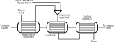

Feedwater Heater Dynamic (0D)
=============================

.. index::
    pair: idaes.power_generation.unit_models.feedwater_heater_0D_dynamic;FWH0DDynamic

.. module:: idaes.power_generation.unit_models.feedwater_heater_0D_dynamic
  :noindex:

The FWH0DDynamic model is a 0D feedwater heater model suitable for dynamic modeling.
It is intended to be used primarily with the
:ref:`IAWPS95 <reference_guides/model_libraries/generic/property_models/iapws95:International Association of the Properties of Water and Steam IAPWS-95>` property package.
The feedwater heater is split into three sections. The condensing section is required while
the desuperheating and drain cooling sections are optional. There is also an optional mixer
for adding a drain stream from another feedwater heater to the condensing section.  The figure
below shows the layout of the feedwater heater.  All but the condensing section are optional.

  Feedwater Heater

Features of Dynamic Model
-------------------------

The dynamic version of the 0-D feed water heater model is based on the steady-state feed water heater 0D model
:ref:`FWH0D <reference_guides/model_libraries/power_generation/unit_models/feedwater_heater_0D:Feedwater Heater (0D)>`.
It contains additional variables related to the mass and energy inventories inside the condensing section of the feed water heater
on both the tube and the shell sides.  The desuperheater and drain cooler sections, if any, are usually treated as steady-state.
For the condensing section, the tubes are always filled with condensate or feed water and the total volume of the liquid inside the tube is usually specified as a user input.
The shell side, however, is partially filled with saturated liquid water and the water level changes with time and so is the volume of the saturated water.
Only the horizontal design of the feed water heater is modeled here and it usually consists of a cylindrical tank with a fraction of its internal volume
occupied by the heat transfer tubes with the remaining gaps between the tubes occupied either by the steam or the saturated water.
The shell side of the condenser section is modeled as a horizontal cylinder similar to that in a drum model :ref:`Drum1D <reference_guides/model_libraries/power_generation/unit_models/drum1D:Drum 1D Model>`
with the total volume of the shell side liquid and the submerged tubes calculated from the water level (see the description of the drum model).
The volume of the saturated liquid is simply a fraction of the total volume.
Therefore, the additional input variables in the dynamic version of the feed water heater model include the inner diameter of the feed water heater cylinder,
the length of the condensing section, the fraction of the volume occupied by the shell side liquid (gaps between the tubes),
and the volume of the feed water inside the tubes of the condensing section.
Those input variables are constant (do not change with time) for a given design.  In addition,
the water level defined as the distance from the bottom of the cylinder to the top of the water is also included in the model and indexed by time.
The dynamic version of the feed water heater model provides the constraint (equation) to calculate the volume of the shell-side liquid as
a function of the water level.  The mass and energy accumulation terms are handled by the IDAES control volume class based on
the volumes of the tube-side and the shell-side liquids.  Since the density of the steam on the shell side is much lower than the density of the liquid,
the mass and energy accumulations of the steam above the water level are ignored.

Note that the total heat transfer area and overall heat transfer coefficient are required inputs as in the steady-state model for the condensing section.
The overall heat transfer coefficient is dominated by the tube-side convective heat transfer coefficient since the shell-side heat transfer coefficient
is usually very high due to the phase change.  Based on an empirical correlation (Bird et al, 1960),
the Nusselt number on the tube side is proportional to the Reynolds number to the power of 0.8.  Therefore, the overall heat transfer coefficient is
approximately proportional to the feed water flow rate to the power of 0.8.
A flowsheet level constraint can be imposed to account for the effect of feed water flow rate on the overall heat transfer coefficient.

Initialial Condition of Dynamic Model
-------------------------------------

Typical initial condition for the dynamic model is a steady state condition. The user can call `set_initial_condition` function of the model to
initialize the variables related to the material and energy accumulation terms for the dynamic model.  Note that the water level at the initial time
usually should be fixed to ensure the inventories of mass and energy are well defined.

Degrees of Freedom
------------------

The ``area`` and ``overall_heat_transfer_coefficient`` should be fixed or constraints should be provided to calculate ``overall_heat_transfer_coefficient``.
In addition, the geometry variables related to the condensing section including ``heater_diameter``, ``cond_sect_length``, ``vol_frac_shell``, and ``tube.volume`` should be fixed.
The initial value of ``level`` should also be fixed.

If the inlets are also fixed except for the inlet steam flow rate (``inlet_1.flow_mol``), the model will have 0 degrees of freedom.

See :class:`FWH0DDynamic` and :class:`FWH0DDynamicData` for full Python class details.
