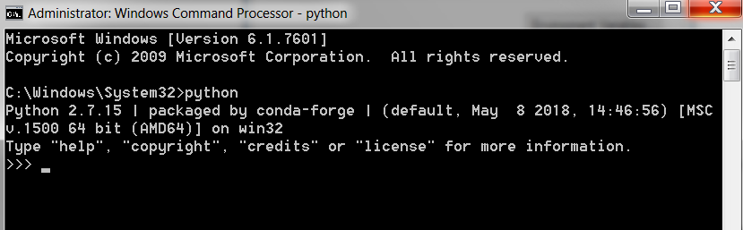

Installation Instructions
=========================

.. contents:: Contents

The IDAES toolkit is written in Python. It should run under versions of Python 2.7 and 3.6, and above. The toolkit uses [Pyomo](https://www.pyomo.org), a Python-based optimization language. See the Pyomo website for details.

.. note:: Although Python can run on most operating systems, *we are currently only
    supporting installation of the IDAES PSE framework on Linux*. This is due largely
    to complications of installing third-party solvers, not inherent properties
    of the PSE framework itself, and we plan to support Windows and Mac OSX
    installation in the not-too-distant future.

Dependencies
------------

Some of the model code depends on external solvers. All of the solvers are optional to some extent, however IPOPT is used extensively.

Solvers
^^^^^^^

**CPLEX**

* `Getting CPLEX <https://www.ibm.com/developerworks/community/blogs/jfp/entry/CPLEX_Is_Free_For_Students?lang=en>`_
* `Setting up CPLEX Python <http://www.ibm.com/support/knowledgecenter/SSSA5P_12.5.1/ilog.odms.cplex.help/CPLEX/GettingStarted/topics/set_up/Python_setup.html>`_

**Gurobi**

* `Gurobi license <https://user.gurobi.com/download/licenses/free-academic>`_
* `Gurobi solver <http://www.gurobi.com/downloads/gurobi-optimizer>`_
* `Gurobi Python setup <http://www.gurobi.com/documentation/6.5/quickstart_mac/the_gurobi_python_interfac.html>`_

**IPOPT**

* Installing `IPOPT <https://www.coin-or.org/Ipopt/documentation/node10.html>`_

Function Dependencies
^^^^^^^^^^^^^^^^^^^^^

In some cases, IDAES uses AMPL user-defined functions written in C for property
models.  Compiling these functions is optional, but some models may not work
without them.

**ASL**

The AMPL solver library (ASL) is required, and can be downloaded from
from https://ampl.com/netlib/ampl/solvers.tgz.  Documentation is available at
https://ampl.com/resources/hooking-your-solver-to-ampl/. Typically to build the
ASL the files can be extracted, then in the directory with the ASL file run the
commands below.

.. code-block:: sh

  ./configure
  make

**Boost**

The C++ Boost libraries should be available. One possibility is to use conda to
install boost, but the best option depends on your system.

Installation on Linux/Unix
--------------------------

Install IDAES
^^^^^^^^^^^^^^

* The installation instructions assume a Python packaging system called [Conda](https://conda.io/docs/) is available. Please first consult the [Conda documentation](https://conda.io/docs/user-guide/) to install this on your system. You can use either Anaconda or Miniconda.

* Conda allows you to to create separate environments containing files, packages and their dependencies that will not interact with other environments.

**Create/switch to your preferred Python environment**

.. code-block:: sh

  conda create -n idaes python=3 pyqt
  source activate idaes

You can replace idaes with any name you like.  PyQt is used for some IDAES
graphical user interface elements.

**Install the master branch of IDAES from GitHub:**

.. code-block:: sh

  git clone https://github.com/IDAES/idaes.git
  cd idaes

**Install the requirements**

.. code-block:: sh

  pip install -r requirement.txt`

**Install the IDAES Framework**

  To compile C functions for some property models, the location of the compiled ASL is required
  for the commands below a location of :code:`$HOME/local/src/solvers/sys.x86_64.Linux`;
  however, this location will depend on your system and where you put the files.

  The BOOST_HEADER environment variable can be set optionally if the the build
  fails due to not finding BOOST. This allows more flexibility for alternative
  locations.  Setting BOOST_HEADER is usually not needed.

  If make fails or you do not want to compile, you can skip to the last line, but
  some property packages may not work.

.. code-block:: sh

  export ASL_BUILD=$HOME/local/src/solvers/sys.x86_64.Linux
  make
  python setup.py develop

**OR**

.. code-block:: sh

  export ASL_BUILD=$HOME/local/src/solvers/sys.x86_64.Linux
  make
  python setup.py install

Installation on Windows
-----------------------

.. note:: We are NOT supporting Windows at this time. Some developers on the team have had success with the following instructions, but we do not promise that they will work for all users, nor will we prioritize helping debug problems.

Python Distribution
^^^^^^^^^^^^^^^^^^^

* Install `Anaconda for Windows <https://www.anaconda.com/download/#download>`_

* Add Anaconda and Anaconda scripts to the path "c:\users\<user>\Anaconda2\" and "c:\users\<user>\Anaconda2\Scripts\". To do this, search for "Edit system variables" in Windows search.  Click on "Edit system environment variables". Click on "Environment Variables". Under "System   Variables", search for the variable "Path" and click "Edit"

	.. image:: _static/install_windows_system_properties.png
	   :align: center
	   :scale: 75%

	1. For Windows 10:

	      1. In the new dialog box, click on "New" and add the path where you find the python.exe file. If you installed Anaconda2, this should be in “c:\users\<user>\Anaconda2\”. Copy the address and paste it here.

	      2. Repeat for "c:\users\<user>\Anaconda2\Scripts\".

   	2. For earlier versions:

	      1. Add path to the existing list, use semicolon as separator

	      2. Type "c:\users\<user>\Anaconda2\;c:\users\<user>\Anaconda2\Scripts\"

* Restart the command prompt and type `python`. If the path variable was added correctly, then you should be able to see the python interpreter as shown below.

Pyomo
^^^^^
* See `instructions <http://www.pyomo.org/installation/>`_ for pyomo installation. As mentioned, you can either use the pip or the conda install methods which come included with the Anaconda distribution but conda may be preferable if you installed Anaconda.

* To install pyomo using python’s **pip** package, follow these steps:

    1. Launch the "Anaconda prompt". You can find this in the start menu under Anaconda.

    2. Navigate to the "Scripts" folder in Anaconda. Or simply type, `where pip` in the prompt. This should return 1 paths and this should be in the scripts folder.

    3. Pip install pyomo from trunk (we recommend installing the IDAES branch of pyomo)

        1. Install the master branch of PyUtilib from GitHub using pip:

           `pip.exe install git+https://github.com/PyUtilib/pyutilib`

        2. Install the master branch of Pyomo from GitHub using pip:

           `pip.exe install git+https://github.com/Pyomo/pyomo@IDAES`

* To install using python’s **conda** package, follow the following steps:

    1. Launch the "Anaconda prompt". You can find this in the start menu under Anaconda.

    2. Navigate to the "Scripts" folder in Anaconda. Or simply type, `where conda` in the prompt. This should return 2 paths and one of these should be in the scripts folder.

    3. In the scripts folder run the following commands:

        `conda.exe install -c conda-forge pyomo`

        `conda.exe install -c conda-forge pyomo.extras`
* If the installation was successful, you should see the pyomo executable listed in the Scripts folder. You can check this using the `where pyomo` command.

IDAES
^^^^^

Option 1: Download zip file
"""""""""""""""""""""""""""
* From the `IDAES <https://github.com/IDAES/idaes>`_ repository on GitHub, click on "Clone or download" on the right in green. Click on “Download zip”.

* Extract the contents in the desired directory you want IDAES in.

* Open command prompt and navigate to the folder where you extracted the contents of the IDAES repository (`cd <user>/.../<desired directory>/IDAES/`).

    1. Run: `python setup.py develop`

Option 2: Using Git
"""""""""""""""""""

* Install `git <https://git-scm.com/download/win>`_ for Windows.

* If cloning the repository from the command line, move to a directory where you want to install the IDAES repository. Then run the following command:

	1. `git clone https://github.com/IDAES/idaes.git`

* Enter your github user id and password. The git installation in 1 should have added the git executable to your system path and you should be able to execute git commands from the command line.

* Open command prompt and navigate to the folder where you extracted the contents of the IDAES repository (`cd <user>/.../<desired directory>/IDAES/`).

   1. Run: `python setup.py develop`
