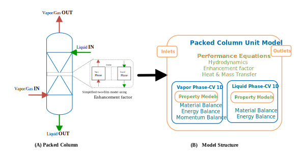
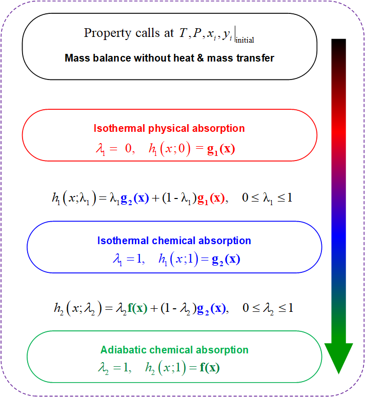

MEA Packed Column
=================

The first generation (GEN 1) rate-based  IDAES Packed Column model represents a
unit operation for MEA-based post-combustion carbon capture for both absorption
and stripping processes. The contactor model uses an enhancement factor model
that is superior to the Hatta number approximation and more accurate over a wide
range of operating conditions. The vapor and liquid streams flow in a
counter-current arrangement as shown in Figure 1(A). For more information on the Column model
see `Akula et al. (2021) <https://doi.org/10.1021/acs.iecr.0c05035>`_.

    **Figure 1. Schematic diagram of : (A) Packed column (B) Packed column structure in IDAES**

Degrees of Freedom
------------------

Once the configuration parameters (construction arguments of the ``PackedColumn``
Class) have been specified, the remaining degrees of freedom for the ``PackedColumn``
are the operating and design  parameters as listed in the Specification Table
below. The indexed components for ``mole_frac_comp`` depend on the phase and
``process_type`` as follows:

*  Vapor phase:
     * absorption process: ``H2O, CO2, N2, O2``.
     * stripping process: ``H2O, CO2``.

*  Liquid phase:
    * all process types: ``H2O, MEA and CO2``.

Due to the reactions in the liquid phase, the apparent species (``H2O, MEA and CO2``)
are reconstituted from the true species (``H2O, MEA, CO2, MEA+, MEACOO-, HCO3-``)
in the speciation model based on the kinetics below:

.. math:: \mathrm{CO_2 + 2MEA  \leftrightharpoons  MEA^{+} + MEACOO^{-}}
.. math:: \mathrm{CO_2 + MEA + H_2O  \leftrightharpoons  MEA^{+} + HCO^{-}_{3}}

Specification
^^^^^^^^^^^^^

.. csv-table::
   :header: "Variable Name", "Description", "Units"
   :widths: 18,30,8

   "**Configuration parameters**", " "," "
   "``process_type``","Flag indicating either absorption or stripping process", "None "
   "``packing_specific_area``","Specific surface area of packing", ":math:`m^{2}/m^{3}` "
   "``packing_void_fraction``","Void fraction of the packing", "None "
   "``fix_column_pressure``","Indicates whether the column pressure should be fixed", "None"
   "``column_pressure``","Value of fixed column pressure", ":math:`Pa` "
   "**Design parameters**", " ", " "
   "``diameter_column``", "Column diameter", ":math:`m`"
   "``length_column``", "Column length", ":math:`m`"
    "**Operating parameters**", " ", " "
   "``vapor_inlet.flow_mol``", "Vapor/Gas inlet total molar flowrate", ":math:`mol/s`"
   "``vapor_inlet.temperature``", "Vapor/Gas inlet temperature", ":math:`K`"
   "``vapor_inlet.pressure``", "Vapor/Gas inlet pressure", ":math:`Pa`"
   "``vapor_inlet.mole_frac_comp``", "Vapor/Gas inlet mole fraction indexed by component", "None"
   "``liquid_inlet.flow_mol``", "Liquid inlet total molar flowrate", ":math:`mol/s`"
   "``liquid_inlet.temperature``", "Liquid inlet temperature", ":math:`K`"
   "``liquid_inlet.pressure``", "Liquid inlet pressure", ":math:`Pa`"
   "``liquid_inlet.mole_frac_comp``", "Liquid inlet mole fraction indexed by component", "None"

Model Structure
---------------

The ``PackedColumn`` unit model consists of two
:ref:`ControlVolume1D Blocks <technical_specs/core/control_volume_1d:1D Control Volume Class>`
(named ``vapor_phase`` and ``liquid_phase``), each with one Inlet Port (named ``vapor_inlet``
and ``liquid_inlet``) and one Outlet Port (named ``vapor_outlet`` and ``liquid_outlet``)
as shown in Figure 1(B). The ``vapor_phase`` ControlVolume1D Block uses the
:ref:`Vapor Phase Property Methods <technical_specs/model_libraries/power_generation/carbon_capture/mea_solvent_system/properties/vapor_prop:Vapor Phase Property Methods>` while the ``liquid_phase``
ControlVolume1D Block block uses the :ref:`Liquid Phase Property Methods <technical_specs/model_libraries/power_generation/carbon_capture/mea_solvent_system/properties/liquid_prop:Liquid Phase Property Methods>`. Both property packages are built
off of the :ref:`Physical Property Package Class <technical_specs/core/physical_property_class:Physical Property Package Classes>`.

Additional Constraints (Performance Equations)
----------------------------------------------

The ``PackedColumn`` unit  writes additional ``Constraints`` beyond those written
by the :ref:`ControlVolume1D Blocks <technical_specs/core/control_volume_1d:1D Control Volume Class>`
to describe the reactive absorption / desorption
process for post-combustion carbon capture using MEA solvent.

Initialization
--------------

The ``PackedColumn`` unit uses  two homotopy/continuation parameters
( :math:`\lambda_{1}`, :math:`\lambda_{2}`) as shown in Figure 2 to initalize the column in
steady-state mode (this is extended over the entire time horizon for dynamic
simulation while fixing the accumulation terms to zero). The functions,
:math:`g_{1}(x)`, :math:`g_{2}(x)`, :math:`f(x)`, describe the ``Constraints``
when the homotopy parameters become zero or unity. The initialization
routine uses the user-provided inputs to initialize the properties and then
first solves only the material balance equations by turning off the heat and
mass transfer rates ``Constraints``. Then, the isothermal chemical absorption
continuation  parameter, :math:`\lambda_{1}`, is used to turn on the **mass transfer**
``Constraints`` gradually with values ranging from 0 to 1. Subsequently, the adiabatic
chemical absorption continuation parameter, :math:`\lambda_{2}`, is used to turn
on the **heat transfer** equations gradually with values ranging from 0 to 1 to
finish initializing the ``PackedColumn``. Lastly, for dynamic simulation, the
accumulation terms are computed to initialize the dynamic column.

    **Figure 2.  Packed Column Initialization Strategy**

PackedColumn Class
------------------

.. module:: idaes.power_generation.carbon_capture.mea_solvent_system.unit_models.column

.. autoclass:: PackedColumn
  :members:

PackedColumnData Class
----------------------

.. autoclass:: PackedColumnData
  :members:

References
------------

1. Akula, P., J. Eslick, D. Bhattacharyya and D. C. Miller (2021).
   "Model Development, Validation, and Optimization of an MEA-Based
   Post-Combustion CO2 Capture Process under Part-Load and Variable Capture Operations."
   Industrial & Engineering Chemistry Research. https://doi.org/10.1021/acs.iecr.0c05035
2. Eslick, J. C., Akula, P. T., Bhattacharyya, D., & Miller, D. C. (2018).
   Simultaneous parameter estimation in reactive-solvent-based processes.
   In Computer Aided Chemical Engineering (Vol. 44, pp. 901-906). Elsevier.
   https://doi.org/10.1016/B978-0-444-64241-7.50145-2
