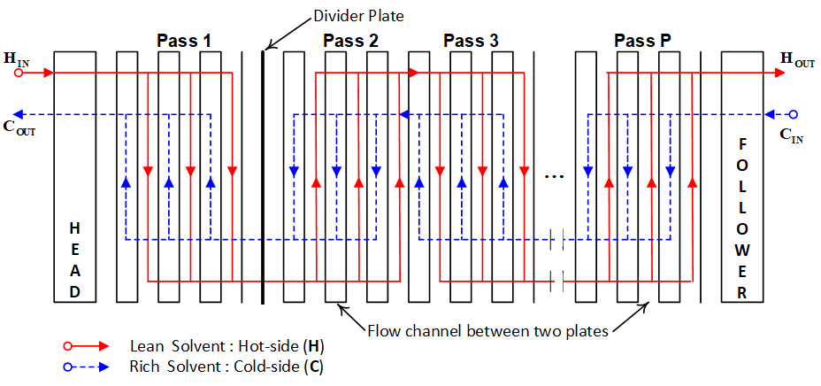
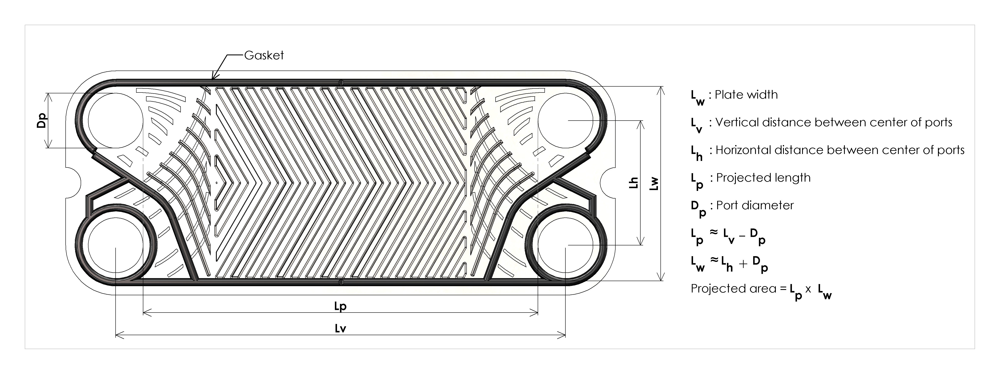

Plate Heat Exchanger
====================

The thermal model of IDAES Plate Heat Exchanger (PHE) as part of the MEA
scrubbing process for post-combustion carbon capture (PCC) is based on the
Effectiveness-Number of Transfer Units (e-NTU) approach. In amine-based PCC,
the rich solvent leaving the absorber is pre-heated in the PHE using heat recovered
from the lean solvent leaving the stripper to reduce the regeneration energy
requirement. In the PHE unit, the series of plates stacked together form channels
where hot and cold fluids flow alternatively as shown in Figure 1(A). Divider plates
enable the partitioning of PHEs into different operating zones. The main dimensions
of a gasket plate are shown in Figure 1(B). The PHE is a viable alternative to the
conventional Shell and Tube Heat Exchanger specifically because of its lower
approach temperature difference capability. For more information on the PHE model
see `Akula et al. (2019) <https://doi.org/10.1016/B978-0-12-818597-1.50008-4>`_.

  **Figure 1(A). Z-configuration Plate Heat Exchanger with P passes**

  **Figure 1(B). Basic details of a Chevron Plate**

Degrees of Freedom
------------------

The Plate Heat Exchanger model has 3 design parameters and 7 design variables.

Design Parameters and Variables:

    * number of passes (mutable parameter),
    * channels per pass (mutable parameter),
    * number of divider plates (mutable parameter,
    * plate length,
    * plate width,
    * plate thickness,
    * port diameter,
    * plate thermal conductivity, and
    * total heat transfer area.

Model Structure
---------------

The Plate Heat Exchanger unit model builds off the core 
:ref:`HeatExchangerNTU model <technical_specs/model_libraries/generic/unit_models/heat_exchanger_ntu:Heat Exchanger using the NTU Method>`,
and heat transfer is based on the Effectiveness-Number of Transfer Units
(e-NTU method).

Parameters
----------

The following parameters can be set via configuration arguments when instantiating the Plate Heat Exchanger model, or modified later.

=========================== ==================== =========== =============================================================================
Variable                    Symbol               Index Sets  Doc
=========================== ==================== =========== =============================================================================
number_of_passes            :math:`N_{passes}`   None        Number of passes in heat exchanger unit
channels_per_pass           :math:`N_{channels}` None        Number of channels per heat exchanger pass (assumed equal in all plates)
number_of_divider_plates    :math:`N_{dividers}` None        Number of divider plates in heat exchanger assembly
=========================== ==================== =========== =============================================================================

Variables
---------

The following variables are declared in addition to those variables created by the HeatExchangerNTU class.

=========================== ================== =========== =============================================================================
Variable                    Symbol             Index Sets  Doc
=========================== ================== =========== =============================================================================
plate_length                :math:`L`          None        Length of a heat exchanger plate
plate_width                 :math:`W`          None        Width of a heat exchanger plate
plate_thickness             :math:`H`          None        Thickness of a heat exchanger plate
plate_pact_length           :math:`L_{pact}`   None        Compressed plate pact length
port_diameter               :math:`d_{port}`   None        Diameter of fluid ports in each plate
plate_therm_cond            :math:`k_{plate}`  None        Thermal conductivity of heat exchanger plates
=========================== ================== =========== =============================================================================

Expressions
-----------

The following expressions are declared in addition to those created by the HeatExchangerNTU class.

Plate gap:

.. math::
  g_{plate} = \frac{L_{pact}}{N_{plates}} - H

where

.. math::
  N_{plates} = 2N_{channels}N_{passes} - (1+N_{dividers})

Channel diameter:

.. math::
  d_{channel} = \frac{2LWg_{plate}}{A}

Hot and cold side heat transfer coefficients are calculated using the following correlation:

.. math::
  U_{side} = \frac{k_{fluid} \times A \times Re^B \times Pr^C}{d_{channel}}

where :math:`k_{fluid}` is the thermal conductivity of the fluid, :math:`Re` and :math:`Pr` are the Reynolds and Prandlt number respectively and :math:`A`, :math:`B` and :math:`C` are coefficients.

The friction factor for the pressure drop correlation is expressed as:

.. math::
  f = A + B \times Re^C

where :math:`Re` is the Reynolds and :math:`A`, :math:`B` and :math:`C` are coefficients (different to those above).

Constraints
-----------

The Plate Heat Exchanger unit model writes additional ``Constraints`` beyond those written by the
HeatExchangerNTU class.

The overall heat transfer coefficient is calculated using the following correlation:

.. math::
  U == \frac{1}{\frac{1}{U_{hot}} + \frac{g_{plate}}{k_{plate}} + \frac{1}{U_{cold}}}

For heat exchangers with an even number of passes, the following correlation is used for the effectiveness factor:

.. math::
  \epsilon = \frac{(1 - exp(-\frac{NTU}{{channels}} \times (1 - C_{ratio})))}{(1 - C_{ratio} \times exp(-\frac{NTU}{{channels}} \times (1 - C_{ratio})))}

For heat exchangers with an odd number of passes, the following correlation is used for the effectiveness factor:

.. math::
  \epsilon = \frac{(1 - exp(-\frac{NTU}{{channels}} \times (1 + C_{ratio})))}{(1 + C_{ratio})}

Pressure drop for both sides of the heat exchanger is calculated using the following correlation:

.. math::
  \Delta P = \frac{2fN_{passes}v^2\rho_{mass} \times (L_{plate} + d_{port})}{d_{channel}} + 0.7N_{passes}v^2\rho_{mass}g \times (L_{plate} + d_{port})

where :math:`f` is the friction factor for the side and :math:`v` is the velocity of the fluid at the port.

PlateHeatExchanger Class
------------------------

.. module:: idaes.power_generation.carbon_capture.mea_solvent_system.unit_models.plate_heat_exchanger

.. autoclass:: PlateHeatExchanger
  :members:

PlateHeatExchangerData Class
----------------------------

.. autoclass:: PlateHeatExchangerData
  :members:

References
------------

1. Akula, P., Eslick, J., Bhattacharyya, D., & Miller, D. C. (2019).
   "Modelling and Parameter Estimation of a Plate Heat Exchanger as Part of a
   Solvent-Based Post-Combustion CO2 Capture System", In Computer Aided Chemical
   Engineering (Vol. 47, pp. 47-52). Elsevier. https://doi.org/10.1016/B978-0-12-818597-1.50008-4
2. Kakac, S., Liu, H., & Pramuanjaroenkij, A. (2012). Heat exchangers:
   selection, rating, and thermal design. CRC press.
