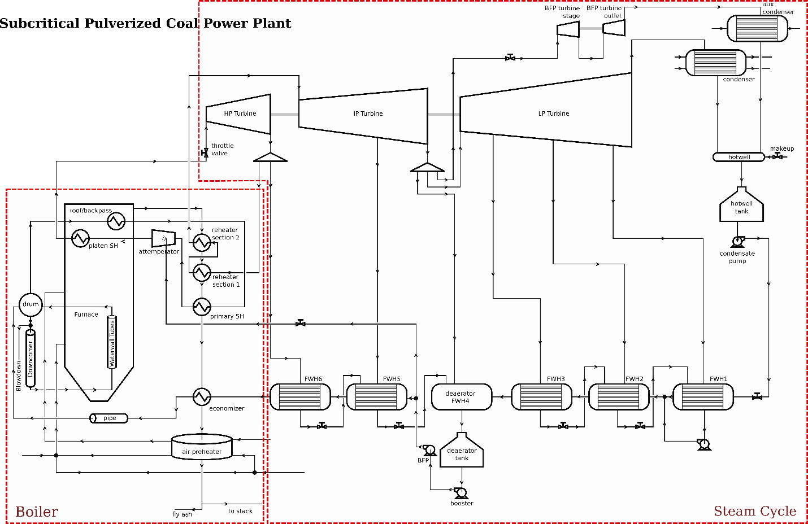
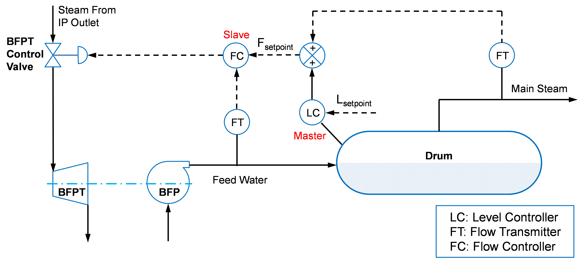
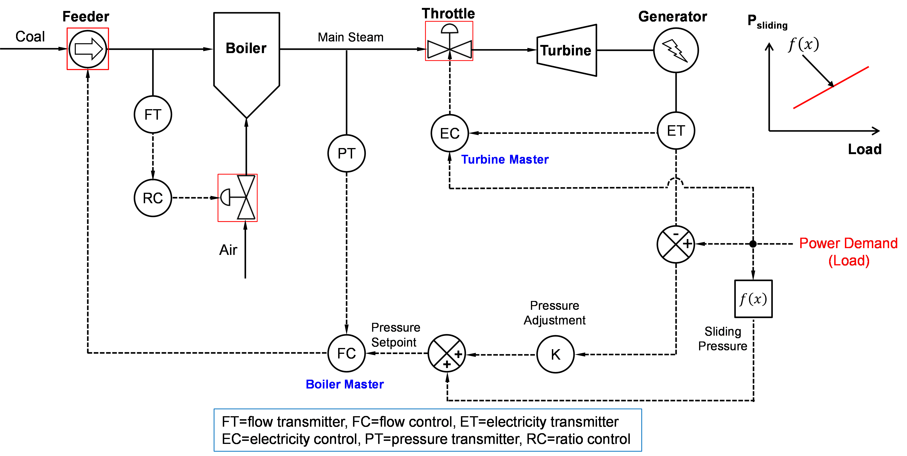
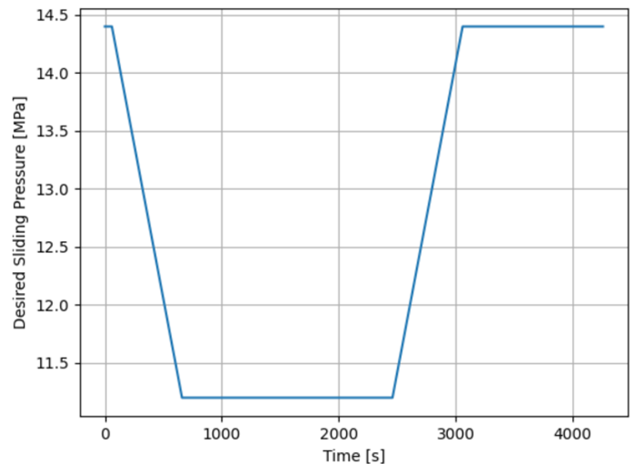
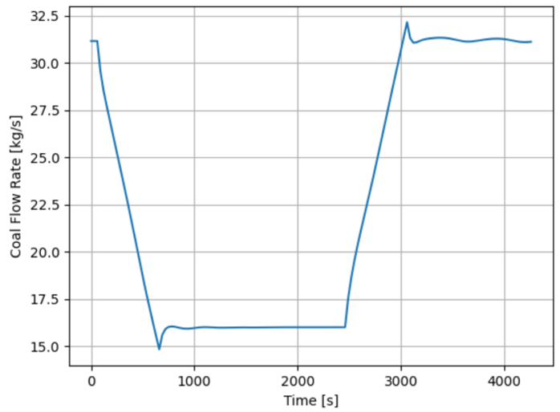

Subcritical Coal-Fired Power Plant Flowsheet (steady state and dynamic)
=======================================================================

.. currentmodule:: idaes.power_generation.flowsheets.subcritical_power_plant.subcritical_power_plant

Overview
++++++++
This is an example subcritical pulverized coal (SCPC) power plant. This simulation model consist of a ~320 MW gross coal fired power plant. 
 The dimensions and operating conditions used for this simulation do not represent any specific coal-fired power plant.

This model is for demonstration and tutorial purposes only. Before looking at the
model, it may be useful to look at the process flow diagram (PFD in Figure 1).

Subcritical Power Plant Overview

Inputs:

* Throttle valve opening, 
* Feed water pump pressure,
* BFW - boiler feed water (from Feed water heaters),
* Coal from pulverizers
    

Main Assumptions:

Coal flowrate is a function of the plant load, the coal HHV is fixed and heat duty from fire side to water wall and platen superheater are fixed.

Water/Steam and Flue Gas Routes: 

* Water Flow: Fresh water -> FWH's -> Economizer -> Drum --> Downcomer --> Water Wall -> Drum --> roof SH --> Primary SH -> Platen SH -> HP Turbine -> Reheater -> IP Turbine
* Flue Gas Flow: Fire Ball -> Platen SH -> Reheater  -> Primary SH -> Economizer -> Air Preheater
* Steam Flow: Boiler -> HP Turbine -> Reheater -> IP Turbine -> Condenser + steam extractions (including HP, IP, and LP steam extractions to Feed Water Heaters)

Main Models used:

* Mixers: Attemperator, Flue gas mix
* Heater: Platen SH, Fire/Water side (simplified model), Feed Water Heaters, Hot Tank, Condenser
* BoilerHeatExchanger: Economizer, Primary SH, Finishing SH, Reheater
* Shell and tube heat exchanger: Economizer, Primary SH, Finishing SH, Reheater (tube side: Water/Steam (side 1 holdup); shell side: flue gas (side 2 holdup))
* Turbines
* Pumps

Property packages used:

* Helmholtz Equation of State (IAPWS95): Water and steam :ref:`IAWPS95 <technical_specs/model_libraries/generic/property_models/iapws95:International Association of the Properties of Water and Steam IAPWS-95>`
* IDEAL GAS: Air and Flue Gas :ref:`FlueGas <technical_specs/model_libraries/power_generation/properties/flue_gas:Flue Gas Property Package>`

Introduction
++++++++++++

A 320 MW gross subcritical coal-fired power plant is modeled using the unit model library has been developed for demonstration purposes only. 
This plant simulation does not represent any power plant. This subcritical unit burns Illinois #6 high-volatile bituminous coal. 
The fuel is identical to the NETL baseline case for a 650 MW unit and its analysis data are listed in Table 1.

Table 1. coal specifications - Proximate Analysis (weight %)

=============== =========== =====
item            As-Received Dry
=============== =========== =====
Moisture        11.12       0.00
Ash             9.70        10.91
Volatile Matter 34.99       39.37
Fixed Carbon    44.19       49.72
Total           100.00      100.0
=============== =========== =====

Table 2. coal specifications - Ultimate Analysis (weight %)

=============== =========== =====
item            As-Received Dry
=============== =========== =====
Moisture        11.12       0.00
Carbon          63.75       71.72
Hydrogen        4.50        5.06
Nitrogen        1.25        1.41
Chlorine        0.15        0.17
Sulfur          2.51        2.82
Ash             9.70        10.91
Oxygen          7.02        7.91
Total           100.00      100.0
=============== =========== =====

Table 3. coal specifications - Heating Value

========================================== ================ ===============
item                                       As-Received      Dry
========================================== ================ ===============
Higher Heating Value (HHV), kJ/kg (Btu/lb) 27,113 (11,666)  30,506 (13,126)
Lower Heating Value (LHV), kJ/kg (Btu/lb)  26,151 (11,252)  29,544 (12,712)
========================================== ================ ===============

The power plant is a generic subcritical unit, where the boiler has 4 levels of wall burners and one level of overfire airports. 
There are 18 platen superheaters hanging over the furnace roof serving as the finishing superheater. 
The platen superheater panels are parallel to the furnace side walls. The boiler has one drum, eight downcomers, backpass superheater, platen superheater, a reheater section (represented with 2 heat exchanger model), a primary superheater, an economizer, and the air preheater (this model is a simplified tri-sector Ljungström type)

The steam cycle equipment includes a multistage steam turbine with single reheat. It has a throttle valve, multiple stages for HP, IP, and LP sections with steam extraction to 3 low-pressure feed water heaters and 2 high-pressure feed water heaters as well as a deaerator and a boiler feed pump turbine. The steam cycle also includes the main and auxiliary condensers, a hotwell tank, a condensate pump, a booster pump and a main pump.  Multiple control valves are used to control the water levels of hotwell tank, deaerator tank, and feed water heaters and the spray flow to main steam attemperator.
The process flow diagram is shown in Figure 1.  The entire process is modeled in two sub-flowsheets, one for the boiler system and the other for the steam cycle system, corresponding to two separate files named “boiler_subfs.py” and “steam_cycle_subfs.py”, respectively.  The main flowsheet contains the two sub-flowsheets in a file named “plant_dyn.py”.

Figure 1: Process Flow Diagram

It can be seen from the Figure 1 that primary air is first split to two inlet streams, one goes through the primary air sector of the regenerative air preheater where it is heated, and the other, also known as tempering air, bypasses the air preheater and is used for primary air temperature control. The two streams are then mixed and connected with the fire side of the boiler.  The coal stream is also fed to the fire side of the boiler. While this boiler sub-flowsheet does not contain a specific coal mill model, the partial vaporization of the moisture in the raw coal is modeled in the fire-side boiler model.  The secondary air enters the secondary air sector of the air preheater.  After being heated in the air preheater, the hot secondary air stream enters boiler’s windbox, from which it enters the furnace either as the secondary air of the burners or as overfire air.  The pulverized coal from primary air stream is eventually burned in the boiler by both primary and secondary air to form flue gas that leaves the boiler with small amount of unburned fuel in fly ash.  The hot flue gas then goes through the boiler backpass consisting of multiple convective heat exchangers including first the hot reheater, then the cold reheater, the primary superheater, and the economizer.  Finally, the flue gas enters the air preheater to heat the cold primary air and secondary air before entering the downstream equipment which is not modeled.  The feed water from steam cycle system enters the economizer to absorb the heat transferred from the flue gas and leaves the economizer at a temperature considerably below its saturation temperature.  The subcooled water then goes to the boiler drum through water pipes where it mixes with the saturated water separated from the water/steam mixture from the boiler waterwall.  The mixed water stream splits to two streams. A small amount of water leaves the system as a blowdown water to prevent buildup of slag and the main portion of the water stream goes through eight downcomers to enter the bottom of waterwall tubes.  The vertical waterwall is modeled by multiple waterwall section models in series. The subcooled water from the downcomers is heated by the combustion products inside the boiler and part of the liquid are vaporized, forming a liquid-vapor 2-phase mixture and eventually enters the drum to complete a circuit for natural circulation of the feed water, in which the density difference between the liquid in the downcomers and the 2-phase mixture in the waterwall tubes drives the circulating flow.

The saturated steam from drum goes to the roof superheater before entering the primary superheater.  Note that the enclosure wall tubes for the backpass as a part of the superheaters is not included in the flowsheet model.  The steam leaving the primary superheater is mixed with spray water from boiler main feed pump in an attemperator.  Finally, the steam from the attemperator enters the platen superheater where the steam is heated to main steam temperature before entering the main turbine.  The cold reheat steam from the HP outlet is first heated in the cold reheater and then heated in the hot reheater before entering the IP stages of the turbine. There is no attemperation for the reheat steam.

The steam cycle, depicted in Figure 1, accepts steam from the boiler and uses it to generate electricity.  Specifically, HP steam from the boiler passes through a throttle valve prior to entering the HP turbine, after which some is extracted to supply heat to feedwater heater (FWH) 6 while the remaining steam is sent back to the boiler to be reheated. The reheated steam then enters the IP turbine section where some is extracted to supply heat to FWH 5. Additional steam is extracted for the boiler feed pump turbine (BFPT) and deaerator between the IP and LP turbine sections at the IP/LP crossover, while the remaining steam enters the LP turbine. In the LP section, steam is extracted for FWHs 1, 2, and 3.  Steam leaving the LP turbine is condensed in the main condenser, while steam leaving the BFPT is condensed in the auxiliary condenser. The condensate from the condenser hotwell is pumped through the LP FWHs 1, 2, and 3, where it is heated by steam extracted from the LP turbine.  After passing through the deaerator, the feedwater enters a booster pump prior to entering the main boiler feed pump and HP FWHs 5 and 6.

Dynamic Flowsheet
+++++++++++++++++

The dynamic model considers the mass and energy inventories in large vessels in the system including drum, deaerator, feed water heaters, and condenser hotwell.  Meanwhile, inventories in downcomers and multiple waterwall zones are also considered.  To keep the problem tractable, the inventory in the 2D boiler heat exchanger model for the reheaters, the primary superheater, and the economizer are not considered.  However, the internal energy held by the tube metal of those heat exchangers are considered.  Some unit models are treated as the steady-state models on the dynamic flowsheet.  For example, the boiler fire-side model is assumed as steady-state since the flue gas density is low and so is the residence time (2-3 seconds).  All turbine stages, condensers and pumps are modeled as pseudo-steady-state. The entire process is pressure driven, indicating the flow rates of air, flue gas, water, and steam are related to the pressures in the system.
Table 4 lists all unit operation models on the boiler sub-flowsheet including their names, descriptions, unit model library names, and dynamic/steady-state flag.  Table 5 lists all unit operations on the steam cycle sub-flowsheet.

Table 4.  List of unit models on the boiler system sub-flowsheet

=============== ========================== ================================================================================================================================================================================= ===========
Unit Name       Description                Unit Library Name                                                                                                                                                                 Dynamic
=============== ========================== ================================================================================================================================================================================= ===========
aBoiler         Boiler fire-side surrogate BoilerFireside :ref:`BoilerFireside <technical_specs/model_libraries/power_generation/unit_models/boiler_fireside:Boiler Fire Side Model>`                                        False
aDrum           1D boiler drum             Drum1D :ref:`Drum1D <technical_specs/model_libraries/power_generation/unit_models/drum1D:Drum 1D Model>`                                                                          True
blowdown_split  Splitter for blowdown      HelmSplitter                                                                                                                                                                      False
aDowncomer      Downcomer                  Downcomer :ref:`Downcomer <technical_specs/model_libraries/power_generation/unit_models/downcomer:Downcomer Model>`                                                               True
Waterwalls      12 waterwall zones         WaterwallSection :ref:`WaterWall <technical_specs/model_libraries/power_generation/unit_models/waterwall:WaterWall Model>`                                                        True
aRoof           Roof superheater           SteamHeater :ref:`SteamHeater <technical_specs/model_libraries/power_generation/unit_models/steamheater:Steam Heater Model>`                                                      False
aPlaten         Platen superheater         SteamHeater :ref:`SteamHeater <technical_specs/model_libraries/power_generation/unit_models/steamheater:Steam Heater Model>`                                                      False
aRH1            2D Cold reheater           HeatExchangerCrossFlow2D_Header :ref:`HX2D <technical_specs/model_libraries/power_generation/unit_models/boiler_heat_exchanger2D:BoilerHeatExchanger2D>`                          True *
aRH2            2D Hot reheater            HeatExchangerCrossFlow2D_Header :ref:`HX2D <technical_specs/model_libraries/power_generation/unit_models/boiler_heat_exchanger2D:BoilerHeatExchanger2D>`                          True *
aPSH            2D Primary superheater     HeatExchangerCrossFlow2D_Header :ref:`HX2D <technical_specs/model_libraries/power_generation/unit_models/boiler_heat_exchanger2D:BoilerHeatExchanger2D>`                          True *
aECON           2D Economizer              HeatExchangerCrossFlow2D_Header :ref:`HX2D <technical_specs/model_libraries/power_generation/unit_models/boiler_heat_exchanger2D:BoilerHeatExchanger2D>`                          True *
aPipe           Pipes from eco. to drum    WaterPipe :ref:`WaterPipe <technical_specs/model_libraries/power_generation/unit_models/waterpipe:Water Pipe Model>`                                                              False
Mixer_PA        Mixer of hot PA and TA     Mixer                                                                                                                                                                             False
Attemp          Attemperator               HelmMixer                                                                                                                                                                         False
aAPH            Air preheater              HeatExchangerWith3Streams :ref:`HX3Streams <technical_specs/model_libraries/power_generation/unit_models/boiler_heat_exchanger_3streams:Heat Exchanger With Three Streams>`       False
=============== ========================== ================================================================================================================================================================================= ===========

* The heat held by tube metal is modeled as dynamic while fluids are modeled as steady-state

Table 5.  List of unit models on the steam cycle system sub-flowsheet

================= ============================= ========================== ===========
Unit Name         Description                   Unit Library Name          Dynamic
================= ============================= ========================== ===========
turb              Multistage turbine            HelmTurbineMultistage      False
bfp_turb_valve    BFPT regulating valve         HelmValve                  False
bfp_turb          Front stage of BFPT           HelmTurbineStage           False
bfp_turb_os       Outlet stage of BFPT          HelmTurbineOutletStage     False
condenser         Main condenser                HelmNtuCondenser           False
aux_condenser     Auxiliary condenser           HelmNtuCondenser           False
condenser_hotwell Mixer of 3 water streams      HelmMixer                  False
makeup_valve      Makeup water valve            HelmValve                  False
hotwell_tank      Hotwell tank                  WaterTank                  Dynamic
cond_pump         Condensate pump               HelmIsentropicCompressor   False
cond_valve        Condensate Valve              HelmValve                  False
fwh1              Feed water heater 1           FWH0D                      True *
fwh1_drain_pump   Drain pump after FWH 1        HelmIsentropicCompressor   False
fwh1_drain_return Mixer of drain and condensate HelmMixer                  False
fwh2              Feed water heater 2           FWH0D                      True *
fwh2_valve        Drain valve for FWH 2         HelmValve                  False
fwh3              Feed water heater 3           FWH0D                      True *
Fwh3_valve        Drain valve for FWH 3         HelmValve                  False
fwh4_deair        Mixer for deaerator           HelmMixer                  False
da_tank           Deserator water tank          WaterTank                  True
booster           Booster pump                  HelmIsentropicCompressor   False
bfp               Main boiler feed pump         HelmIsentropicCompressor   False
split_attemp      Splitter for spray water      HelmSplitter               False
spray_valve       Control valve for water spray HelmValve                  False
Fwh5              Feed water heater 5           FWH0D                      True *
Fwh5_valve        Drain valve for FWH 5         HelmValve                  False
Fwh6              Feed water heater 6           FWH0D                      True *
Fwh6_valve        Drain valve for FWH 6         HelmValve                  False
================= ============================= ========================== ===========

* Dynamic flag is true for condensing section only

There are several control valves to regulate the water and steam flows in the steam cycle system including the throttle valve to control the power output, BFPT valve to control feed water pump speed and, therefore, the feed water flow, makeup water valve to control condenser hotwell tank level, condensate valve to control deaerator tank level, and water spray valve to control the main steam temperature.  There are also drain valves between the drain outlet of a feed water heater and the drain inlet of its cascading downstream feed water heater.  They are used to control the water level inside the condensing section of the feed water heater.

Controllers are included in the dynamic flowsheet.  There are several regulatory level controllers, all of which are either PID controllers, including those to control the levels of FWH2, FWH3, FWH5, FWH6, deaerator tank, and hotwell tank.  The corresponding control valves involved in those level controllers are drain valves of FWH2, FWH3, FWH5, FWH6, the condensate valve, and the makeup water valve, respectively.

The main steam temperature is controlled by the attemperator with the spray water from the main feed pump outlet.  The spray valve between the attemperator and the feed pump outlet is controlled by a PID controller that is also configured with default valve opening bounded between 0.05 and 1.  This configuration limits the spray flow to certain values if the main steam temperature is way below or above its setpoint.

The drum level is controlled by a 3-element controller as shown in Figure 2.  It is implemented with two cascading PI control loops.  The master controller of the drum level cascading control is used to provide the setpoint of the slave controller.  The slave controller controls the feed water flow rate based on the setpoint provided by the master controller.  The three measured elements include drum level, main steam flow and feed water flow.  Note that the main steam flow rate is usually controlled by a throttle valve such that the required power output is met.  The feed water flow rate should be the same as the main steam flow rate in a steady-state condition.  If the drum level is deviated from its setpoint, the feed water flow should be adjusted to compensate the level deviation.  For example, when the drum level is too low, the feed water flow rate should be increased.  Therefore, the setpoint of the feed water flow rate for the slave controller is equal to the sum of the measured main steam flow rate and the output of the master controller, which is the adjustment calculated by the master controller due to the deviation of the drum level from its setpoint.  In case there is a drum water blowdown flow, the amount of blowdown flow should also be added.  In the modeled power plant, the flow rate of feed water is controlled by the governing valve of the boiler feed pump turbine (BFPT), which controls the speed of the BFPT and hence the speed of the boiler feed pump (BFP).  The BFPT uses the steam from the IP turbine outlet to generate the mechanical work needed for the BFP pump.

Figure 2: Drum Level Control

The supervisory level control for the power generation is implemented as a typical coordinated control as shown in Figure 3.  It involves a turbine master that controls the throttle valve opening to meet the power demand and a boiler master that controls the coal feed rate and air flow rates.  In the dynamic flowsheet model, both the turbine master and the boiler master are implemented as PI controllers.  The turbine master simply controls the power output to meet the power demand by adjusting the throttle valve opening.  The boiler master controls the coal feed rate and air flow rates to maintain the desired main steam pressure.  The setpoint for the main steam pressure is calculated as the sum of two parts.  The first part is the desired steady-state sliding pressure as a function of load (sliding pressure curve as shown in the figure).  In the current dynamic plant model, the sliding pressure is implemented as a linear function of power demand.  The second part is the pressure adjustment term calculated based on the deviation of electrical power output from the demand multiplied by a gain factor.  The second part represents the coordination between the turbine master and boiler master.  Note that in the current dynamic flowsheet model, the control for the air flows is not implemented with detailed PID controllers for FD and ID fans and their dampers.  The primary and secondary air flow rates are actually specified as constraints such that the mole fraction of O2 in flue gas is set to be a predefined function of coal flow rate, which is related to the load.  The primary air flow rate is specified as a constraint that specifies the primary air to coal flow ratio as a function of coal feed rate (mill curve).  In other words, the primary and secondary air flow rates is controlled in proportion to the coal feed rate as in a typical ratio control loop.

Figure 3: Coordinated Control

Table 6 lists the PI and PID controllers on the dynamic flowsheet.  Some controllers are declared on the steam cycle sub-flowsheet while others are declared on the main flowsheet.  The table also lists the type of the controller, whether it is bounded for output, and whether it belongs to the steam cycle or main flowsheet.

Table 6.  Controllers in the dynamic flowsheet model

==================== ==================================== ===== ======= ===========
Unit Name            Description                          Type  Bounded Flowsheet
==================== ==================================== ===== ======= ===========
fwh2_ctrl            Level controller for FWH 2           PI    No      Steam cycle
Fwh3_ctrl            Level controller for FWH 3           PI    No      Steam cycle
Fwh5_ctrl            Level controller for FWH 5           PI    No      Steam cycle
Fwh6_ctrl            Level controller for FWH 6           PI    No      Steam cycle
da_ctrl              Level controller for deaerator tank  PI    No      Steam cycle
makeup_ctrl          Level controller for hotwell tank    PI    Yes     Steam cycle
spray                Main steam temperature controller    PID   Yes     Steam Cycle
drum_master_ctrl     Master controller for drum level     PI    No      Main
drum_slave_ctrl      Slave controller for drum level      PI    No      Main
turbine_master_ctrl  Turbine master controller            PI    No      Main
boiler_master_ctrl   Boiler master controller             PI    No      Main
==================== ==================================== ===== ======= ===========

To solve the dynamic flowsheet, the user needs to provide the initial condition of the system.  Typically, a steady-state initial condition at certain load should be specified by the user.  The change of the power demand (load) as a function of time should also be specified as the perturbation of the dynamic system.  In the current dynamic flowsheet model, default steady-state problems for the boiler sub-flowsheet and the steam cycle sub-flowsheet are initialized and solved separately.  Then the default steady-state problem of the combined system for the full plant will be solved.  After the default steady-state load is solved, the user is allowed to change the load (power output demand) and set that specified load as the process perturbation or disturbance for the dynamic simulation.
One or two separate dynamic flowsheet models are then created with “dynamic” flag turned on and the discretization in the time domain defined.  We recommend to have two dynamic models created, one for a time step size of 30 second and the other with a time step size of 60 second.  Both models contain only two time steps, representing 60 and 120 seconds of time periods to be simulated, respectively.  Using a dynamic model with limited number of time steps results in very limited number of variables to be solved.  The first dynamic model with 30-second step size can be used to model the process with dramatic load changing disturbance while the second dynamic model with 60-second step size can be used to model the process with slow load changing or near steady-state transient conditions.  To solve a transient problem with a long duration, we use a rolling time window approach as described below.  First, the results of the steady-state model are copied to one of the dynamic flowsheet models and the steady-state bias for the controllers are set to the steady-state values.  The setpoints for the PI and PID controllers can also be fixed as the steady-state results with zero error for the proportional part of the controllers. For a controller with bounds of the manipulated variable enabled, a non-zero error for the integral part is calculated.  The error for the derivative part is also set to zero since at the steady state, the derivative of the process variable is also zero.  Then the dynamic model with 2 time steps is solved based on the disturbance of load demand specified by the user.  If the time duration for the simulation is longer than the period of the 2 time steps, the results of the solved dynamic model at the end of the second time step will be copied as the initial condition for the simulation of the next 2 time steps.  The results to be copied include the errors for the integral and derivative parts of individual controllers.  In case the error term for the integral part of a controller is too large (windup error), the user has an option to reset the windup error.  If the time step size is changed, the user needs to choose a different dynamic model to copy to.  After that the time window is rolled to the second one and the simulation for the second time period can then be solved.  This process can be repeated for multiple time periods until the entire duration for the dynamic simulation is covered.  During each rolling time window simulation, the results at individual time step for the main performance variables and equipment health related expression values can be saved to a dictionary of lists in the Python code.  Those results can be plotted after the last simulation and written to a text file for review and further processing.  Figure 4 shows an example of dynamic model simulation result, the load demand and coal feed rate for as functions of time.

Figure 4: Transient results for a load changing dynamic simulation

