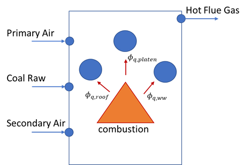

Boiler Fire Side Model
======================

.. index::
  pair: idaes.power_generation.unit_models.boiler_fireside;BoilerFireside

.. currentmodule:: idaes.power_generation.unit_models.boiler_fireside

Introduction
------------
The boiler fire side model consists of a hybrid model, including first principle equations and surrogate models. The surrogate models 
determine the heat flux to the individual water wall zones, heat flux to platen superheater, heat flux to roof superheater, NOx formation in PPM, and unburned carbon in fly ash. 
Meanwhile, the flue gas outlet conditions (flowrate, temperature, and pressure) are determined by complete mass and energy balances.

The processes inside a coal-fired boiler are very complicated involving combustion of the fuel by an oxidizer, typically air, and the transfer of the heat released from the combustion to waterwall, roof, and platen superheater, if any.  The reacting flow inside the boiler is turbulent flow with both gas-phase homogenous reactions and gas-solid heterogenous reactions.  At high combustion temperatures, the homogenous gas-phase reactions can be assumed to reach chemical equilibrium while the heterogenous reactions involving devolatilization, oxidation of char by O2, and gasification of the char by H2O and CO2 are usually controlled by finite-rate chemistry and mass transfer of the reactants to the external and internal surfaces of the solid fuel.  The main heat transfer mechanism inside the boiler is radiative transfer involving both gas phase and solid phase participating media.  Due to its complexity, a high-fidelity model such as NETL’s 1D/3D hybrid fire-side boiler model should be developed first based on a given geometry of the furnace.  A surrogate model could then be generated from the results of multiple high-fidelity model simulations sampled in the input space of the high-fidelity model.  Those inputs could possibly include the flow rates of coal, primary and secondary air, lower furnace Stoichiometric ratio, fuel composition, secondary air temperature, and the slag layer wall temperatures of waterwall, roof, and platen superheater.  The surrogate model provides the algebraic functions mapping the input variables to the output variables such as heat transfer rates to the waterwall, roof, and platen superheater, unburned carbon in the fly ash, and NOx mole fraction in the flue gas.
As mentioned above, the variables calculated from the surrogate functions include the heat transfer rates to individual waterwall zones, platen superheater, and roof, the unburned carbon in fly ash, and mole fraction of NO in flue gas.  The mole fractions of individual species in the flue gas including O2, N2, CO2, H2O, and SO2 are calculated based on the mass balance of individual elements including C, H, O, N, and S.  Note that Ar in air is ignored here and its mole fraction in air is assigned to N2.  It is also assumed that coal contains C, H, O, N, S elements only (no Cl) and ash in coal is inert (no mineral related reaction is considered).  The amount of unburned carbon in fly ash determines the coal burnout (percent of dry-ash-free coal burned).  Only the amount of burned coal is considered in calculating the flue gas composition.  Unburned CO in the flue gas is ignored in the current model.  To enforce energy balance, the furnace exit gas temperature (FEGT) is not calculated by a surrogate function.  It is calculated by the energy balance instead.

Note that the surrogate models are trained off line and imported as a model argument, these surrogate models usually are a function of the coal flowrate, moisture content, stoichiometric ratio (O2 real/O2 reaction), primary air to coal ratio, and wall/slag temperatures among others.

    
    Figure 1. Schematic representation of a Boiler fire side model

Property package: This model requires the IdealFlueGas property package.

Model Arguments:

* number_of_zones: the number of water wall zones are required to maintain the overall energy balance
* calculate_PA_SA_flows: Depending on the user's selection, this feature builds different parts of the model (config argument: calculate_PA_SA_flows=True or False).

  - Option1 assumes that users know primary air flowrate and secondary air flowrate (if calculate_PA_SA_flows is False).
  - Option2 assumes that the users provide stoichiometric ratio and primary air to coal ratio to calculate primary air and secondary air flowrates (if calculate_PA_SA_flows is True).
    
* has_platen_superheater: True/False if a platen superheater will be included in the flowsheet
* has_roof_backpass: True if a roof and backpass heater will be included in the flowsheet
* surrogate_dictionary: user must provide a dictionary with surrogate models for water wall zones, platen and roof superheaters, NOx, and flyash

Note that the surrogate dictionary can be either surrogate models (algebraic equations), or fixed values, or variables to calculate the heat flux required for certain performance. 
For example, this model can be used for data reconciliation to calculate the heat duty to the water wall, platen superheater, and roof.

Model inputs (variable name):

* primary_air_inlet (flow_mol, enth_mol, pressure)
* secondary_air_inlet (flow_mol, enth_mol, pressure)
* number of water wall zones (number_of_zones)
* Coal composition in dry basis (mf_C_coal_dry)
* coal flowrate (coal_flowrate_raw)
* moisture content in the coal (mf_H2O_coal_raw)
* stoichiometric ratio (SR)\*
* primary air to coal ratio (ratioPA2coal)\*
* heat flux (or heat_duty) to water wall zones, platen superheater, and roof superheater

\* not required if calculate_PA_SA_flows is False

Model outputs:

* flue_gas_outlet (flow_mol, enth_mol, pressure)
* heat duty to water wall (ww_heat), platen superheater (platen_heat)\*, and roof and backpass (roof_heat)\*

Note that platen_heat and roof_heat are only constructed if arguments are equat True

Degrees of Freedom
------------------
if calculate_PA_SA_flows is True:
By specifying the inlet conditions (primary air and secondary air temperature and pressure), stoichiometric ratio, primary air to coal ratio, coal composition, coal High Heating Value, coal flowrate (raw), moisture content in coal, and surrogate_dictionary, the model will be fully specified. Things that are frequently fixed are:

if calculate_PA_SA_flows is False:
This means users "know" or have measurements of the primary air and secondary air, therefore, stoichiometric ratio and primary air to coal ratio are not required to estimate the primary and secondary air. 
By specifying the primary air inlet (flow_mol_comp, temperature, pressure), secondary air inlet (flow_mol_comp, temperature, pressure), coal composition, coal High Heating Value, coal flowrate (raw), moisture content in coal, and surrogate_dictionary, the model will be fully specified. Things that are frequently fixed are:

Constraints
-----------

The main constraints in the model satisfy the energy balance and calculate flue gas outlet conditions (flow_mol_comp, temperature, pressure).

.. math:: Heat_{in} = Heat_{out}

.. math:: Heat_{in} = Coal_{mass flow}*H_{coal} + Primary\_air{mol flow}*enth\_mol_{primary air} + Secondary\_air{mol flow}*enth\_mol_{secondary air}

.. math:: Heat_{out} = flue\_gas_{molar flow}*enth\_mol_{flue gas} + ww_{heat} + platen_{heat} + roof_{heat} + ash_{mass flow}*Hs_{flyash}

.. math::
  ww_{heat} = f(coal\_flow, secondary air temperature, stoichiometric ratio, ratioPA2coal, wall temperature)

.. math::
  platen_{heat} = f(coal\_flow, secondary air temperature, stoichiometric ratio, ratioPA2coal, wall temperature)
  
.. math::
  roof_{heat} = f(coal\_flow, secondary air temperature, stoichiometric ratio, ratioPA2coal, wall temperature)

.. math::
  NOx = f(coal\_flow, secondary air temperature, stoichiometric ratio, ratioPA2coal, wall temperature)

.. math::
  flyash = f(coal\_flow, secondary air temperature, stoichiometric ratio, ratioPA2coal, wall temperature)

.. math::
  T_{coal} = T_{primary air}

where:

* Flow_mol_comp in mol/s
* Temperature in K
* Pressure in Pa
* Heat duty in W
* Coal mass flow after removing the moisture content kg/s
