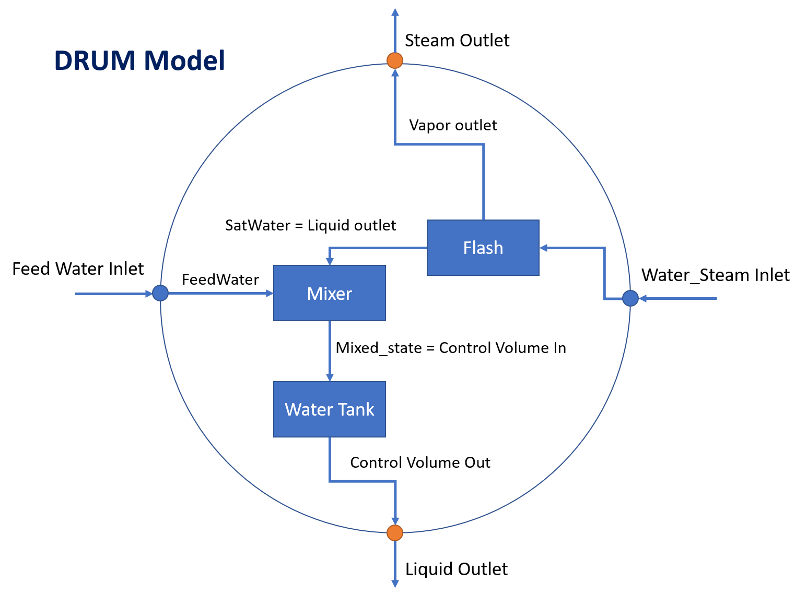

Drum Model
==========

.. index::
  pair: idaes.power_generation.unit_models.drum;Drum

.. currentmodule:: idaes.power_generation.unit_models.drum

Introduction
------------

The drum model consists of three main sub-unit operations: 

1) a flash model to separate the saturated steam from the saturated liquid water in the water/steam mixture, 
2) a mixer model to mix saturated liquid water with feed water, and 
3) a water tank model to calculate drum level and pressure drop.

First the water/steam mixture from boiler waterwall tubes (risers) enters the flash model and leaves in two separate streams (liquid water and steam). 
Then, the saturated water from the flash model is mixed with the feed water stream (typically from the economizer or a water pipe linking the economizer and the drum) 
and leave the mixer model in a single mixed stream. Finally, the mixed stream enters the water tank of the drum and leaves the vessel through the multiple downcomers (see Figure 1).

    
    Figure 1. Schematic representation of a Drum modeled in IDAES

Inlet Ports:

* water_steam_inlet: water/steam mixture from waterwall
* feedwater_inlet: feedwater from economizer/pipe

Outlet Ports:

* liquid_outlet: liquid to downcomer
* steam_outlet: saturated steam leaving the drum

Variables
---------

Model inputs (variable name):

* water/steam inlet (water_steam_inlet: flow_mol, enth_mol, pressure)
* feedwater inlet (feedwater_inlet: flow_mol, enth_mol, pressure)
* drum diameter (drum_diameter)
* drum length (drum_length)
* number of downcomer tubes (number_downcomers)
* downcomer diameter (downcomer_diameter)
* drum level (drum_level)
* heat duty (heat_duty)

Model Outputs:

* vapor outlet (vap_outlet: flow_mol, enth_mol, pressure)
* liquid outlet (liq_outlet: flow_mol, enth_mol, pressure)

Constraints
-----------

As mentioned above, the drum model imports a `HelmPhaseSeparator` and mixer models, specific documentation for these models can be obtained in: 
Once the water enters the tank model the main equations calculate water velocity and pressure drop calculation due to gravity based on water level and contraction to downcomer. 
Water level (drum_leve) is either fixed for steady state simulation or calculated for dynamic model (Dynamic = True)

Main assumptions:

1) Heat loss is a variable given by the user (zero heat loss can be specified if adiabatic)
2) Pressure change due to gravity based on water level and contraction to downcomer is calculated
3) Water level is either fixed for steady-state model or calculated for dynamic model
4) Assume enthalpy_in == enthalpy_out + heat loss + energy accumulation
5) Subcooled water from economizer and saturated water from waterwall are well mixed before entering the drum

Pressure equality constraint:

.. math::
  P_{SaturatedWater} = P_{FeedWater}

Pressure drop in unit:

.. math::
  deltaP = deltaP_{contraction} + deltaP_{gravity}

.. math::
  deltaP_{gravity} = f(\rho_{liquid}, acceleration gravity, drum\_level)

.. math::
  deltaP_{contraction} = f(\rho_{liquid}, V)

where:
* V: fluid velocity (m/s, liquid only)

Note that the model builds an Pyomo Arc to connect the Liquid_outlet from the self.aFlash unit to the SaturatedWater inlet port of the mixer, and the mixed_state (Mixer outlet) is directly constructed as the Drum `control_volume.properties_in`. 
Once the Drum model is constructed, the mixer and flash blocks can be found as `self.aDrum.aMixer` and `self.aDrum.aFlash`

Degrees of Freedom
------------------
Once the unit dimensions have been fixed, the model generally has 5 degrees of freedom. The water/steam mixture inlet state (flow_mol, enth_mol, and pressure) and feewater inlet state (flow_mol and enth_mol). The feedwater inlet pressure is usually free due to the pressure equality mentioned above.

Dynamic Model
-------------

The dynamic model version of the drum model can be constructed by selecting dynamic=True. 
If dynamic = True, material accumulation, energy accumulation, and drum level must be calculated. Therefore, a dynamic initialization method has been developed `set_initial_conditions` to initialize the holdup terms.
