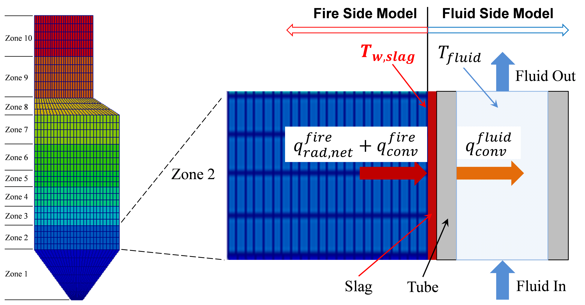
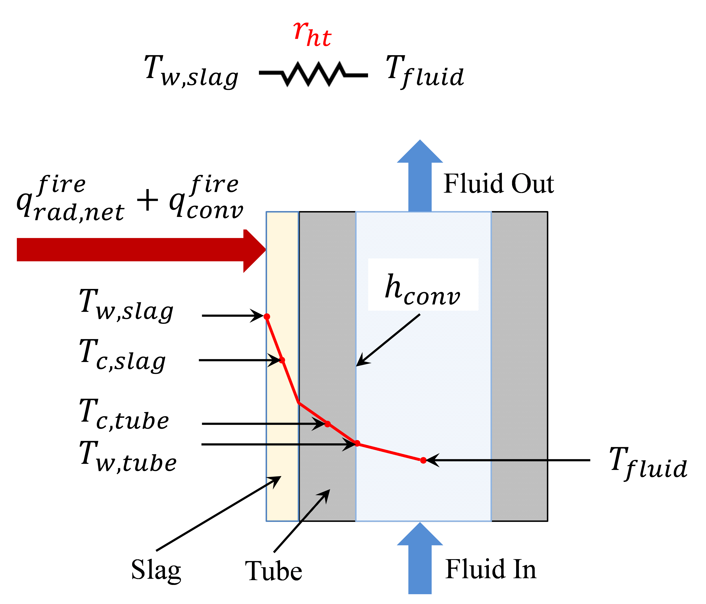

WaterWall Model
===============

.. index::
  pair: idaes.power_generation.unit_models.waterwall;WaterwallSection

.. currentmodule:: idaes.power_generation.unit_models.waterwall

Introduction
------------

The waterwall section model simulates the water hydraulics and the heat transfer inside typical membrane waterwall tubes. The fluid flowing inside the tubes is 
either liquid water or a mixture of liquid water and steam (two-phase flow). A boiler is typically discretized in multiple zones or sections along its height 
and a waterwall section model represents one section of the waterwall. It is usually coupled with IDAES’ 1-D fire-side model to solve the wall temperatures and heat transfer rate in each section.
Figure 1 shows a schematic representation of the integrated boiler fire-side and fluid-side models, in which the sum of the net radiation and convective heat fluxes (:math:`q_{rad}^{fire}` and :math:`q_{conv}^{fire}`) at the slag outer layer 
is an output of the fire-side model and an input of the waterwall section model (the fluid-side model) and the temperature of the outer slag layer :math:`T_{w,slag}` is an output of the fluid-side model 
and an input (boundary condition) of the fire-side model. The heat conduction through the slag and tube layers is a part of the fluid-side model. At a steady state, the amount of the heat transferred at the outer slag surface 
(:math:`q_{rad}^{fire}` and :math:`q_{conv}^{fire}`) is equal to the heat conducted through the slag and tube layers, which is equal to the heat convected to the fluid :math:`q_{conv}^{fluid}`.

    
    Figure 1. Coupling of fire-side zones and fluid-side waterwall sections modeled in IDAES

As shown in the figure, multiple waterwall sections in a form of indexed set block in IDAES are modeled and coupled with the multiple zones on the fire side.  
A user must set the number of waterwall sections equal to the number of zones in the fire-side model.  
The first (the lowest) section is either connected with the water liquid from a downcomer for a subcritical boiler or the water from the outlet of an economizer for a supercritical boiler. 
Other sections are connected with their neighboring sections below them via Pyomo Arcs. 
Finally, the last section is connected either to a drum for a subcritical boiler or a superheater for a supercritical boiler. 

Model inputs:

* number of zones
* number of tubes around the perimeter of the boiler
* heat duty of individual zone from fire-side model (sum of net radiation and convection)
* tube dimensions (length, inside diameter and thickness)
* projected membrane wall area
* fin dimension of membrane wall (width and thickness)
* slag layer thickness
* water/steam flow rate and states at inlet (F, T, h, P, x)
* properties of slag and tube metal (thermal conductivity, heat capacity, density)

Model Outputs:

* temperatures of tube metal at inner wetted surface and at center of the tube thickness
* temperatures of slag layer at outer surface and at the center of the slag layer
* pressure drop through each section and heat added to each section
* water/steam flow rate and states at outlet (F, T, h, P, x)

Note that the number of zones required depends on the discretization of the boiler fire-side model. A simplified version of a boiler water wall could be obtained by using a simple IDAES heater model, modeling the waterwall as one section (without detailed heat transfer calculations and slag thickness).

Figure 2 illustrates the physics and main variables in a single waterwall section model. This model assumes that the net radiation and convective heat fluxes are given from the fire-side model for the corresponding zone. The membrane wall geometry and slag layer thickness are the given input variables along with the fluid inlet flow rate and state conditions. In case of 2-phase flow, the volume fraction of the vapor phase is calculated based on an empirical correlation that calculates the slip velocity between the two phases due to their density difference. The pressure drop of the 2-phase flow is calculated based on the liquid-only velocity, Reynolds number and friction factors corrected for the volume fraction of vapor.  Likewise, the convective heat transfer coefficient h_conv on the fluid side is calculated from empirical correlations for nucleate boiling with forced convection enhancement factor and pool boiling suppression factor. The overall heat transfer coefficient is the reciprocal of the overall heat transfer resistance (:math:`r_{ht}` in Figure 2) obtained from a surrogate model generated from a rigorous 2-D model for the heat conduction through the complicated geometry of the slag and tube layers and heat convection between the inner tube wall and the fluid. The heat conduction submodel also solves the slag outer surface temperature :math:`T_{w,slag}`, slag layer center point temperature :math:`T_{c,slag}`, tube center point temperature :math:`T_{c,tube}`, and tube inner wall temperature :math:`T_{w,tube}`. The center point temperatures are used to calculate the energy stored in the slag and tube layers for dynamic simulations.
The single waterwall section model eventually calculates the heat transfer rate to the fluid, pressure drop of the fluid in the waterwall section, and the slag outer wall temperature, which is required as the boundary condition input for the fire-side model. The material and energy balances of the fluid are handled by the IDAES framework.

    
    Figure 2. Ilustration of a waterwall section model and its main variables

Degrees of Freedom
------------------

As mentioned above, the water wall section model has been modeled as an index set block, therefore, the number of zones must be selected during the construction of this model. 
Each waterwall section is then considered a single model. Aside from the inlet conditions and tube dimensions, a waterwall section model usually has two degrees
of freedom, which can be fixed for it to be fully specified. Things that are frequently fixed are two of:

* tube dimensions and number of tubes,
* heat loss to the water wall,
* ash or slag thickness

Variables
---------

=========================== ================== =========== =============================================================================
Variable                    Symbol             Index Sets  Doc
=========================== ================== =========== =============================================================================
heat_duty                   :math:`Q`          time        Heat transferred from flue gas to tube side fluid
area_proj_total             :math:`A`          None        Heat transfer area (total projected area based on tube shape)
hconv, hconv_lo             :math:`h_{conv}`   time        Overal convective heat transfer coefficient and hconv_lo for liquid only
temp_slag_boundary          :math:`T_{w,slag}` time        Temperature of the slag
=========================== ================== =========== =============================================================================

Constraints
-----------

The main constraints here show the heat flux and convective heat transfer model. This model calculates the slag temperature, slag center temperature, tube boundary temperature, tube center temperatures, and heat flux from fire side to the water/steam side. 
Finally, a two phase flow model is considered, including water boiling effects in the convective heat transfer coefficient calculations.

Heat flux equation:

.. math::
  heat_{flux} = Q*pitch/(projected_{area}*perimeter\_slag)

Temperature of slag:

.. math::
  T_{w,slag} - T_{c,slag} = heat_{flux} * slag_{resistance}

Heat flux interface equation:

.. math::
  heat_{flux\_int} * (slag_{resistance} + metal_{resistance}) = (T_{c,slag} - T_{c,tube})

Convective heat flux eqn at tube boundary:

.. math::
  heat_{flux\_conv} * fshape_{conv} * tube_{perimeter} = pitch * h_{conv} * (T_{w,tube} - T_{fluid,in})

Tube boundary wall temperature: 

.. math::
  heat_{flux\_conv} * metal_{resistance} * tube_{perimeter} = interface_{perimeter} * (T_{c,tube} - T_{w,tube})

Heat equation:

.. math:: heat_{duty} = number_{tubes} * heat_{flux\_conv} * tube_{length} * tube_{perimeter}

Convective heat transfer:

.. math::
  h_{conv} = h_{convective\_lo} * enhancement_{factor} + h_{pool} * suppression_{factor}

Pressure drop:

.. math::
  \Delta P = \Delta P_{friction} + \Delta P_{gravity}

Convective heat transfer liquid only:

.. math:: h_{conv\_lo} = f (tube_{di}, N_Re, N_Pr, k)

Enhancement factor:

.. math:: enhancement_{factor} = f(boiling_{number})

Pool boiling heat tranfeer coefficient:

.. math:: hpool = f(MW, reduced_{pressure}, heat{flux\_conv})

Prandtl number:

.. math:: Pr_{tube} = \frac{Cp  \mu}{ k  Mw}

Reynolds number:

.. math:: Re_{tube} = \frac{tube_{di} V \rho}{\mu}

where:

* hconv : convective heat transfer coefficient tube side (fluid water/steam) (W / m2 / K)
* hconv_lo : convective heat transfer coefficient for liquid only
* projected_area : total projected wall area of waterwall section (m2)
* Pr : Prandtl number (liquid only)
* Re : Reynolds number (liquid only)
* V: fluid velocity (m/s, liquid only)
* k : thermal conductivity of the fluid (W / m / K)
* MW: molecular weigth of water (kmol/kg)

Note that at the flowsheet level first waterwall section is connected to the economizer, arcs connecting section 2 to n-1 have to be constructed by the user, and the outlet of section n is connected to the drum model or superheater (subcritical and supercritical plant, respectively)