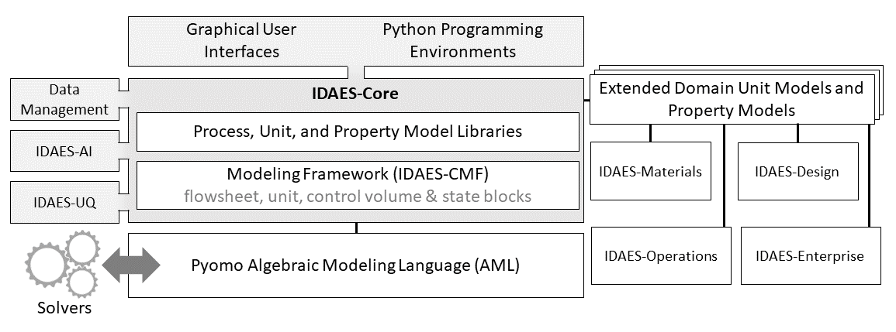
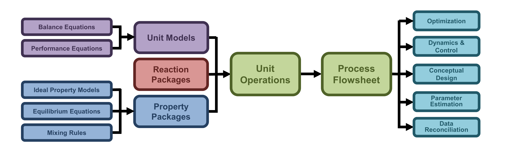

Concepts
========

This page gives a conceptual overview of the IDAES platform and provides terminology for the different
components of that platform.

.. rubric:: Contents

.. contents::
    :depth: 3
    :local:

IDAES-IP
--------

Description
^^^^^^^^^^^
The IDAES integrated platform (IDAES-IP) supports the full process modeling lifecycle from conceptual design to dynamic optimization and
control within a single modeling environment. At the center of this platform is the Core Modeling Framework
(:term:`IDAES-CMF`) which leverages the open source, U.S. Department of Energy-funded extensible algebraic modeling
environment, :term:`Pyomo`.

Below is a diagram showing the components of the IDAES Integrated Platform (IDAES-IP).

Terminology
^^^^^^^^^^^
The following terms are used in the diagram above, and throughout this documentation.

.. glossary::

    IDAES-IP
        IDAES integrated platform, described on this page

    IDAES-Core
        The software package that includes the Core Modeling Framework (IDAES-CMF); process, unit, and property model libraries;
        data management, artificial intelligence and uncertainty quantification tools; and graphical user interfaces.

    IDAES-CMF
        The IDAES-CMF is the center of the IDAES-Core. It extends :term:`Pyomo`'s block-based hierarchical modeling
        constructs to create a library of models for common process unit operations and thermophysical properties,
        along with a framework for the rapid development of process flowsheets.

    IDAES-AI
        Artificial intelligence and machine learning tools

    IDAES-UQ
        Tools supporting rigorous uncertainty quantification and optimization under uncertainty

    Graphical User Interfaces
        Tools for graphical interactive work, such as visualization of IDAES flowsheets

    Python programming environments
        Jupyter Notebook examples and extensions for interactive scripting in Python

    Data Management (IDAES-DMF)
        Data Management Framework (DMF) supporting provenance for IDAES workflows

    Pyomo
        Open source, U.S. Department of Energy-funded extensible algebraic modeling environment (AML).
        For more information, see the `Pyomo website <https://pyomo.org>`_.

    IDAES-Materials
    IDAES-Design
    IDAES-Enterprise
    IDAES-Operations
         Domain-specific tools for materials design, process design, enterprise-wide optimization, and control.

IDAES-CMF
---------

Overview
^^^^^^^^
The core modeling framework of IDAES was designed to be modular, and is based on the
block-hierarchical structure shown below:

An IDAES process model begins with a process flowsheet, which is the canvas on which the
representation of the user’s process will be constructed. Each process consists of a network of
unit operations which represent different pieces of equipment within the process (such as
reactors, heater and pumps) and are connected together to form the overall process. Each unit
operation in turn is made up of modular components – a unit model which describes the behavior
and performance of the piece of equipment, a thermophysical property package which represents
the material being processed by the unit operation, and a reaction package (if applicable) which
represents any chemical reactions that may occur within the unit. Each of these components can
be further broken down into sub-modules:

* Unit models consist of a set of material, energy and momentum balance equations which describe how
  material flows through the system, coupled with a set of performance equation which describe
  phenomena such as heat and mass transfer.
* Thermophysical property packages (generally) consist of a set of ideal, pure component properties
  for each component, a set of mixing rules and departure functions which describe how the mixture
  properties depend on the ideal properties, and a set of equations describing phase-equilibrium
  phenomena.

At the other end of the spectrum, IDAES process models are designed to be general purpose and
to be applicable to a wide range of modeling activities. By providing access to a wide range of
different numerical solvers and modeling tools, IDAES process models can be applied to a wide
range of different problems, such as:

* process optimization and simulation of both steady-state and dynamic applications,
* data reconciliation,
* parameter estimation and uncertainty quantification,
* optimization under uncertainty, and
* conceptual design (superstructure problems).

Modeling Components
^^^^^^^^^^^^^^^^^^^
The IDAES Integrated Platform represents each level within the hierarchy above using
“modeling components”. Each of these components represents a part of the overall model structure
and form the basic building blocks of any IDAES process model. An introduction to each of the
IDAES modeling components can be found
:ref:`here<user_guide/components/index:Components>`.

Model Libraries
^^^^^^^^^^^^^^^
To provide a starting point for modelers in using the process modeling tools, the IDAES Integrated
Platform contains a library of models for common unit operations and thermophysical
properties. Modelers can use these out-of-the-box models to represent their process applications or
as building blocks for developing their own models. All models within IDAES are
designed to be fully open and extensible, allowing users to inspect and modify them to suit
their needs. Documentation of the available model libraries can be found
:ref:`here<user_guide/model_libraries/index:IDAES Model Libraries>`.

Modeling Extensions
^^^^^^^^^^^^^^^^^^^
The IDAES Integrated Platform also provides users with access to a number of cutting edge tools not
directly related to process modeling. These tools are collected under the heading of Modeling
Extensions, and information on them can be found
:ref:`here<user_guide/modeling_extensions/index:Modeling Extensions>`.
