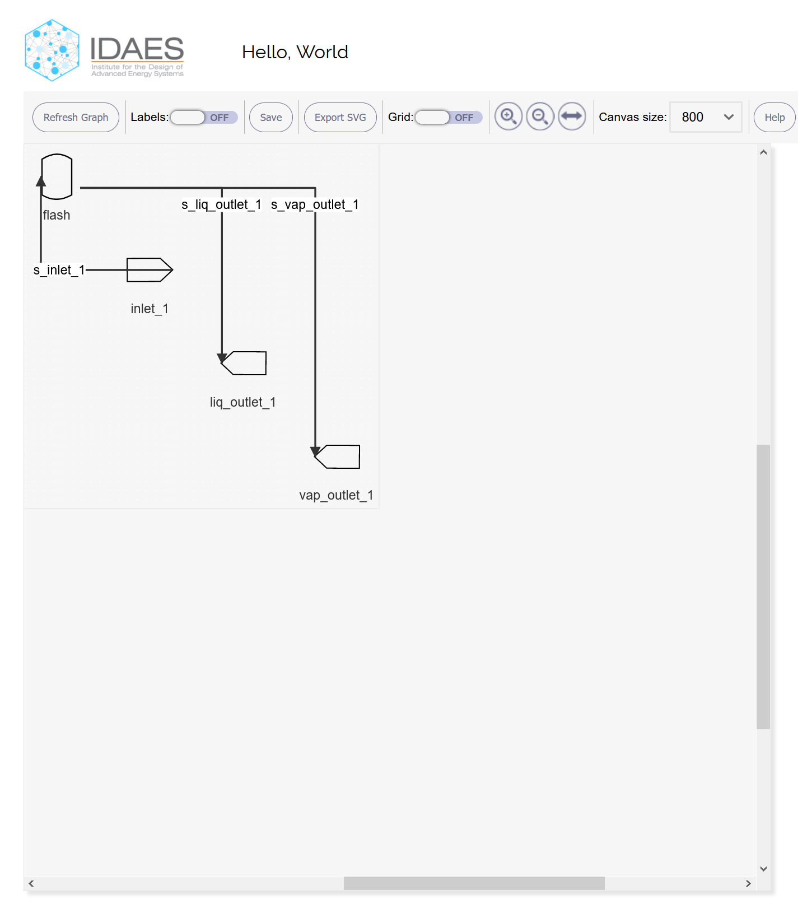

.. _IFV:

IDAES Flowsheet Visualizer
===========================

.. contents::
    :depth: 2

Concepts
--------
The IDAES Flowsheet Visualizer, or IFV for short, is a graphical user interface for viewing an IDAES flowsheet.
It uses the visual language of traditional process engineering diagrams to display
the components of a given flowsheet,
their connections, and values associated with unit models and streams. While the changes made from the UI do
not affect the underlying model, changes in the flowsheet -- e.g., from Python code or from solvers updating the
stream values -- are immediately available to be displayed in the IFV. The IFV does not require running a
separate program, as its functionality is embedded in the invoking Python code (see the `Client/server architecture <ifv-architecture>`_ for details).
Starting and stopping the IFV is fast and does not consume many resources, a fact which we hope encourages
its frequent use.

Quickstart
----------
This section will walk you through constructing a basic flowsheet and visualizing it with the IFV.

Before starting to use the IFV, you must have installed IDAES. For detailed instructions on how to do this,
see :ref:`IDAES Installation`.

In this quickstart we will use a Jupyter Notebook to compose our flowsheet and view it with the IFV. So, first
you need to open a new, blank, Jupyter Notebook. You can start the Jupyter Notebook (server) from the terminal command-line with
the command ``jupyter notebook``. See the `official Jupyter Notebook documentation <https://jupyter-notebook.readthedocs.io/>`_
for detailed instructions. The Jupyter Notebook is a web application, so you should get a web page (often as a tab
on an open browser window) that shows the contents of the directory from where you issued the command. Navigate to
a directory where you want to save your work, then click on the "New" button in the upper-right corner to create
a new notebook. You may have multiple options under the "Python" sub-menu; make sure you select a Python installation
that has IDAES already installed.

We need to create, in this Jupyter Notebook, an IDAES flowsheet to visualize. Paste the following code (taken from the Flash unit tutorial)
into the first cell in the notebook::

    from pyomo.environ import ConcreteModel, SolverFactory, Constraint, value
    from idaes.core import FlowsheetBlock
    from idaes.generic_models.properties.activity_coeff_models.BTX_activity_coeff_VLE \
        import BTXParameterBlock
    from idaes.generic_models.unit_models import Flash
    # Model and flowsheet
    m = ConcreteModel()
    m.fs = FlowsheetBlock(default={"dynamic": False})
    # Flash properties
    m.fs.properties = BTXParameterBlock(default={"valid_phase": ('Liq', 'Vap'),
                                                "activity_coeff_model": "Ideal",
                                                "state_vars": "FTPz"})
    # Flash unit
    m.fs.flash = Flash(default={"property_package": m.fs.properties})
    m.fs.flash.inlet.flow_mol.fix(1)
    m.fs.flash.inlet.temperature.fix(368)
    m.fs.flash.inlet.pressure.fix(101325)
    m.fs.flash.inlet.mole_frac_comp[0, "benzene"].fix(0.5)
    m.fs.flash.inlet.mole_frac_comp[0, "toluene"].fix(0.5)
    m.fs.flash.heat_duty.fix(0)
    m.fs.flash.deltaP.fix(0)
    # Initialize
    m.fs.flash.initialize()

Run that cell (hit shift-enter), and you should see some output from the last call to ``initialize()``, ending with something like ::

    2020-11-24 08:41:53 [INFO] idaes.init.fs.flash: Initialization Complete: optimal - Optimal Solution Found

This means the initialization succeeded, and you can move on. If you see instead something like this ::

    ---------------------------------------------------------------------------
    ModuleNotFoundError                       Traceback (most recent call last)
    <ipython-input-2-ad88ea7f7460> in <module>
    ----> 1 from pyomo.environ import ConcreteModel, SolverFactory, Constraint, value
          2 from idaes.core import FlowsheetBlock
          3 from idaes.generic_models.properties.activity_coeff_models.BTX_activity_coeff_VLE \
          4     import BTXParameterBlock
          5 from idaes.generic_models.unit_models import Flash

    ModuleNotFoundError: No module named 'pyomo'

In this case, you probably didn't run the notebook within a Python environment where IDAES is installed. To fix,
first try other Python environments, or "kernels", from under the '*Kernel -> Change kernel*' menu. If that
doesn't work, review the :ref:`installation instructions <IDAES Installation>` instructions.
To pick up changes in the installation, the best thing to do is close this notebook and exit the current running
Jupyter. Then, from inside the installed IDAES environment, try again to run the command ``jupyter notebook``.

Optionally, save the notebook ('File -> Save' or Ctrl-S) with an appropriate name, like "Flowsheet visualization quickstart".

When you ran the cell above, it created a new blank cell for you to continue editing. We will use this cell to visualize
our initialized (but not solved) model. In the new cell, type in and run (shift-enter) the following code::

    m.fs.visualize("Hello World", save_as="hello_world.json")

This will create a new browser tab or window with the IFV displaying the flowsheet:

For the initial layout, you can see that the unit models and other components
have just been placed in a diagonal. You can rearrange icons and lines on the diagram with the mouse.
For more details on this and other functions, see the next section. If you hit ``Save``, the IFV will save
your changes in the layout to the destination that you passed to "save_as" (in this case the file
"hello_world.json") in the current directory.

.. TODO Tell user how to see values on the unit model and streams

When you are done using the IFV, you can simply close the browser tab. If you quit the Python program that
invoked it, which is in this case the Jupyter Notebook, then the IFV will be cut off from the source flowsheet and
will lose its ability to save, export, or refresh. Generally, you will want to quit both the IFV and the Python
program at the same time.

That's the end of our quick tour of the IFV. Please see below for descriptions of the full functionality.
Happy visualizing!

User Guide
----------

This section describes each of the sections of the IFV interface.

It also describes the `visualize()` function used to start the IFV:

.. .. autofunction:: idaes.ui.fsvis.fsvis.visualize

Title bar
^^^^^^^^^
At the top of the window is the IDAES project logo and the name of the flowsheet.

Graph actions
^^^^^^^^^^^^^

Units
    *Units* is the term used for any geometric shape in the flowsheet that is connected by lines.
    The three types of units are IDAES unit models (such as a Flash, Mixer, or Splitter), inlets, or
    outlets. Units can be moved by clicking and dragging them. If you double-click on a unit, it
    will rotate 90 degrees.

Lines
    The lines connecting units, also called "arcs", can be manipulated by clicking and dragging.
    If you double-click on a line, you will create a new segment that can be used for routing the line
    around objects.

Annotations
    Both the units and the arcs have associated values that can be shown. See the
    :ref:`View:Labels <ifv-action-view>` action.

Menu actions
^^^^^^^^^^^^
In the current interface, all the actions described below are on a "button bar".
The structure of this documentation reflects the planned next-generation interface, which
will have a traditional application menu, below which is a set of buttons [#f1]_ for rapid access.

.. _ifv-action-file:

File actions
    * |ifv-refresh| Refresh - Refresh with view with any changes made to the flowsheet in Python.
      This also has the effect of saving the current layout. Changes in the units or their connections will of
      course alter the layout.
    * |ifv-save| Save - Save the current layout to the data store that was specified with the visualization
      was launched. This does *not* update with any changes made to the flowsheet in Python. Neither does it
      have any effect on the Python flowsheet values (the IFV can never modify the flowsheet).
    * |ifv-export| Export - Save the flowsheet as a Scalable Vector Graphics (SVG) file, a common format for
      images that consist of "vector" elements like boxes, lines, and text. SVG files can be viewed like images
      by most programs that allow image viewing, and even edited with a program like `Inkscape <https://inkscape.org/>`_.
    * Quit - Close the UI window.

.. |ifv-refresh| image:: ../../_images/icons/refresh-24px.svg
.. |ifv-save| image:: ../../_images/icons/save-24px.svg

.. _ifv-action-view:

View actions
    * Labels - Toggle view of the annotations, or labels
    * Grid - Toggle a background "grid"
    * Zoom - Zoom the view of the flowsheet within the canvas. This is a label for a set of related options:
        * |ifv-zoom-in| Zoom in - Zoom in by 25%
        * |ifv-zoom-out| Zoom out - Zoom out by 25%
        * |ifv-zoom-reset| Reset - Reset zoom to 100%
    * Canvas size - Change the size of the "canvas" on which the flowsheet is drawn. This lets you adapt
      the IFV for different display (screen) sizes.

.. |ifv-zoom-out| image:: ../../_images/icons/zoom_out-24px.svg
.. |ifv-zoom-reset| image:: ../../_images/icons/zoom_out_map-24px.svg

.. _ifv-action-help:

|ifv-help| Help actions
   * About - General information about the IFV

.. TBD  * Documentation - Links to the online documentation

.. |ifv-help| image:: ../../_images/icons/help_outline-24px.svg

Notes
+++++
.. [#f1] Button icons shown here use `Google Material Design system icons <https://material.io/design/iconography/system-icons.html#design-principles>`_. These are provided under the Apache 2.0 license.
    They were not modified for this use.

Advanced
--------
This section provides some additional details for developers or more advanced users.

.. _ifv-architecture:

Client/server architecture
^^^^^^^^^^^^^^^^^^^^^^^^^^
The ``visualize()`` command works by starting an HTTP server in a separate thread, and serving
requests from the UI (or any other requester). The server only responds to requests from your computer,
not the internet. When you exit the script or Jupyter Notebook that called `visualize` then you will also
stop the server -- and the associated IFV page will no longer be able to save or refresh the flowsheet.
The architecture diagram is shown below.

.. note ; the figure below was generated with asciiflow infinity, but is just text and can
.. be edited in any way. For HTML and PDF these are rendered as nice little diagrams by the
.. Sphinx plugin "sphinxcontrib.aafig" using the Python "aafigure" https://pypi.org/project/aafigure/ package

.. aafig::

    +-------------------+                        +--------------------+
    |                   |                        |    Web browser     |
    |  'Python script'  |                        +--------------------+
    |  'or Jupyter'     |    +---------------+   | IFV web interface  |
    |  'Notebook'       |    | 'HTTP server' |   +--------------------+
    |                   |    | 'running in'  |   |    +--+            |
    |                   |    | 'a separate'  |   |    +--+            |
    |                   |    | 'thread'      |   |      |      +--+   |
    |                   |    |               <--->      +----> +--+   |
    |  m.fs.visualize   +---->  Load/Save    |   |                    |
    |                   |    |               |   |                    |
    +-------------------+    +-----^---------+   +--------------------+
                                   |
                                   |
                            +------v--------------+
                            |   Local Storage     |
                            +---------------------+

Persistence architecture
^^^^^^^^^^^^^^^^^^^^^^^^

.. py:currentmodule:: idaes.ui.fsvis.persist

The saving of the model uses the the module :mod:`idaes.ui.fsvis.persist`.
This module implements the well-known "|factory-link|", which makes it easy to extend by adding
a new :class:`~.DataStore` sub-class and updating the logic in the factory method,
:func:`~.DataStore.create`, to create and return instances of that class for a given input type.
The input in this case comes from the ``save_as`` argument to the *visualize()* method.

.. |factory-link| raw:: html

    <a href="https://en.wikipedia.org/wiki/Factory_(object-oriented_programming)" target="_blank" style="text-decoration: none;">factory pattern</a>

.. TODO: add an example of extending it, e.g. to save in an S3 bucket
