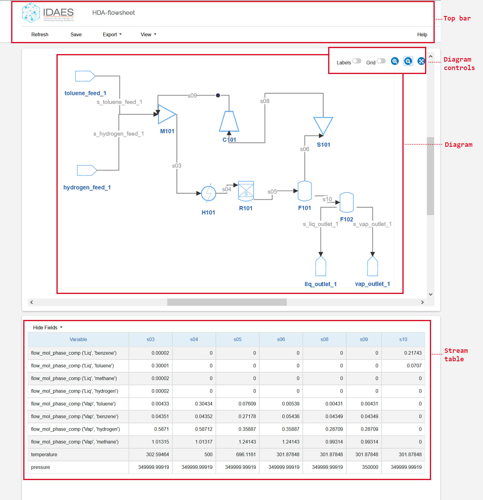
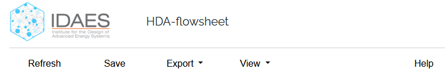
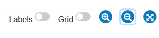
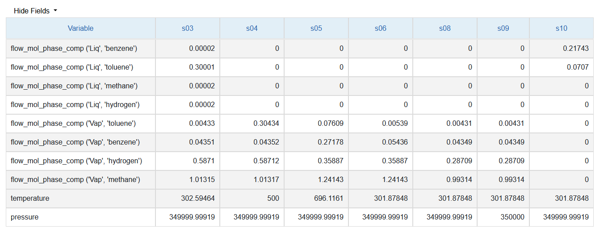

.. _IFV:

IDAES Flowsheet Visualizer
===========================

.. contents::
    :depth: 2

Introduction
------------
The IDAES Flowsheet Visualizer, or IFV for short, is a web-based user interface (UI) that lets you:

* View any IDAES flowsheet as a process engineering diagram
* Export flowsheet diagrams as images
* View the "stream table" for the flowsheet
* Rearrange the flowsheet diagram to your taste and save the arrangement for next time
* Dynamically refresh the displayed values to reflect changes in the underlying IDAES model

The IFV can be invoked from a Jupyter Notebook or a Python script. It does not require that you run any
other "server" application. Currently the IFV is only for viewing the flowsheet on your own computer (but,
since it is a web application, a shared service for viewing flowsheets stored remotely is definitely possible).

Starting and stopping the IFV is fast and does not consume many resources, a fact which we hope encourages
its frequent use.

Guide
-----
This guide describes how to invoke and use the IFV.

Invocation
^^^^^^^^^^
Once you have created your flowsheet, simply call the `visualize` method on that object,
passing some parameters to give it a name and optional file for saving changes::

    # First, create your IDAES model, "m", which has an attribute ".fs" for the flowsheet
    # Then, invoke the `visualize` method
    m.fs.visualize("My Flowsheet", save_as="my_flowsheet.json")

The invocation of the `visualize` method will pop up a browser tab or window with the UI, displaying the
flowsheet and, if the information is available, the stream table. In the notebook or script, you can continue
to run more code and the UI will continue to work in the background. You can close the UI at any time. If you
exit the script or notebook while the UI is running, it will continue to function but will not be able to save
or refresh, since these require communication with the Python process that no longer exists.

See the :ref:`visualize-function <visualize function documentation>` for details on parameters to this function.

Web UI
^^^^^^
This section describes how to use the graphical web user interface. We start with a screenshot of the UI, with
the main areas highlighted. Then we zoom in on each area and describe how to use it.

    Screenshot of the main window of the IFV UI

    Screenshot of the top bar of the IFV UI

The top bar has a title bar, which contains the IDAES logo and the name of the flowsheet being visualized,
and a menu. The menu items are:

* Refresh: Refresh with view with any changes made to the flowsheet from the Python side.
      This also has the effect of saving the current layout. Changes in the units or their connections will of
      course alter the layout.
* Save: Save the current layout to the data store that was specified with the visualization
      was launched. This does *not* update with any changes made to the flowsheet in Python. Neither does it
      have any effect on the Python flowsheet values (the IFV can never modify the flowsheet).
* Export:
    * Flowsheet: Save the flowsheet as a Scalable Vector Graphics (SVG) file, a common format for
      images that consist of "vector" elements like boxes, lines, and text. SVG files can be viewed like images
      by most programs that allow image viewing, and even edited with a program like `Inkscape <https://inkscape.org/>`_.
    * Stream table:
* View: Toggle the view of the flowsheet (diagram) area and the stream table area.
* Help: Load this documentation page

    Screenshot of the main diagram (or flowsheet) area of the IFV UI

The diagram or flowsheet area lets you rearrange the flowsheet as you need and zoom in on particular sections.
For the purposes of this documentation
The main visual components are called Units, Lines, and Annotations.

Units
    *Units* is the term used for any geometric shape in the flowsheet that is connected by lines.
    In addition to different shapes for the different IDAES unit models, there are also designated
    shapes for inlets and outlets. All units can be moved by clicking and dragging them.
    If you right-click on a unit, it will rotate 90 degrees.

Lines
    The lines connecting units can be manipulated by clicking and dragging.
    If you double-click on a line, you will create a new segment that can be used for routing the line
    around objects. You can eliminate a segment by clicking on the dot that appears as you hover over
    the line.

Annotations
    Both the units and the arcs have associated values that can be shown. See the
    :ref:`View:Labels <ifv-action-view>` action.

    Screenshot of the diagram controls area of the IFV UI

View actions
    * Labels - Toggle view of the annotations, or labels
    * Grid - Toggle a background "grid"
    * Zoom - Zoom the view of the flowsheet within the canvas. This is a label for a set of related options.
    *  Zoom in - Zoom in by 25%
    *  Zoom out - Zoom out by 25%
    *  Reset - Reset zoom to 100%
    * Canvas size - Change the size of the "canvas" on which the flowsheet is drawn. This lets you adapt
      the IFV for different display (screen) sizes.

    Screenshot of the stream table area of the IFV UI

Reference
----------

There are two ways to invoke the `visualize` functionality, which in the end do the same thing and
have the same arguments.

1. Use the `visualize` method of a flowsheet
2. Call the `visualize` function from the package `idaes.ui.fsvis`
3. Call the same `visualize` function from the module `idaes.ui.fsvis.fsvis`

In all cases, the arguments and behavior are the same, as described below.

.. _visualize-function:

.. autofunction:: ~idaes.ui.fsvis.fsvis.visualize

Advanced
--------
This section provides some additional details for developers or more advanced users.

.. _ifv-architecture:

Client/server architecture
^^^^^^^^^^^^^^^^^^^^^^^^^^
The ``visualize()`` command works by starting an HTTP server in a separate thread, and serving
requests from the UI (or any other requester). The server only responds to requests from your computer,
not the internet. When you exit the script or Jupyter Notebook that called `visualize` then you will also
stop the server -- and the associated IFV page will no longer be able to save or refresh the flowsheet.
The architecture diagram is shown below.

.. note ; the figure below was generated with asciiflow infinity, but is just text and can
.. be edited in any way. For HTML and PDF these are rendered as nice little diagrams by the
.. Sphinx plugin "sphinxcontrib.aafig" using the Python "aafigure" https://pypi.org/project/aafigure/ package

.. aafig::

    +-------------------+                        +--------------------+
    |                   |                        |    Web browser     |
    |  'Python script'  |                        +--------------------+
    |  'or Jupyter'     |    +---------------+   | IFV web interface  |
    |  'Notebook'       |    | 'HTTP server' |   +--------------------+
    |                   |    | 'running in'  |   |    +--+            |
    |                   |    | 'a separate'  |   |    +--+            |
    |                   |    | 'thread'      |   |      |      +--+   |
    |                   |    |               <--->      +----> +--+   |
    |  m.fs.visualize   +---->  Load/Save    |   |                    |
    |                   |    |               |   |                    |
    +-------------------+    +-----^---------+   +--------------------+
                                   |
                                   |
                            +------v--------------+
                            |   Local Storage     |
                            +---------------------+

Persistence architecture
^^^^^^^^^^^^^^^^^^^^^^^^

.. py:currentmodule:: idaes.ui.fsvis.persist

The saving of the model uses the the module :mod:`idaes.ui.fsvis.persist`.
This module implements the well-known "|factory-link|", which makes it easy to extend by adding
a new :class:`~.DataStore` sub-class and updating the logic in the factory method,
:func:`~.DataStore.create`, to create and return instances of that class for a given input type.
The input in this case comes from the ``save_as`` argument to the *visualize()* method.

.. |factory-link| raw:: html

    <a href="https://en.wikipedia.org/wiki/Factory_(object-oriented_programming)" target="_blank" style="text-decoration: none;">factory pattern</a>

.. TODO: add an example of extending it, e.g. to save in an S3 bucket
