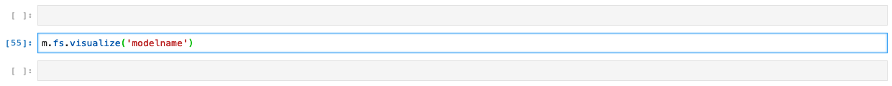
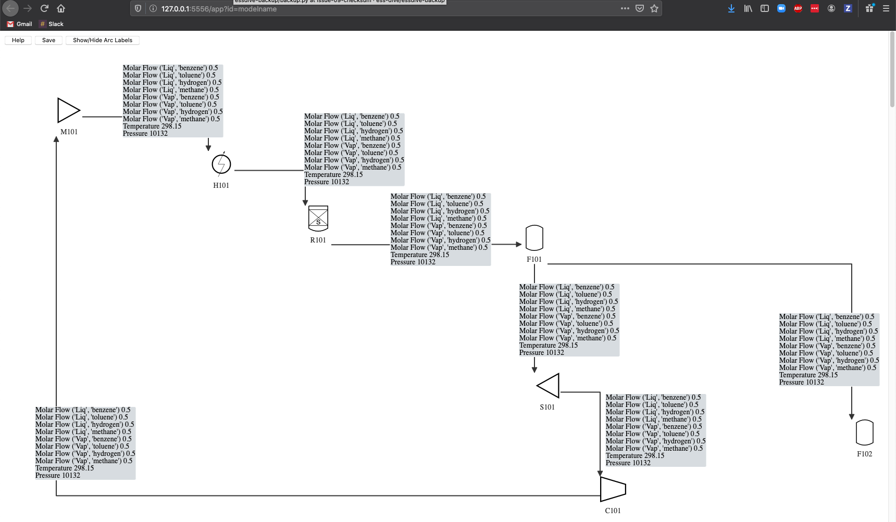
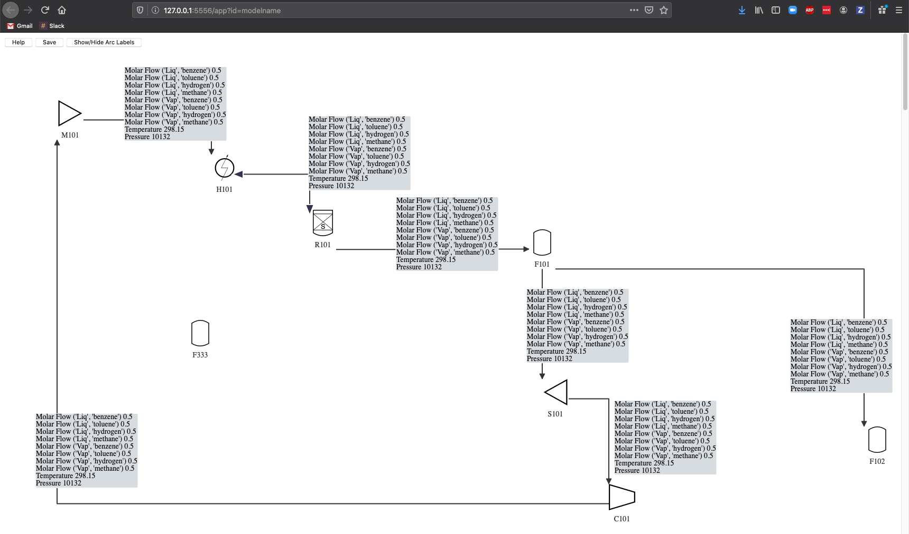

Visualization
=============

.. warning::
    The visualization library is still in active development and we
    hope to improve on it in future releases. Please use its
    functionality at your own discretion.

Overview
--------

The Flowsheet Visualizer is a service that starts a flask server and
displays a webpage with the current model's unit models as icons and 
the arcs as links between the icons.

The icons are fully movable as are the links and link labels.

Installation instructions
-------------------------

1. :ref:`Ensure that the latest IDAES is installed. <idaes_installation>` 

.. _usage:

Usage
-----

1. Create a flowsheet in a Jupyter Notebook. For the purpose of these 
   instructions the model will be `m` and the flowsheet will be `m.fs`

2. Call visualize from the flowsheet with a model name as a string. 
   `m.fs.visualize('model_name')`

3. A webpage should display. If a webpage does not display then copy and
   paste the URL that outputs from the visualize command.

.. image:: ../_images/modelvis/initial_layout.png

4. Modify the layout of the model

5. Modify the model if needed

6. Call visualize from the flowsheet with a model name as a string. 
   `m.fs.visualize('model_name')`

7. A new webpage should display with the model. If the only changes to the
   model are to the labels then the layout should be entirely preserved.
   If there is a new unit model then the existing model is partially 
   preserved and the new unit model and arcs will appear in a diagonal line.

8. Modify the model layout for the new unit models if needed

9. Repeat steps 5 though 8 as necessary

10. Save the model to a file
