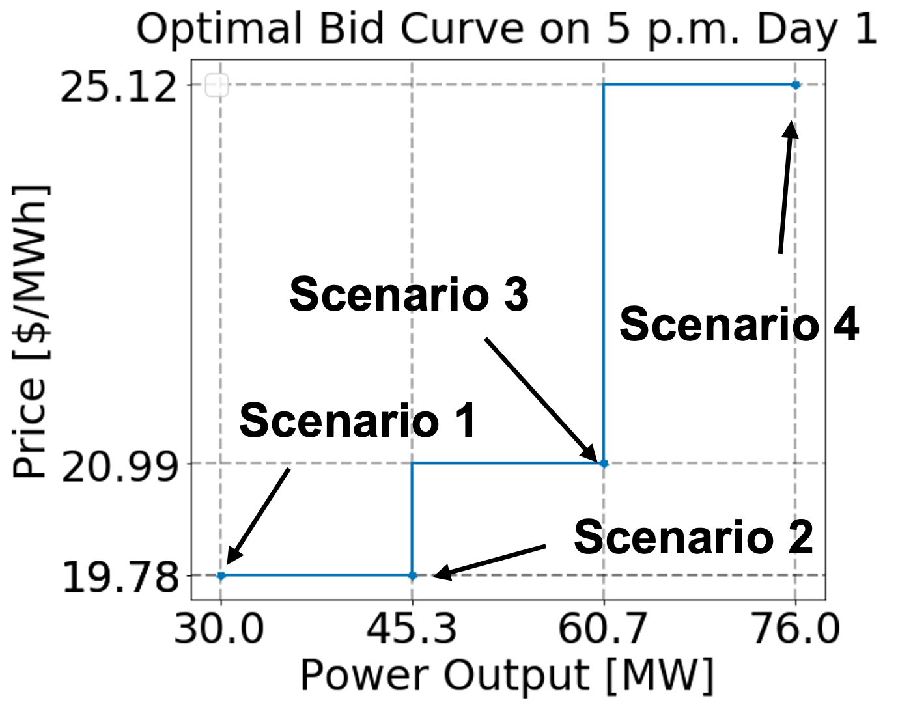

Bidder
============================================
Market participating resources (e.g., generators, IESs) submit energy bids
(a.k.a., bid curves) to the day-ahead and real-time markets for each trading time
period to communicate their flexibility and marginal costs. As shown in the figure
below, an energy bid is a piecewise constant function described by several energy
offer price (\$/MWh) and
operating level (MW) pairs. Bid curves from each resource are inputs (i.e.,
parameters) in the market-clearing optimization problems solved by production cost models. Currently,
the ``Bidder`` formulates a two-stage stochastic program to calculate the optimized
time-varying bid curves for thermal generators. In this stochastic program, each
uncertain price scenario has a corresponding power output. As shown in the figure,
each of these uncertain price and power output pairs formulates a segment in the
bidding curves.

|example_bid|

.. autoclass:: bidder.Bidder
  :members:
