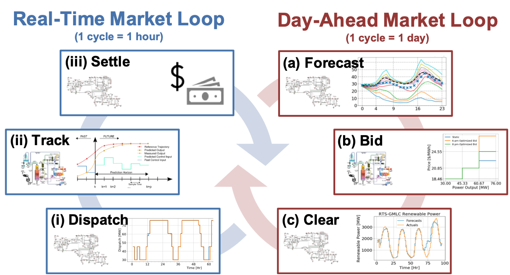
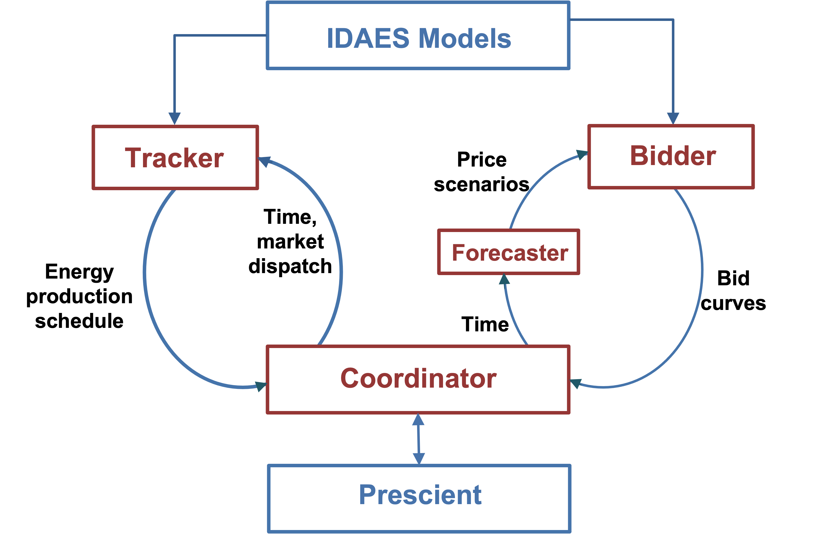

.. grid_integration documentation master file, created by
   sphinx-quickstart on Wed Dec 15 17:14:39 2021.
   You can adapt this file completely to your liking, but it should at least
   contain the root `toctree` directive.

Welcome to grid_nmpc's documentation!
============================================

|doubleloop|

The subpackage implements a new generalized multiscale simulation framework (shown in
figure) that integrates the process and grid modeling paradigms to quantify
the operational (hours to year timescale) interactions between energy systems and
wholesale electricity markets. This multiscale framework aims to:
(1) elucidate complex relationships between resource dynamics and market dispatch
(with uncertainty, beyond price-taker assumption);
(2) predict the economic opportunities and market impacts of emerging
technologies (e.g., H2 production, integrated energy systems);
(3) guide conceptual design & retrofit to meet current and future power grid
needs.

The framework integrates optimal operations, and control of an energy system with
market clearing via a high-fidelity Production Cost Model (PCM) Prescient which
optimizes resource dispatch decisions across an entire transmission network.
Specifically, in the day-ahead market loop, the following steps are modeled:
(a) Forecast: energy systems perform market uncertainty forecasts, e.g., locational
marginal prices (LMP).
(b) Bid: energy systems utilize the uncertainty forecasts and solve optimization
problems to derive optimal bidding strategies into the markets.
(c) Clearing: after collecting day-ahead bids from market participants, the market
operator (modeled by Prescient) solves unit commitment problems to clear the
day-ahead market.
Similarly, in the real-time market loop, the following steps are modeled:
(i) Dispatch: after collecting hourly real-time bids from market participants,
the market operator (modeled by Prescient) dispatches power generation schedules
to energy systems by solving real-time economic dispatch problems.
(ii) Tracking: energy systems solve optimal nonlinear model predictive control
(NMPC) problems to track the dispatch signals.
(iii) Settle: based on the actual energy production schedules, the market operator
calculates and pays the energy and ancillary service settlements to the participants.

|doubleloop_implementation|

The design of framework's implementation is shown in the figure above. Specifically,
we added the objects in red ``Forecaster``, ``Bidder``, ``Tracker``, and ``Coordinator``.
The ``Bidder`` and ``Tracker`` take an IDAES model, and augment the model with
necessary variables and constraints for energy system optimal bidding and tracking.
The ``Coordinator`` acts as the bridge between process modeling and grid modeling.
On the one hand, the ``Coordinator`` passes time to the ``Forecaster`` which then
forecasts market uncertainty for the ``Bidder``. The ``Bidder`` then calculates
optimal bids and passes back to the ``Coordinator`` and the bids finally enter
Prescient. On the other hand, the ``Coordinator`` passes time and market dispatches
to the ``Tracker``. The ``Tracker`` solves optimal tracking problems and passes
actual energy production schedules back to the ``Coordinator``, and these schedules
will enter Prescient for settlement calculation.

The readers can find an example with an IDAES Rankine cycle of the framework.

.. toctree::
   :maxdepth: 2
   :caption: Contents:

   Bidder
   Tracker
   Coordinator

Indices and tables
==================

* :ref:`genindex`
* :ref:`modindex`
* :ref:`search`
